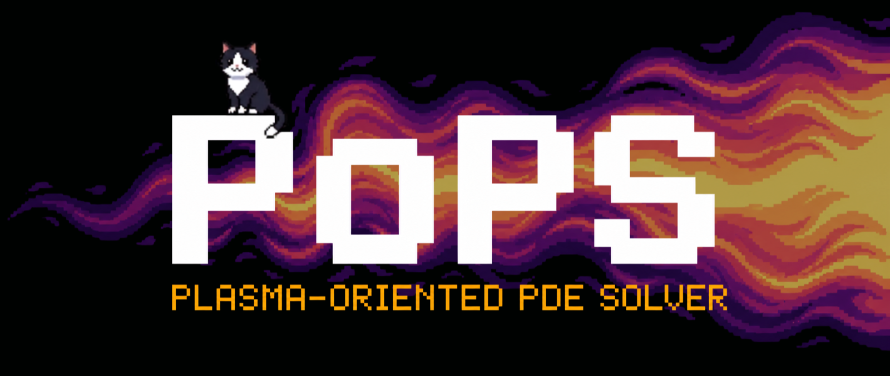

<div align="center">

# PoPS - Plasma-Oriented PDE Solver

**A model-free C++20 core for coupled hyperbolic-elliptic systems on adaptive (AMR) meshes.**


</div>

<p align="center">
  
</p>

---

PoPS is a compiled solver engine, not a Python numerical library and not a scenario repository.
Python authors an inert, typed `pops.Case`: physics model, finite-volume descriptors,
field problems, time program, outputs, and runtime parameters. The explicit typed pipeline is
`validate(case) → resolve(validated, layout=...) → compile(resolved) → bind(artifact, ...)`.
Compilation lowers the resolved assembly to generated or native C++; binding creates the runtime;
`pops.run(sim, **run_controls)` advances it with C++/Kokkos/MPI kernels.
Python never runs a per-cell loop.

Named applications such as diocotron, Euler-Poisson, two-fluid, and validation setups live in
[`adc_cases`](https://github.com/wolf75222/adc_cases). This repository owns the reusable solver core,
the Python DSL that builds compiled artifacts, and the C++ runtime that executes them.

At the mathematical level, a case usually couples conservative states `U` to one or more elliptic
fields:

```
dU/dt + div F(U, fields, aux) = S(U, fields, aux)
D phi                         = f(U)
```

Field outputs are exposed through owner-qualified, typed field handles. Each field operator declares
its own output schema (scalar, vector, tensor, components and frame); consumers bind those handles
without relying on reserved names such as `phi` or `grad_x`. Names remain optional metadata for the
generated C++ path, never Python callbacks or runtime lookup authority.

## Table of contents

- [Prerequisites](#prerequisites)
- [Installation](#installation)
- [Usage](#usage)
- [Documentation](#documentation)
- [Versioning](#versioning)
- [Contributing](#contributing)
- [License](#license)

## Prerequisites

- **C++20** compiler: AppleClang 16+, GCC 13+, Clang 17+ (`nvcc_wrapper` for the CUDA target).
- **CMake >= 3.21**: the build is driven by presets ([CMakePresets.json](CMakePresets.json)).
- **[Kokkos](https://kokkos.org) 4.4.01**: the exact promised release, with Serial and OpenMP
  execution spaces. It is the only on-node backend and is required. No need to
  pre-install it; if it is not found, CMake fetches and builds it (FetchContent).
- **MPI** *(optional, `-DPOPS_USE_MPI=ON`: halos and distributed FFT)*, with
  `MPI_THREAD_MULTIPLE` support for the native runtime.
- **HDF5** parallel *(optional, `-DPOPS_USE_HDF5=ON`: DataWriter)*.
- **Python 3.12 + numpy** *(optional, the `pops` bindings; conda env via `scripts/setup_env.sh`)*.

## Installation

Recommended path for the Python module:

```bash
git clone https://github.com/wolf75222/PoPS.git && cd PoPS
bash scripts/setup_env.sh      # conda env + toolchain
bash scripts/build_python.sh   # build + install, then pops.doctor()
```

`scripts/setup_env.sh` creates the conda environment and pins the platform toolchain.
`scripts/build_python.sh` builds and installs `pops`, exports the discovery variables, and
finishes with `pops.doctor()`.
Use `bash scripts/build_python.sh --mpi` for the final distributed artifact; that strict route
enables both MPI and its native parallel-HDF5 writer and fails if either backend is unavailable.

### C++ core only

The C++ core is built through CMake presets:

```bash
cmake --preset serial
cmake --build --preset serial
ctest --preset serial --output-on-failure
```

The Ninja build already uses all available cores. Pin it to fewer jobs on a constrained machine
with `cmake --build --preset serial -j<N>`. The serial test preset runs tests one at a time;
parallelize with `ctest --preset serial -j<N>` when needed.

Parallel presets are available when the required backend dependencies are visible:

```bash
cmake --preset parallel && cmake --build --preset parallel && ctest --preset parallel  # threaded, Kokkos OpenMP
cmake --preset mpi      && cmake --build --preset mpi      && ctest --preset mpi        # distributed, MPI + parallel HDF5
```

Each preset writes into its own folder (`build`, `build-kokkos`, `build-mpi`). For an OpenMP build,
set `OMP_NUM_THREADS` (and, where required by the Kokkos installation, `KOKKOS_NUM_THREADS`) before
launching Python or use the scheduler's native CPU/thread controls.

### Uninstall

```bash
bash scripts/uninstall_pops.sh # full teardown (env + caches); --keep-env drops only the module
```

Released versions and binaries: the
[Releases page](https://github.com/wolf75222/PoPS/releases).

## Usage

<p align="center">
  
</p>

<div align="center">
<sub>
Validation scenario: diocotron instability (E x B drift) on a 3-level nested AMR hierarchy, ROMEO (96 cores).
The scenario itself lives outside this core repository:
<a href="https://github.com/wolf75222/adc_cases/tree/master/diocotron_amr"><code>adc_cases/diocotron_amr</code></a>.
</sub>
</div>

### From a C++ project

The C++ core is header-only for consumers and is consumed via `find_package(pops)` or FetchContent:

```cmake
include(FetchContent)
FetchContent_Declare(PoPS GIT_REPOSITORY https://github.com/wolf75222/PoPS.git)
FetchContent_MakeAvailable(PoPS)   # PoPS tests are not built for the consumer
target_link_libraries(my_app PRIVATE pops::pops)
```

Define a type that satisfies the `PhysicalModel` concept and compose it with the C++ coupling and
time machinery. This is the low-level engine path. Most users should author a typed Python `Case`
and let PoPS generate and bind the corresponding C++ artifact.

### From Python

The public Python path is typed and compiled. Physics, numerics, boundaries, the explicit time
`Program`, layout, consumers, and execution controls each have one authority. Final executable
references are collected under [`examples/final`](examples/final); the complete scalar-advection
case runs directly:

```bash
python examples/final/EXEMPLE_SPEC_FINALE_ADVECTION_SCALAIRE_COMPLET.py
```

Its final lifecycle is exactly `Case -> validate -> resolve -> compile -> bind -> run`.
`pops.bind` receives concrete value families directly (`params=`, `initial_state=`, `aux=`,
`resources=`, `initial_values=`); users never construct an install plan or runtime engine. See the
[complete source](examples/final/EXEMPLE_SPEC_FINALE_ADVECTION_SCALAIRE_COMPLET.py) for explicit
SSPRK2 construction, qualified handles, AMR policies, outputs, diagnostics, and checkpointing.
The same acceptance corpus also executes the
[multiphysics](examples/final/EXEMPLE_SPEC_FINALE_MULTIPHYSIQUE_CORE.py),
[IMEX-AMR](examples/final/EXEMPLE_SPEC_FINALE_ADVECTION_IMEX_AMR.py), and
[HyQMOM15](examples/final/EXEMPLE_SPEC_FINALE_15_MOMENTS_HYQMOM.py) cases.

## Documentation

The documentation corpus describes the final public lifecycle and its current implementation:

- [Architecture](docs/ARCHITECTURE.md): current technical map of the core.
- [Final technical specification](docs/design/SPECIFICATION_TECHNIQUE_FINALE_POPS_ARCHITECTURE.md):
  normative Python/C++ contract and acceptance matrix.
- [Algorithms](docs/ALGORITHMS.md): numerical methods and implementation notes.
- [Tutorials](tutorials/README.md): linear, executable introductions built with the public API.
- [Versioning](docs/VERSIONING.md): public API scope and release process.
- [Documentation quality](docs/DOC_QUALITY.md): maintained corpus and conformance rules.
- [Contributing](CONTRIBUTING.md): build, test, review, and PR workflow.
- [Security](SECURITY.md): vulnerability reporting policy.
- [Changelog](CHANGELOG.md): notable changes.
- [Google documentation guide](docs/docguide/): vendored style and documentation guidance.

### Core layers

| Layer | Role | Entry point |
|---|---|---|
| `python/pops/physics`, `python/pops/model`, `python/pops/time` | typed Python authoring: physics facade, operator-first model IR, and compiled time programs | [python/pops/physics](python/pops/physics) |
| `python/pops/mesh`, `python/pops/fields`, `python/pops/solvers`, `python/pops/numerics` | descriptors for layouts, AMR policies, field problems, solvers, Riemann fluxes, reconstruction, and finite-volume spatial choices | [python/pops/mesh](python/pops/mesh) |
| `python/pops/codegen` | validation, inspection, generated C++ emission, cache keys, and `.so` loading | [python/pops/codegen](python/pops/codegen) |
| `include/pops/core` | C++ concepts, state layout, model contracts, and equation blocks | [physical_model.hpp](include/pops/core/model/physical_model.hpp) |
| `include/pops/numerics` | C++ finite-volume, elliptic, time, Krylov, reconstruction, and Riemann kernels | [include/pops/numerics](include/pops/numerics) |
| `include/pops/amr`, `include/pops/mesh`, `include/pops/parallel` | C++ mesh hierarchy, AMR clustering/regrid, MultiFab storage, halos, MPI seams, and reflux support | [include/pops/amr](include/pops/amr) |
| `include/pops/runtime`, `python/pops/runtime` | low-level runtime that `pops.bind(...)` uses internally to materialise uniform or AMR runs | [system.hpp](include/pops/runtime/system.hpp) |

## Versioning

PoPS follows [Semantic Versioning](https://semver.org). The public API under guarantee and
the bump rules are declared in [docs/VERSIONING.md](docs/VERSIONING.md). Available versions and
their change logs: the [Releases page](https://github.com/wolf75222/PoPS/releases) and
[CHANGELOG.md](CHANGELOG.md). Version `1.0.0` establishes the stable public contract; subsequent
compatibility and deprecation decisions follow those Semantic Versioning rules.

## Contributing

Build, test and workflow conventions: [CONTRIBUTING.md](CONTRIBUTING.md).

## License

BSD-3-Clause. See [LICENSE](LICENSE).
