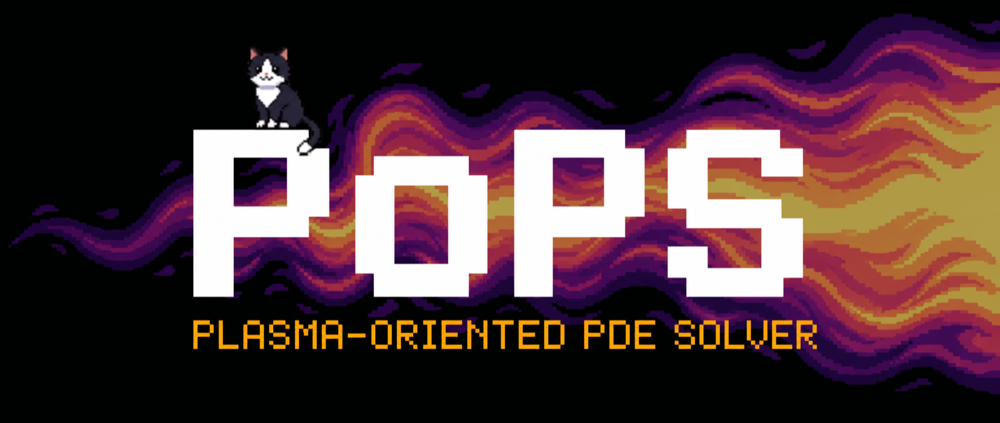
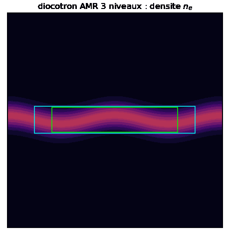

<div align="center">

# PoPS - Plasma-Oriented PDE Solver

**A model-free C++20 core for coupled hyperbolic-elliptic systems on adaptive (AMR) meshes.**


</div>

<p align="center">
  
</p>

---

PoPS is a compiled solver engine. Python authors an inert, typed `pops.Case`: physics
model, finite-volume descriptors, field problems, time program, outputs, and runtime
parameters. The public lifecycle is:

```
validate(case) -> resolve(validated, layout=...) -> compile(resolved) -> bind(artifact, ...) -> run(sim, ...)
```

Compilation lowers the resolved assembly to generated or native C++. Binding creates the
runtime. `pops.run` advances it with C++/Kokkos/MPI kernels. Python never runs a per-cell
loop.

Named applications such as diocotron, Euler-Poisson, two-fluid, and validation setups live
in [`adc_cases`](https://github.com/wolf75222/adc_cases). This repository owns the reusable
solver core, the Python DSL that builds compiled artifacts, and the C++ runtime that
executes them. Source and native test selection is declared by
[`tests/test_manifest.toml`](tests/test_manifest.toml); the qualification boundary and
current unavailable cells are recorded in
[`docs/development/migration_verification_scope.md`](docs/development/migration_verification_scope.md).

At the mathematical level, a case usually couples conservative states `U` to one or more
elliptic fields through an owner-qualified provider pack `P`:

```
dU/dt + div F(U, P) = S(U, P)
D psi               = f(U)
```

`P` is the compact slot plan resolved from declared `ComponentKey`s (`ProviderValues<N>`;
`N = 0` if the model reads no field). `D` is the authored elliptic operator; `psi` is a
typed field handle, not a reserved name such as `phi` or `grad_x`. Each field operator
declares its own output schema (scalar, vector, tensor, components and frame). Names
remain optional metadata for the generated C++ path, never Python callbacks or runtime
lookup authority. A case without an elliptic solve is a real `P`-free hyperbolic block.

## Table of contents

- [Prerequisites](#prerequisites)
- [Installation](#installation)
- [Usage](#usage)
- [Verification](#verification)
- [Documentation](#documentation)
- [Versioning](#versioning)
- [Contributing](#contributing)
- [License](#license)

## Prerequisites

- **C++20** compiler: AppleClang 16+, GCC 13+, Clang 17+ (`nvcc_wrapper` for the CUDA target).
- **CMake >= 3.21**: the build is driven by presets ([CMakePresets.json](CMakePresets.json)).
- **[Kokkos](https://kokkos.org) 4.4.01**: the promised Serial and OpenMP release. It is the
  only on-node backend and is required. CMake fetches and builds it when it is not already
  found.
- **MPI** *(optional, `-DPOPS_USE_MPI=ON`)*: halos and distributed FFT. The native runtime
  needs `MPI_THREAD_MULTIPLE`.
- **HDF5** parallel *(optional, `-DPOPS_USE_HDF5=ON`)*: DataWriter.
- **Python 3.12 + numpy** *(optional)*: the `pops` bindings. The conda env is created by
  `scripts/setup_env.sh`. `pixi.toml` is a lockfile alternative to `environment.yml`.

## Installation

Recommended path for the Python module:

```bash
git clone https://github.com/wolf75222/PoPS.git && cd PoPS
bash scripts/setup_env.sh      # conda env + toolchain
bash scripts/build_python.sh --dim 2  # exact Dim=2 build + install, then doctor()
```

`scripts/setup_env.sh` creates the conda environment and pins the platform toolchain.
`scripts/build_python.sh` builds and installs one compile-time spatial specialization of
`pops`, exports the discovery variables, and finishes with
`from pops.runtime.doctor import doctor; doctor()`. Pass `--dim 1`, `--dim 2`, or
`--dim 3` (or export `POPS_NATIVE_DIM`). There is no implicit dimensional fallback.
`bash scripts/build_python.sh --dim 2 --mpi` builds a distributed Dim=2 artifact and fails
if MPI or its native parallel-HDF5 writer is unavailable.

The CMake-native binding path is `cmake --preset python` (Serial module in `build-py`) or
`cmake --preset python-parallel` (Kokkos from the conda env, `build-py-kokkos`).

### C++ core only

```bash
cmake --preset serial
cmake --build --preset serial
ctest --preset serial --output-on-failure
```

The checked-in presets select `POPS_NATIVE_DIM=2`. To build another specialization, override
it at configure time and use a dimension-specific build directory, for example
`cmake -S . -B build-dim3 -G Ninja -DPOPS_NATIVE_DIM=3`.

The Ninja build already uses all available cores. Pin it with
`cmake --build --preset serial -j<N>`. The serial test preset runs tests one at a time;
parallelize with `ctest --preset serial -j<N>` when needed.

Parallel presets are available when the required backends are visible:

```bash
cmake --preset parallel && cmake --build --preset parallel && ctest --preset parallel  # Kokkos OpenMP
cmake --preset mpi      && cmake --build --preset mpi      && ctest --preset mpi        # MPI + parallel HDF5
```

Each preset writes into its own folder (`build`, `build-kokkos`, `build-mpi`). For an OpenMP
build, set `OMP_NUM_THREADS` (and `KOKKOS_NUM_THREADS` when the Kokkos install requires it)
before launching Python, or use the scheduler's CPU/thread controls.

### Uninstall

```bash
bash scripts/uninstall_pops.sh # full teardown (env + caches); --keep-env drops only the module
```

Released versions and binaries: the
[Releases page](https://github.com/wolf75222/PoPS/releases).

## Usage

<p align="center">
  
</p>

<div align="center">
<sub>
Validation scenario: diocotron instability (E x B drift) on a 3-level nested AMR hierarchy, ROMEO (96 cores).
The scenario itself lives outside this core repository:
<a href="https://github.com/wolf75222/adc_cases/tree/master/diocotron_amr"><code>adc_cases/diocotron_amr</code></a>.
</sub>
</div>

### From a C++ project

The C++ core is header-only for consumers and is consumed via `find_package(pops)` or
FetchContent:

```cmake
include(FetchContent)
FetchContent_Declare(PoPS GIT_REPOSITORY https://github.com/wolf75222/PoPS.git)
FetchContent_MakeAvailable(PoPS)   # PoPS tests are not built for the consumer
target_link_libraries(my_app PRIVATE pops::pops)
```

Define a type that satisfies the `PhysicalModel` concept and compose it with the C++
coupling and time machinery. This is the low-level engine path. Most users should author a
typed Python `Case` and let PoPS generate and bind the corresponding C++ artifact.

### From Python

The public Python path is typed and compiled. Physics, numerics, boundaries, the explicit
time `Program`, layout, consumers, and execution controls each have one authority. Final
executable references are collected under [`examples/final`](examples/final). The complete
scalar-advection case runs directly:

```bash
python examples/final/EXEMPLE_SPEC_FINALE_ADVECTION_SCALAIRE_COMPLET.py
```

The guaranteed public root surface is `Model`, `Program`, `Case`, `RunReport`,
`RunStopReason`, `ExecutionContext`, `set_threads`, `validate`, `inspect`, `explain`,
`resolve`, `compile`, `bind`, `run`, and `__version__`. Call `set_threads` before native
Kokkos initialization. `inspect` / `explain` report authored objects, compiled artifacts,
and bound runtimes. The exact SemVer contract is in [docs/VERSIONING.md](docs/VERSIONING.md).

Its lifecycle is `Case -> validate -> resolve -> compile -> bind -> run`. `pops.bind`
receives concrete value families (`params=`, `initial_state=`, `aux=`, `resources=`,
`initial_values=`). Users never construct an install plan or runtime engine. See the
[complete source](examples/final/EXEMPLE_SPEC_FINALE_ADVECTION_SCALAIRE_COMPLET.py) for
SSPRK2 construction, qualified handles, AMR policies, outputs, diagnostics, and
checkpointing. The same acceptance corpus also executes the
[multiphysics](examples/final/EXEMPLE_SPEC_FINALE_MULTIPHYSIQUE_CORE.py),
[IMEX-AMR](examples/final/EXEMPLE_SPEC_FINALE_ADVECTION_IMEX_AMR.py), and
[HyQMOM15](examples/final/EXEMPLE_SPEC_FINALE_15_MOMENTS_HYQMOM.py) cases.

Shorter introductions live in [`docs/tuto`](docs/tuto/README.md).

## Verification

The former `verification/` campaign contract is absent from this checkout: its manifest,
runner, checker, case package, and JSON schemas are not shipped. The seven files retained
under `tests/python/verification/` are historical orphan records, not an executable
qualification route. See [migration verification scope](docs/development/migration_verification_scope.md)
for the decision, missing assets, and replacement gates.

The repository-owned source and package checks are executable from the repository root:

```bash
python scripts/check_packaging_manifest.py
```

The names `run_m3_gate.py` and `run_m4_gate.py` refer to historical gates from the older ADC-679-era
gate family: `run_m3_gate.py` checks the ADC-672--678 AMR/multi-layout matrix, while `run_m4_gate.py`
checks the ADC-679--687 runtime/I/O matrix. Their `--check-only` modes inspect those historical
manifests; they do not define the current migration M3 fields or M4 interactions.

The current migration fixtures are organized by contract. M3 field-problem and field-observation
coverage includes `tests/python/integration/runtime/test_public_field_problem.py`,
`test_public_field_reuse.py`, and `test_public_field_consumers.py`. M4 interaction and typed-native
call coverage includes `tests/python/unit/codegen/test_joint_interaction_codegen.py`,
`test_native_interaction_matrix.py`, `test_native_call_compiled.py`, and
`tests/python/integration/native_loader/test_external_component_package.py`. The contract and
acceptance boundaries are recorded in
[`migration M3-M6 contract`](docs/development/migration_m3_m6_contract.md) and the
[migration verification scope](docs/development/migration_verification_scope.md).

The C++ native gate uses the checked-in presets and CTest targets:

```bash
cmake --preset serial
cmake --build --preset serial
ctest --preset serial --output-on-failure
```

Use the `mpi` preset only when MPI and parallel HDF5 are part of the declared matrix:

```bash
cmake --preset mpi
cmake --build --preset mpi
ctest --preset mpi --output-on-failure
```

For an installed Python artifact, build exactly one dimension and add `--mpi` only for a
declared MPI cell:

```bash
bash scripts/build_python.sh --dim 2
# bash scripts/build_python.sh --dim 2 --mpi
```

These commands establish source/package consistency, compile and artifact health, and selected
runtime evidence. Build, package, and `doctor()` authentication does not prove that every bind or
scientific workflow executes. A qualification result requires the complete declared M3-M8
matrix, including the current migration fixtures, at one exact source/native/wheel provenance
with its numerical, restart, output, collective, and configuration oracles retained. The
historical AMR/multi-layout and runtime/I/O scripts are not substitutes for those current M3/M4
fixtures. `scripts/run_final_gate.py` is the available release-gate entry point for a selected
dimension and wheel; a successful source or smoke check alone never closes an unrun matrix cell.
The separate benchmark protocol is declared in
`benchmarks/manifest.toml`; source, unit, and operation-count checks do not establish a
performance claim. No local CPU or MPI result establishes GPU or cluster support.

## Documentation

- [Architecture](docs/ARCHITECTURE.md): technical map of the core.
- [Final technical specification](docs/design/SPECIFICATION_TECHNIQUE_FINALE_POPS_ARCHITECTURE.md):
  normative Python/C++ contract and acceptance matrix.
- [Algorithms](docs/ALGORITHMS.md): numerical methods and implementation notes.
- [Tutorials](docs/tuto/README.md): linear introductions built with the public API.
- [Migration verification scope](docs/development/migration_verification_scope.md): current
  executable gates, unavailable campaign assets, and M8 retirement boundary.
- [Versioning](docs/VERSIONING.md): public API scope and release process.
- [Documentation quality](docs/DOC_QUALITY.md): maintained corpus and conformance rules.
- [Contributing](CONTRIBUTING.md): build, test, review, and PR workflow.
- [Security](SECURITY.md): vulnerability reporting policy.
- [Changelog](CHANGELOG.md): notable changes.

### Core layers

| Layer | Role | Entry point |
|---|---|---|
| `python/pops/physics`, `python/pops/model`, `python/pops/time` | typed Python authoring: physics facade, operator-first model IR, and compiled time programs | [python/pops/physics](python/pops/physics) |
| `python/pops/mesh`, `python/pops/fields`, `python/pops/solvers`, `python/pops/numerics` | descriptors for layouts, AMR policies, field problems, solvers, Riemann fluxes, reconstruction, and finite-volume spatial choices | [python/pops/mesh](python/pops/mesh) |
| `python/pops/codegen` | validation, inspection, generated C++ emission, cache keys, and `.so` loading | [python/pops/codegen](python/pops/codegen) |
| `include/pops/core` | C++ concepts, state layout, model contracts, and equation blocks | [physical_model.hpp](include/pops/core/model/physical_model.hpp) |
| `include/pops/numerics` | C++ finite-volume, elliptic, time, Krylov, reconstruction, and Riemann kernels | [include/pops/numerics](include/pops/numerics) |
| `include/pops/amr`, `include/pops/mesh`, `include/pops/parallel` | C++ mesh hierarchy, AMR clustering/regrid, MultiFab storage, halos, MPI seams, and reflux support | [include/pops/amr](include/pops/amr) |
| `include/pops/runtime`, `python/pops/runtime` | low-level runtime that `pops.bind(...)` uses internally to materialise uniform or AMR runs | [system.hpp](include/pops/runtime/system.hpp) |

## Versioning

PoPS follows [Semantic Versioning](https://semver.org). The public API under guarantee and
the bump rules are declared in [docs/VERSIONING.md](docs/VERSIONING.md). Available versions
and their change logs: the [Releases page](https://github.com/wolf75222/PoPS/releases) and
[CHANGELOG.md](CHANGELOG.md). Version `1.0.0` establishes the stable public contract.

## Contributing

Build, test and workflow conventions: [CONTRIBUTING.md](CONTRIBUTING.md).

## License

BSD-3-Clause. See [LICENSE](LICENSE).
