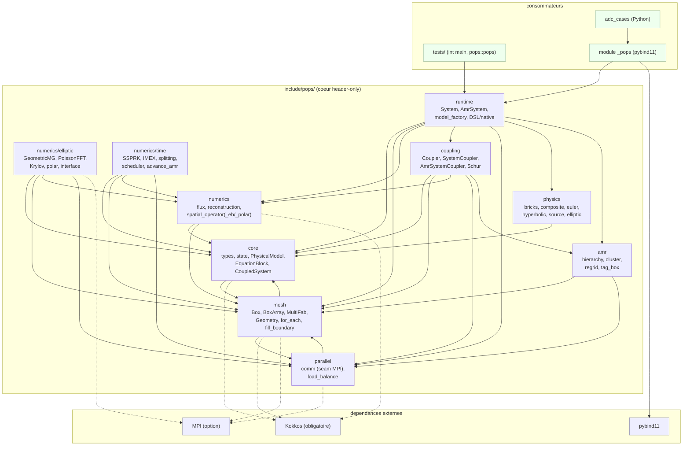
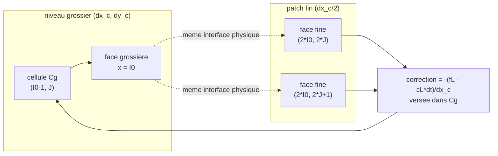
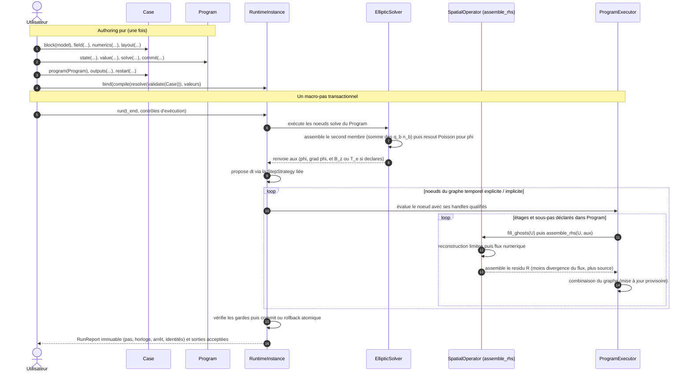
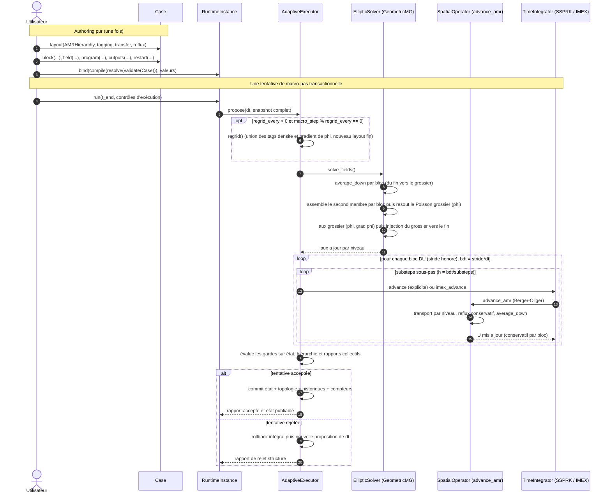

# Architecture of PoPS

PoPS is the header-only C++20 core for coupled hyperbolic-elliptic systems on
adaptive mesh (AMR), written for MPI + Kokkos (Kokkos is the ONLY on-node backend: Serial /
OpenMP / Cuda depending on the install; the standalone OpenMP backend was removed). The generic physics bricks
([`include/pops/physics/`](../include/pops/physics)) and the library's Python bindings (module
`pops` and compiled extension `_pops`) live here. `System` / `AmrSystem` are private native
execution engines behind `RuntimeInstance`, never Python authoring facades; the
neighboring repository `adc_cases` only contains Python use cases that import this module. The
core is model-agnostic: it names no scenario, it provides bricks composed in
`CompositeModel`. The layers are orthogonal (physics, numerics, data/mesh, execution,
time/coupling) and a high layer never depends on an execution detail.


## Contents

- [Overview](#overview)
- [The layers](#the-layers)
- [Component contracts and generated catalog](#component-contracts-and-generated-catalog)
- [Grid conventions](#grid-conventions)
- [AMR coarse-fine stencil (reflux)](#amr-coarse-fine-stencil-reflux)
- [Pipeline of a time step](#pipeline-of-a-time-step)
- [Verified properties](#verified-properties)
- [Backends](#backends)
- [Thread safety](#thread-safety)
- [Using the library](#using-the-library)
- [Limitations](#limitations)
- [Tree](#tree)

---
## Overview

The diagram below shows the public modules of [`include/pops/`](../include/pops), the
real external dependencies, and the consumers of the core. The arrows are the inclusions
actually present in the headers (verified by `grep '#include <pops/...>'`). The
external edges: **Kokkos is required** (the only on-node backend: `POPS_USE_KOKKOS` ON by default,
found by `find_package` or fetched by FetchContent); MPI is optional (`POPS_USE_MPI`);
pybind11 only serves the Python module. The sequential path goes through Kokkos Serial, not through a host loop
without Kokkos. Fidelity note: the project embeds neither Eigen, nor fftw, nor Catch2; the FFT of
[`numerics/elliptic/poisson_fft.hpp`](../include/pops/numerics/elliptic/poisson/poisson_fft.hpp) is written
by hand, and the tests are `int main` programs that link `pops::pops` (no third-party
framework).




## The layers

PoPS is organized into five orthogonal layers. A high layer expresses the problem, a low layer executes it; a high layer never depends on an execution detail. The structuring separation: the containers (what stores) are distinct from the execution policy (how one loops and communicates).

**Physics (local, device-callable).** The `PhysicalModel` concept ([`include/pops/core/model/physical_model.hpp`](../include/pops/core/model/physical_model.hpp)) only exposes local and pointwise laws, all `POPS_HD`: `flux`, `source`, `max_wave_speed`, `elliptic_rhs`. No access to storage nor to parallelism; no allocation in hot loops, no `std::function`, no dynamic polymorphism. The core is model-agnostic: a model is a composition (`CompositeModel`, [`include/pops/physics/composition/composite.hpp`](../include/pops/physics/composition/composite.hpp)) of generic bricks ([`include/pops/physics/bricks/bricks.hpp`](../include/pops/physics/bricks/bricks.hpp)) on three axes (transport / source / elliptic), the scenario names living on the application side. The `aux` channel carries `(phi, grad_x, grad_y)` and is extensible (`B_z`, `T_e`). The geometry (cartesian / polar / disk) is a config axis of the mesh, not of the model.

**Numerics / discretization.** The local numerical logic: Riemann flux ([`include/pops/numerics/fv/numerical_flux.hpp`](../include/pops/numerics/fv/numerical_flux.hpp): Rusanov / HLL / HLLC / Roe, `POPS_HD` policies), MUSCL + WENO5-Z reconstruction ([`include/pops/numerics/fv/reconstruction.hpp`](../include/pops/numerics/fv/reconstruction.hpp)), the elliptic operator ([`include/pops/numerics/elliptic/`](../include/pops/numerics/elliptic/)) and the logical BCs ([`include/pops/mesh/boundary/physical_bc.hpp`](../include/pops/mesh/boundary/physical_bc.hpp)). We distinguish the point-wise policies (flux, reconstruction, stencil: they take states, see no container) from the grid operators (`assemble_rhs`, [`include/pops/numerics/spatial_operator.hpp`](../include/pops/numerics/spatial_operator.hpp)) which loop over a `Box` via a local view `Array4` but ignore the decomposition into boxes/ranks and the backend. The geometry variants are purely additive: [`spatial_operator_eb.hpp`](../include/pops/numerics/spatial/embedded_boundary/operator.hpp) (cut-cell) and [`spatial_operator_polar.hpp`](../include/pops/numerics/spatial/operators/polar_operator.hpp), the cartesian remaining bit-identical.

**Mesh / data.** What stores: `box2d`, `box_array` ([`include/pops/mesh/layout/box_array.hpp`](../include/pops/mesh/layout/box_array.hpp)), `distribution_mapping` ([`include/pops/mesh/layout/distribution_mapping.hpp`](../include/pops/mesh/layout/distribution_mapping.hpp)), `multifab` ([`include/pops/mesh/storage/multifab.hpp`](../include/pops/mesh/storage/multifab.hpp)), `geometry` (cartesian + `PolarGeometry`, [`include/pops/mesh/geometry/geometry.hpp`](../include/pops/mesh/geometry/geometry.hpp)) and the AMR hierarchy. These containers carry the distributed fields and their halos; they do not know how one loops nor communicates.

**Execution (seams).** The execution policy, reduced to seams that only see minimal views (Box2D, `Array4`, scalar, rank), never `BoxArray` nor `DistributionMapping`: `for_each_cell` ([`include/pops/mesh/execution/for_each.hpp`](../include/pops/mesh/execution/for_each.hpp), serial / OpenMP / Kokkos dispatch) takes a box and an `POPS_HD(i, j)` lambda; the POD view `Array4` ([`include/pops/mesh/storage/fab2d.hpp`](../include/pops/mesh/storage/fab2d.hpp)) is identical host/device; `comm` ([`include/pops/parallel/comm.hpp`](../include/pops/parallel/comm.hpp)) does rank/size, all-reduce, barrier (serial / MPI identity); the allocator ([`include/pops/core/foundation/allocator.hpp`](../include/pops/core/foundation/allocator.hpp)) manages the storage of the Fabs. The halo exchange (`fill_boundary`) and the reductions / `saxpy` (`mf_arith`) are not this layer: they are grid operators that orchestrate the seams.

**Time / coupling.** The layer that composes operators without knowing their implementation contains SSPRK ([`include/pops/numerics/time/integrators/ssprk.hpp`](../include/pops/numerics/time/integrators/ssprk.hpp)), IMEX asymptotic-preserving ([`include/pops/numerics/time/schemes/imex.hpp`](../include/pops/numerics/time/schemes/imex.hpp)) and low-level generic `lie_step` / `strang_step` helpers ([`include/pops/numerics/time/schemes/splitting.hpp`](../include/pops/numerics/time/schemes/splitting.hpp)). A `TimePolicy` ([`include/pops/numerics/time/integrators/time_integrator.hpp`](../include/pops/numerics/time/integrators/time_integrator.hpp)) names simple per-block native treatments. Arbitrary production composition is authored through `pops.Program`; `pops.lib.time` presets are ordinary IR builders, and no native `SystemStepper` branch selects a named split or condensed source stage. The fluid <-> Poisson coupling is carried by a `CouplingPolicy` ([`include/pops/coupling/base/coupling_policy.hpp`](../include/pops/coupling/base/coupling_policy.hpp)) which decides the order of operations and the synchronizations, without owning the data nor knowing the backend: `Coupler` single-model ([`include/pops/coupling/single/coupler.hpp`](../include/pops/coupling/single/coupler.hpp)), `SystemCoupler` multi-species single-level ([`include/pops/coupling/system/system_coupler.hpp`](../include/pops/coupling/system/system_coupler.hpp)), `AmrCouplerMP` AMR multi-box ([`include/pops/coupling/amr/amr_coupler_mp.hpp`](../include/pops/coupling/amr/amr_coupler_mp.hpp)). On the public Python surface, inter-species terms are declared with `Model.coupled_rate(...)`, called at explicit stages in the whole-system `Program`, and advanced or solved by that Program. Source-timescale stability is likewise a Program authority, declared explicitly with `Program.set_dt_bound(...)`; it is not inferred by registering a separate public coupling object. At the lower native layer, the private `CouplingOperator` engine ([`include/pops/coupling/source/coupling_operator.hpp`](../include/pops/coupling/source/coupling_operator.hpp)) still wraps the flat coupled-source program with its declared conservation metadata and native frequency-bound field for engine validation and read-only introspection. This is an implementation representation consumed by installation/lowering, not a second authoring path. Named physical couplings may be Python presets that build `Model.coupled_rate` plus Program IR; there is no named C++ coupling method per coupling.


## Component contracts and generated catalog

Every source, native, or externally supplied component crosses composition and loading boundaries
with a schema-v2 `ComponentManifest`. The manifest is an immutable contract, not a report assembled
after lowering. Its stable component identifier is the namespaced `uri` plus semantic `version`; its
semantic payload declares the component type and facets, call signature, reads and writes,
parameters, provided interfaces, requirements and capabilities, effects, admissible layouts and
clocks, correlated target variants (dimension/scalar/device/required features), determinism,
restart schema, precision,
conservation properties, and named entry points.

Two domain-separated identities are deliberate:

- `semantic_digest` covers every behavior-bearing field and every registered semantic extension;
- `manifest_digest` additionally covers documentary extensions and is the identity of the complete
  manifest.

Changing a summary or provenance note therefore does not invalidate scientific semantics. A
semantic extension must name an absolute schema URI and a positive schema version, and must be
validated by a registered `ComponentExtensionSchema`; unversioned or unknown semantic extension
data is refused. Unknown top-level fields are also refused. Values use the closed PoPS canonical
CBOR vocabulary (no binary floats or opaque Python values), so Python and C++ produce identical
bytes and SHA-256 identities.

Builtin routes and model bricks have one declaration authority:
[`schemas/component_catalog.v2.json`](../schemas/component_catalog.v2.json). It owns stable wire IDs,
aliases, native entry points, requirements, limitations, route metadata, component defaults, and the
manifest/capability schema versions. [`scripts/generate_component_catalog.py`](../scripts/generate_component_catalog.py)
generates the Python route/schema products and the C++ catalog header. `routes.py`, `route_ids.hpp`,
and the Python/C++ brick inspection APIs contain behavior only; they must never declare mirrored
rows or fallback defaults. The generator's `--check` mode is a CI drift gate. The semantic catalog
digest enters native route signatures and compiled-artifact cache keys; the full digest additionally
authenticates documentary summaries and limitations without forcing recompilation.

Adding a builtin component is consequently one catalog change followed by regeneration. Adding an
external family does not require a base-class branch: it implements the small facet protocols named
by its manifest, registers that manifest, and lowers through an advertised entry point. Unsupported
targets and missing capabilities fail with a path, error code, and machine-readable evidence before
native execution.

## Grid conventions

The code separates the index space (integer, without physical dimension) from the physical space
(cell centers). The index space is carried by [`Box2D`](../include/pops/mesh/index/box2d.hpp),
a pair of inclusive corners `lo[2]` / `hi[2]` (AMReX convention); the box is empty as soon as
`hi[d] < lo[d]`. The correspondence to the physical is carried by
[`Geometry`](../include/pops/mesh/geometry/geometry.hpp) (cartesian) and `PolarGeometry` (annular), both
trivial PODs whose accessors are annotated `POPS_HD` to stay callable from a
device kernel without returning garbage value under nvcc.

Three modules carry a grid, each with its own convention. The table below fixes
the notations used in the rest of this section.

### Cartesian single-level runtime, $N_x \times N_y$

`System` ([`include/pops/runtime/system.hpp`](../include/pops/runtime/system.hpp)) carries a single
grid shared by all the blocks (species). The configuration lives in `SystemConfig`.

| champ `SystemConfig` | role |
| --- | --- |
| `n` | cells per direction, domain $n \times n$ |
| `L` | size of the square domain $[0, L]^2$ |
| `periodic` | periodic domain (otherwise free outflow in transport) |
| `geometry` | `"cartesian"` (default) or `"polar"` |

The index box is `Box2D::from_extents(n, n)`, i.e. $[0, n-1] \times [0, n-1]$. The cell
center is defined for any index, ghosts included (negative indices): `Geometry::x_cell(i)`
returns $x_{lo} + (i + 1/2)\,dx$ with $dx = (x_{hi} - x_{lo}) / N_x$ and likewise in $y$. The mesh is
therefore uniform and the cell center exists even outside the valid domain, which allows filling
the ghost layers by simple evaluation.

### Polar single-level runtime, ring $n_r \times n_\theta$

When `geometry == "polar"`, the same `System` runs on a global ring $(r, \theta)$ described by
`PolarGeometry`. The axis convention is fixed: the index-0 direction is radial (i traverses
$r$ from `r_min` to `r_max`), the index-1 direction is azimuthal (j traverses $\theta$ from $0$ to
$2\pi$).

| champ `SystemConfig` | role |
| --- | --- |
| `nr` | radial cells ($0 \Rightarrow$ takes `n`) |
| `ntheta` | azimuthal cells ($0 \Rightarrow$ takes `n`) |
| `r_min`, `r_max` | physical radial bounds of the ring |

The resolution `0 -> n` is wired on the facade side: `polar_nr` / `polar_ntheta` in
[`src/runtime/system/system.cpp`](../src/runtime/system/system.cpp) return `c.nr > 0 ? c.nr : c.n` (same for `ntheta`), and the
index box becomes `Box2D::from_extents(polar_nr(c), polar_ntheta(c))`. The mesh is uniform
in index: $dr = (r_{max} - r_{min}) / N_r$ and $d\theta = 2\pi / N_\theta$. The physical mesh in
$\theta$ equals $r\,d\theta$ and therefore grows with $r$; this is the origin of the $1/r$ metric of the
polar divergence (cf. `assemble_rhs_polar`). `PolarGeometry` distinguishes center and face: `r_cell(i)`
$= r_{min} + (i + 1/2)\,dr$, `r_face(i)` $= r_{min} + i\,dr$ (the face $i = 0$ is exactly
$r_{min}$, the face $i = N_r$ is $r_{max}$). In polar, $\theta$ is periodic and $r$ carries a physical BC
in `r_min` / `r_max`; the facade therefore sets `per_ = {false, false}` and `periodic_ = false`
when `polar_` is true.

The polar is `nr != ntheta` in general (the grid is not square), contrary to the cartesian
$n \times n$.

### Adaptive runtime: hierarchy of levels at constant physical extent

`AmrSystem` ([`include/pops/runtime/amr_system.hpp`](../include/pops/runtime/amr_system.hpp)) is the
refined counterpart of `System`: one or more blocks carried over a hierarchy of levels
(currently two levels, ratio 2). The configuration lives in `AmrSystemConfig`.

| champ `AmrSystemConfig` | role |
| --- | --- |
| `n` | cells of the coarse level per direction |
| `L` | size of the square domain $[0, L]^2$ |
| `regrid_every` | re-refinement every $N$ steps ($0 =$ never after init) |
| `periodic` | periodic domain |
| `distribute_coarse` | coarse replicated (default) or multi-box distributed (strong-scaling) |
| `coarse_max_grid` | tile size of the distributed coarse ($0 \Rightarrow n/2$) |

The refinement is not a refinement of the physical mesh: `Geometry::refine(r)` and
`Box2D::refine(r)` preserve the physical extent $[x_{lo}, x_{hi}]$ and refine the index space.
A coarse cell $[lo, hi]$ becomes a block $r \times r$ of fine indices
$[lo \cdot r,\; hi \cdot r + r - 1]$; the inverse `coarsen(r)` is a floor division of each
corner, which stays coherent on both sides of zero (negative ghosts). With a ratio 2, a fine
level therefore has a mesh $dx_f = dx_c / 2$ at unchanged physical domain.

The multi-block co-locates N species on a shared hierarchy (same `BoxArray`, same
`DistributionMapping`, same $dx, dy$ per level); the multi-block supports `regrid_every > 0` (the union-tag regrid rebuilds the
hierarchy from all blocks' tags; `regrid_every == 0` keeps it frozen). Conservation is guaranteed per block via reflux and average_down, described
below.

## AMR coarse-fine stencil (reflux)

At a 2:1 interface between a coarse level and a fine patch, the numerical flux computed on the
coarse side and the flux computed on the fine side do not coincide: without correction, the bordering
coarse cell would lose conservation. The reflux corrects the bordering coarse cell by replacing its
coarse flux contribution with the time-integrated fine flux crossing the same physical interface.

For the ratio 2 of the code, a coarse face at the interface is covered by two fine faces.
The schema below shows a bordering coarse cell `Cg` to the left of the interface and the two
fine sub-faces `f0`, `f1` of the patch that adjoin it.



The mechanics is carried by
[`amr_reflux_mf.hpp`](../include/pops/numerics/time/amr/reflux/amr_reflux_mf.hpp), which is only an umbrella
including the sub-headers; the types of the interface live in
[`amr_patch_range.hpp`](../include/pops/numerics/time/amr/levels/amr_patch_range.hpp) and the subcycling that
drives them in [`amr_subcycling.hpp`](../include/pops/numerics/time/amr/levels/amr_subcycling.hpp).

Three objects share the work.

- `FluxRegister` is a coarse buffer with global indexing over a region. Each rank writes there
  its local contributions (0 elsewhere), `gather()` sums them by `all_reduce_sum_inplace`, then
  each rank reads the total via `at()`. In serial the all-reduce is the identity, hence bit-identical.
  `set` overwrites (average_down path), `add` accumulates while staying bounded to the region (reflux path).

- `CoverageMask` (and its envelope `CoarseFineInterface`) marks, on the coarse region, the
  cells shadowed by a fine patch. The mask is built on the global `BoxArray` of the fine patches,
  known by all the ranks, hence MPI-safe. `covered(I, J)` prevents the double-reflux of a
  fine-fine joint: we only pour a correction onto a bordering coarse cell not covered by an
  other patch.

- The per-patch register (`RegMP` or the local `Reg` of the subcycling) stores, along the border of
  the parent footprint $[I_0..I_1] \times [J_0..J_1]$, two sets of arrays: `cL, cR, cB, cT` =
  coarse flux (without dt) read once at the start, and `fL, fR, fB, fT` = time-integrated fine flux,
  accumulated substep after substep during the Berger-Oliger subcycling.

The accumulation of the fine flux is exactly the sum of the two sub-faces on each substep:
along the left border of the patch, `subcycle_level_mp` does

`g.fL[(J - g.J0) * nc + k] += 0.5 * (FX(2*g.I0, 2*J, k) + FX(2*g.I0, 2*J+1, k)) * dt`

(and symmetrically `fR` at `2*g.I1 + 2`, `fB` / `fT` on the $y$ faces). The two fine faces are
averaged by the factor $0.5$, time-integrated by `* dt` of the substep, and the `+=` accumulates on the
two substeps of the ratio 2.

The final pour is carried by `CoarseFineInterface::route_reflux`. On each bordering coarse
cell not covered, it adds to the register

$$
\text{ref.add}(I_0 - 1,\, J,\, k) \mathrel{+}= -\frac{f_L - c_L \cdot dt}{dx_c}
$$

on the left, $+(f_R - c_R \cdot dt)/dx_c$ on the right, and likewise in $y$ with $dy_c$ ($f_B$, $f_T$,
divided by $dy_c$). One sees the conservative structure: $f_\bullet$ is already the sum of the fine
time-integrated fluxes, $c_\bullet \cdot dt$ is the coarse flux that the cell has already taken in during
the macro-step, and the sign (negative on the left / at the bottom, positive on the right / at the top) follows the
divergence convention of the scheme. The parent footprint is computed by
`PatchRange` ($I_0 = lo/2$, $I_1 = (hi-1)/2$), historically distinct from `Box2D::coarsen` to
preserve the bit-identical arithmetic. The average_down (`mf_average_down_multi` /
`mf_average_down_mb`) then overwrites each covered coarse cell with the $0.25$ average of the
four fine cells, closing the coarse/fine coherence.


## Pipeline of a time step

The time step has two runtime targets that share one generated Program grammar but distinct storage
providers: `System` on a single-level grid and
`AmrSystem` on adaptive hierarchy. Both are private execution engines materialized by `pops.bind`
from one authenticated install plan; their low-level setters and block installers are not authoring
APIs. The plan declares field providers, composes each block and binds its initial state atomically.
It is the macro-step that differs.

### Single-level runtime execution

The core is `SystemStepper::step_cfl` (and `step`), in
[`include/pops/runtime/system/system_stepper.hpp`](../include/pops/runtime/system/system_stepper.hpp). The order is an
explicit invariant (cf. the contract at the head of the file): without an installed Program it runs
`solve_fields`, advances each due transport block, applies inter-block couplings and advances the
clock. With an installed Program, the authored Program owns every stage and the runtime only supplies
cadence, data and operator/provider seams.

The `solve_fields` delegates to `SystemFieldSolver`
([`include/pops/runtime/system/system_field_solver.hpp`](../include/pops/runtime/system/system_field_solver.hpp)): it
solves the system Poisson whose right-hand side is the sum of the elliptic bricks of the blocks
($f = \sum_b q_b\, n_b$), then derives the aux. The aux is the shared channel that carries $\phi$ and $\nabla\phi$
(components 1 and 2), plus optionally $B_z$ and $T_e$.

The mapping from a field-solve output (the handle `phi`, `grad_x`, `grad_y`, or a model-named field)
to the real aux component it lands in is described by a typed `AuxLayout`
([`include/pops/runtime/context/aux_layout.hpp`](../include/pops/runtime/context/aux_layout.hpp)): a
host-only descriptor that WRAPS the fixed component truth of
[`include/pops/core/state/state.hpp`](../include/pops/core/state/state.hpp) (it never redefines the
`kAux*` constants) so a report or a validation step can name outputs instead of magic indices. One
field solve carries a `FieldContext`
([`include/pops/runtime/context/field_context.hpp`](../include/pops/runtime/context/field_context.hpp)),
a validity token recording which field problem, block and stage produced the aux: a context solved for
one stage cannot be silently read as another. These are descriptors around already-computed values;
they add no numerics.

Field solve legality is resolved from the owner-qualified Python `FieldSolvePlan` and its capability
proof before native artifact creation.  The native runtime receives only authenticated prepared
providers and executable operator callbacks; it does not maintain a second closed enum registry or
privilege a field named `phi`.

Each resolved field install carries the ordered, block-qualified RHS provider pack, output route,
method/solver options, four complete physical-face laws, hierarchy policy, and nullspace/gauge proof.
Non-constant Robin/Dirichlet/Neumann laws are compiled into named device launchers: runtime parameters
are copied into POD functors before launch. Pointwise dependencies use the explicit
`pops.fields.boundary_value(handle, component)` expression, while `logical_time(...)` reads the exact
Program-supplied time point; the resolver turns both into ordered direct-buffer/POD slots. Handles
remain Boolean/hashable identities and a vector state cannot be sampled without naming its component.
An iterate-dependent law installs its exact symbolic JVP and requires an explicit nonlinear solver,
and a device-invalid denominator is reduced to one rank-consistent witness before the solve can
publish. Uniform state/field dependencies and single-level AMR state dependencies are prepared
outside the iteration; multilevel AMR state providers and AMR field-to-field providers are rejected
until a per-level materialization contract exists. No route falls through to a Python callback or a
per-cell registry lookup.
Linear and nonlinear field routes both retain the accepted warm start until their `SolveReport` is
consumed; an invalid boundary evaluation or iteration limit restores that value and cannot update the
published aux channel.

Nullspace dimension is derived from operator, boundary closure, and the material topology, while the
gauge remains an explicit representative choice. The Cartesian topology recipe is an explicit
axis-neighbor cell graph with its periodic and coarse/fine identifications; its connected-component
derivation proves one full-domain component (and, for composite AMR, masks coarse cells covered by
finer levels).
An embedded-boundary field solve or a level-local solve over partial AMR BoxArrays is therefore
refused until its material connectivity and coarse/fine boundary closure can be materialised; PoPS
does not pretend that a single constant mode covers an unknown disconnected topology.  Every AMR
topology replacement increments a runtime epoch embedded in the nullspace recipe, so no coverage mask
survives a regrid or restart hierarchy rebuild.

That derivation belongs only to an installed `FieldDiscretization` provider. A generic matrix-free
`LinearProblem` has no such provider authority and therefore never infers a nullspace from its stencil,
BC names, periodic axes, or preconditioner. Its author must always write `nullspace=None` or pair
`nullspace=ConstantNullspace()` with exactly one `MeanValueGauge(value)`. The latter route is scalar-only.
Because a right constant kernel alone does not prove invariance of the mean-zero complement, it also
requires at least the explicit `LinearOperatorProperties.symmetric_operator()` certificate.
Both choices are snapshotted into exact schema-v1 `nullspace_contract` / `gauge_contract` IR records;
mutating the authoring gauge later cannot alter graph identity or lowering. Until a provider exports a
real complement-preservation certificate, the constant-nullspace Krylov route accepts only
`preconditioners.Identity()`. The hierarchy-wide `CompositeTensorFAC` route rejects that contract
rather than pretending that a per-level gauge is a composite AMR gauge.

`LinearOperatorProperties` independently carries exactly three Boolean facts: symmetry, global
positive-definiteness, and positive-definiteness on the declared nullspace complement. Its four
canonical certificates are `general()`, `symmetric_operator()`,
`symmetric_positive_definite()`, and
`symmetric_positive_definite_on_nullspace_complement()`. Global and complement
positive-definiteness are mutually exclusive. Consequently CG requires the global SPD certificate
when `nullspace=None`, and the complement-SPD certificate for `ConstantNullspace`; PoPS never swaps
methods or upgrades a certificate from stencil metadata.

Field warm starts are checkpoint payloads keyed by the complete qualified provider slot.  The AMR v3
reader validates topology, ownership maps, state, aux, potentials, provider slots and history rings
before its first write, then restores the hierarchy through the final clock update inside one native
accepted-state transaction.  Any exception restores the previous hierarchy, data, field warm starts,
histories, diagnostics and cadence counters; a partially restored simulation is never observable.
The sealed accepted-state contract also records the topology epoch and regrid count, exact rational
level clocks, owner/state/space-qualified ring slots, lagged effective-flux publications, parent/child
temporal relations and every required transfer route.  Restart compares the bound identities and this
provenance before mutation.  Multi-block and active-regrid layouts use this same strict route; PoPS does
not silently degrade to a weaker regrid-on-restart guarantee.

The transport of a block, in turn, reads this aux:
`advance_transport` routes toward the closure `s.advance` (full path) or its disk variants, and
this closure does `fill_ghosts` then `assemble_rhs` (limited reconstruction then numerical flux ->
$R = -\mathrm{div} F + S$) at each SSPRK stage (cf.
[`include/pops/numerics/time/integrators/ssprk.hpp`](../include/pops/numerics/time/integrators/ssprk.hpp), `SSPRK2Step` /
`SSPRK3`). The step $dt$ returned by `step_cfl` is the min over the evolutive blocks of
$cfl \cdot h \cdot \mathrm{substeps}_b / (\mathrm{stride}_b \cdot w_b)$, with $h = \min(dx, dy)$ in
cartesian and $h = \min(dr,\, r_{\min}\, d\theta)$ in polar.



Le `RunReport` compte les macro-pas acceptés et les tentatives rejetées de l'appel, expose le temps et
le macro-pas finaux ainsi que les identités authentifiées du run, du bind, du contexte d'exécution et
de l'artefact. Un run qui échoue lève une exception ; il ne retourne jamais un rapport marqué succès.

Strang and Lie composition are Program macros (`pops.lib.time.strang` / `lie`). They lower explicit
sub-flows into the same IR rather than selecting a native `System` stepper branch.

### Adaptive runtime execution

On the adaptive hierarchy, `AmrSystem::step`
([`include/pops/runtime/amr_system.hpp`](../include/pops/runtime/amr_system.hpp)) forces the lazy build
then delegates to the multi-block engine `AmrRuntime::step`
([`include/pops/runtime/amr/amr_runtime.hpp`](../include/pops/runtime/amr/amr_runtime.hpp)) (or, in single-block, to
the closure `step_fn` of an `AmrCouplerMP`). The engine adds two steps proper to the adaptive around
the same skeleton.

First the periodic regrid: if `regrid_every > 0` and the macro-step falls on the cadence
(`macro_step_ % regrid_every == 0`, and not at the very first step), `regrid()` re-grids the hierarchy
from the union of the tags of all the blocks plus the tag of $|\nabla\phi|$, applies a single new
fine layout to all the blocks and to the shared aux. Then `solve_fields`: it first does an
`average_down` per block (fine -> coarse), assembles the co-located summed right-hand side
($f = \sum_b r_b(U_b)$ (each $r_b$ = `elliptic_rhs` of the block)), solves the coarse Poisson by geometric multigrid,
derives the coarse aux ($\phi$, $\nabla\phi$ via `field_postprocess`), then injects the coarse aux
to the fine levels (`coupler_inject_aux_mb`). The transport of each block DU is then `advance`
(explicit transport: `advance_amr` = Berger-Oliger + conservative reflux + `average_down`) or
`imex_advance` (source-free transport + stiff implicit source `backward_euler_source`), subcycled
`substeps` times on the effective step $\mathrm{stride} \cdot dt$. Finally `coupled_source_step` applies the
inter-species sources by splitting, before `advance the macro-step counter`.



The parallel between the two pipelines is deliberate: `AmrRuntime::solve_fields` reproduces
`AmrSystemCoupler::solve_fields` (the compile-time counterpart), and the sequence (solve the elliptic;
transport per block honoring stride/substeps; source; advance the macro-step counter) is the
same as that of `SystemStepper`. The difference lies in the transport engine (`assemble_rhs` full
versus `advance_amr` Berger-Oliger with reflux and `average_down`), in the coarse -> fine injection of the aux
and in the periodic regrid, proper to the hierarchy.


## Verified properties

The library distinguishes two safety nets (cf. [`docs/ARCHITECTURE.md`](ARCHITECTURE.md) section 11): the bit-identical is a software net (the refactoring did not break anything), not a numerical proof. Both are necessary. The properties below are those actually measured by the test suite, not objectives.

**Mass conservation at round-off.** The finite-volume scheme is conservative by telescoping of the
fluxes; at coarse/fine interfaces the FluxRegister reflux closes the same balance. A condensed Program
freezes density during its implicit sub-flow, so any density change comes from the explicitly authored
transport/coupling sub-flows. The AMR conservation suites validate the resulting ledger at round-off.

**MPI bit-identical outputs np=1/2/4.** The distributed multipatch (FillPatch / FluxRegister 2-level) is bit-identical to the single-process reference on the MPI ctest entries (`-DPOPS_USE_MPI=ON`, np=1/2/4). `test_mpi_mbox_parity`, `test_mpi_amr_compiled_parity`, `test_generic_krylov`, `test_schur_condensation`, `test_mpi_poisson` and their `_np1/2/4` variants pass in CI in the MPI job. Honest caveat documented: a distributed multi-box coarse is not bit-identical on the global sums (the FMA reduction order changes), but the `max` stays exact and the behavior stays correct.

**Device-clean kernels GH200.** The Kokkos Cuda backend has been validated on GH200 (node `armgpu`, `Kokkos_ARCH_HOPPER90`, `nvcc_wrapper`, OpenMPI CUDA-aware) with components bit-identical to CPU: single-grid System, AMR field operations (flux_register, diffusion), multi-GPU MPI halos (fill_boundary np=1/2/4, gfails=0), screened and anisotropic EPM (`dmax=0`), B_z per AMR level (`dmax=0`), compiled path with named functors multi-box and MPI. The integrated validation AmrSystem + MPI + GPU is done (the three axes in a single run, np=1/2/4, `dmax=0`, mass conserved at `0`). These harnesses live in `tests/gpu/romeo/` (out of CI for lack of GPU runner). A component variant that does not declare and prove the selected GPU execution context is refused; there is no implicit host fallback. Multi-rank additive sums are not bit-exact across np (FMA order), and the AMR strong-scaling by distributed coarse is negative at this scale.

**Parity of authenticated generated blocks.** The private native block artifact specializes the same
catalog-selected templates as the builtin leaf. `test_compiled_model_parity` validates their numerical
parity on CPU/Serial, and `test_amr_compiled_model` validates the hierarchy installation. This is a
test oracle, not a second public registration route or a compatibility fallback. The generic native
component protocol separately proves its exact interface and target variant before installation.

## Backends

The backends (Kokkos, MPI, HDF5) are a property of the library, not a flag per target. They are attached to the interface target `pops`: everything that links `pops` (core tests, downstream applications) inherits the backend chosen at configuration. Kokkos is the ONLY on-node backend and it is required (the serial goes through Kokkos Serial, not through a manual C++ loop). One configures once (cf. [`docs/ARCHITECTURE.md`](ARCHITECTURE.md) section 9):

```
# Kokkos est obligatoire mais PAS forcement pre-installe : trouve s'il existe (-DKokkos_ROOT),
# sinon recupere + construit automatiquement (FetchContent). La cible on-node = options Kokkos_ENABLE_*.
cmake -B build                                       # serie : Kokkos fetch+build auto (Serial defaut)
cmake -B build -DKokkos_ENABLE_OPENMP=ON             # CPU multi-thread (Kokkos OpenMP, fetch)
cmake -B build -DKokkos_ROOT=$K                       # reutilise une install Kokkos existante
cmake -B build -DKokkos_ROOT=$K -DCMAKE_CXX_COMPILER=$K/bin/nvcc_wrapper  # GPU Cuda (install nvcc_wrapper)
cmake -B build -DPOPS_USE_MPI=ON                       # + distribue (POPS_HAS_MPI + MPI::MPI_CXX)
```

**Kokkos: the only on-node backend.** Kokkos covers the sequential (Serial), the multi-thread CPU (OpenMP) AND the GPU (Cuda/HIP) with a single code, without any CUDA kernel written by hand nor `#pragma omp`. The target is chosen by the options `Kokkos_ENABLE_SERIAL` / `Kokkos_ENABLE_OPENMP` / `Kokkos_ENABLE_CUDA` -- at config (FetchContent path) or at the install of Kokkos (`-DKokkos_ROOT` path), not by an pops flag. Kokkos is REQUIRED but does not need to be pre-installed: CMake does `find_package(Kokkos)` then, failing that, fetches it via FetchContent (version `POPS_KOKKOS_FETCH_VERSION`, default 4.4.01, tarball verified by SHA256). Configuring without Kokkos (`-DPOPS_USE_KOKKOS=OFF`) is a fatal error, and the seam `for_each_cell` does not compile without `POPS_HAS_KOKKOS`. The standard is C++20 (nvcc CUDA 12.x does not offer `-std=c++23`); the kernels marked `POPS_HD` and the seam `for_each_cell` are compiled for the chosen execution space. CI plays Kokkos Serial (gate `build-and-test`, C++ + Python) and, since the `ci-full` job, Kokkos OpenMP (`Kokkos_ENABLE_OPENMP=ON`). CI never builds `-DKokkos_ENABLE_CUDA=ON`: all the Kokkos Cuda cells are therefore ROMEO (manual GH200 validation) or unknown.

**MPI: distributed, optional.** `-DPOPS_USE_MPI=ON` defines `POPS_HAS_MPI` and links `MPI::MPI_CXX`. The `if(POPS_HAS_MPI)` block of the CMake compiles the MPI-only tests, each replayed at np=1/2/4. Out of MPI (a single process), the seam `comm` ([`include/pops/parallel/comm.hpp`](../include/pops/parallel/comm.hpp)) degenerates to the identity (rank 0, size 1, all-reduce and barrier no-op), so that a binary linked MPI but launched single-process behaves like a single-rank run. MPI + Kokkos Cuda multi-GPU is validated on ROMEO for 10 Krylov/Schur/MPI-kernel tests (rank-invariant np=1/2/4, `dmax=0`).

**The seam `for_each_cell`.** The seam point that makes all this possible is `for_each_cell(box, f)` in [`include/pops/mesh/execution/for_each.hpp`](../include/pops/mesh/execution/for_each.hpp). It expresses an execution policy, not numerical logic: it takes a `Box` and an `POPS_HD(i, j)` lambda, and compiles into `Kokkos::parallel_for` (Serial / OpenMP / Cuda depending on the Kokkos install). The numerical logic stays in the lambda (layer 2: discretization), never in the seam; growing it into `for_each_cell(U, grid, ghosts, mpi, bc, amr, ...)` would recreate an opaque framework. A grid operator sees a local view `Array4` + `Box`, but neither the `DistributionMapping` nor the loop policy. The reductions share the same philosophy: `for_each_cell_reduce_sum` / `_max` carry the deterministic reducers `Kokkos::Sum` / `Max` (the `sum` reassociates the addition by tile -- deterministic/idempotent but not bit-identical to a lexicographic sum, for all the Kokkos spaces; the `max` stays exact).

## Thread safety

The execution model is pure data parallelism, no threads sharing an arbitrary mutable state. What is safe and what is not follows directly from the mesh/data vs execution separation (layers 3-4, section 4 of the architecture).

**Reentrant / without shared state.**
- The body of `for_each_cell` is an `POPS_HD(i, j)` lambda that writes the cell `(i,j)` of its own local view `Array4`. As long as the kernel only writes its cell (cell-by-cell FV idiom), there is no race: each iteration touches a disjoint address. This is the basis of the Serial / OpenMP / Cuda portability without lock.
- A grid operator receives a local view (`Array4` + `Box`) and sees neither the `DistributionMapping`, nor the MPI rank, nor the loop policy. It is therefore independent of the decomposition into boxes/ranks and reentrant on distinct fabs.
- The reductions go through the deterministic reducers `for_each_cell_reduce_sum` / `_max`: the accumulation is managed by Kokkos (no shared host accumulator written concurrently), which avoids the hand-made reduction races.

**Not shared / to sequence explicitly.**
- Unified memory + fence: on GH200 the memory is unified (a single buffer). Any function that launches a device kernel then reads the same memory in a host loop must call `device_fence()` (= `sync_host()`) between the two, otherwise host/device race invisible in CPU CI. This is, according to CHOICES.md, the most subtle bug of the repository. The assumed choice is the explicit fence separate from the access (not a `Memory<T>`-like type that hides the barrier in the accessor). The detection net is `romeo/sanitizer.sbatch` (compute-sanitizer) plus the bit-identical CPU vs GPU checksum of `diocotron_amr_kokkos`, which diverges if a fence is missing.
- Halo writes: the three families of ghosts (physical, parallel, coarse-fine) are sequenced steps, not concurrent with the interior computation. `fill_ghosts` is an explicit composition `fill_boundary` (exchange) then `fill_physical_bc` (BC at the border); it executes between two sweeps, not during.
- MPI communication: the seam `comm` is not designed for concurrent calls from several threads on the same communicator; the pattern is single-thread per rank, threads/GPU inside the rank via `for_each_cell`.

**Post-commit scientific output.** A detached observer frame is immutable and is submitted only
after its numerical step commits. `ROOT` gathers on the main path and performs no MPI from its
worker. Asynchronous `PER_RANK` and `COLLECTIVE` output require `MPI_THREAD_MULTIPLE`; each consumer
receives a run-scoped duplicated execution lane and its worker never borrows `MPI_COMM_WORLD`. All
post-commit sessions in one `RuntimeInstance` run share one process-local FIFO, which gives HDF5 and
other asynchronous writers the same initialization/execution/finalization order on every rank.
Synchronous HDF5 drains that FIFO before entering its writer. The default PVTU placement relays
bounded VTU chunks through the lane to rank zero, so the published dataset does not require a shared filesystem;
`SharedDirectory()` is the explicit direct-publication contract.

`LiveVisualization` and the built-in Catalyst provider accept `SERIAL` and `COLLECTIVE`. The MPI
route uses the same duplicated observer lane as collective asynchronous output, passes its exact
Fortran handle through `catalyst/mpi_comm`, and agrees local preparation failures before entering
each Catalyst collective. `ROOT` and `PER_RANK` remain invalid because the Catalyst lifecycle is
collective. Progressive PVTU or HDF5 `AsyncScientificOutput` artifacts remain independent of the
live connection. Collective Catalyst execution is deliberately drained after every published frame
and followed by a rank consensus before the next native solver step. This prevents a VTK worker
collective from overlapping an AMR/solver collective on the main thread. Serial live visualization
and scientific-output workers remain asynchronous.

The built-in Catalyst provider permits one combined pipeline consumer and one simulation run per
`RuntimeInstance`. Its one-shot process-global lifecycle reservation is never released; another
built-in Catalyst simulation requires a fresh OS process. Multiple concurrent `RuntimeInstance`
runs in one process are unsupported when asynchronous HDF5 or built-in Catalyst is active: each
runtime owns a different FIFO and cannot jointly order process-global library state.

The PoPS post-commit worker is the sole worker layer: Catalyst internal async is forced off and an
active inherited `CATALYST_ASYNC_ENABLED` is rejected, so `catalyst.execute` completes before its
delivery receipt. In collective MPI mode PoPS then drains that worker before returning to the
solver; this live route is intentionally synchronous at frame boundaries. A worker-safe live
pipeline may publish sources and filters, but a local render
view additionally requires a ParaView off-screen backend that supports creation outside the main
thread. In particular, the macOS Cocoa backend cannot create `RenderView` from this worker; the
tutorial keeps its live pipeline renderless and carries reproducible presentation in the file-output
recipe/PVSM instead. A `DurableJournal` does not widen this
concurrency contract. Its at-least-once delivery guarantee starts only after the frame reaches the
durable `pending` handoff; that handoff is not atomic with the accepted transaction or a checkpoint.
Complete `delivered` archives are retained as evidence and require an application-managed storage
lifecycle.

The VTK XML writer itself accepts authenticated Cartesian snapshots in one, two or three spatial
dimensions and maps cell- and node-centred arrays to `CellData` and `PointData`/`PPointData`.
The native PoPS capture path and built-in Catalyst Blueprint path remain two-dimensional and
cell-centred; the generic writer does not imply a native 1D, 3D or nodal solver state. VTK array
names come from explicit declaration strings such as `model.state("U", ...)`, not Python
left-hand-side variable names. A real materialised PVSM is created only by a real ParaView
`pvpython`; the portable JSON/Python recipe remains the installation-independent representation.

## Using the library

`PoPS` is a header-only core. On the C++ consumer side, one pulls it by `FetchContent` and links the
target `pops::pops`; nothing is compiled in advance, the instantiation takes place at the caller's.

```cmake
include(FetchContent)
FetchContent_Declare(PoPS GIT_REPOSITORY https://github.com/wolf75222/PoPS.git)
FetchContent_MakeAvailable(PoPS)
target_link_libraries(mon_appli PRIVATE pops::pops)
```

The entry contract is the `PhysicalModel` concept, declared in
[`include/pops/core/model/physical_model.hpp`](../include/pops/core/model/physical_model.hpp). A type that satisfies it
exposes a flux, a source, a maximum wave speed (`max_wave_speed`) and a contribution to the elliptic right-hand
side (`elliptic_rhs`), with `M::Aux == pops::Aux` explicitly required by the concept. The
methods called in the kernels must carry `POPS_HD` (device callable); the concept does not verify it,
it is an invariant in the charge of the model author. One obtains such a type either by composing
generic bricks in `CompositeModel<Hyperbolic, Source, Elliptic>`
([`include/pops/physics/composition/composite.hpp`](../include/pops/physics/composition/composite.hpp)), or by writing one's own
struct.

The model is then instantiated in a coupler, which closes the loop Poisson -> `aux` channel -> advance in
time. For a single-level domain, it is `Coupler<Model, Elliptic = GeometricMG>`
([`include/pops/coupling/single/coupler.hpp`](../include/pops/coupling/single/coupler.hpp)): the elliptic solver is a
template parameter, `GeometricMG` by default. For the multi-patch AMR ExB, it is
`AmrCouplerMP<Model, Elliptic = GeometricMG>`
([`include/pops/coupling/amr/amr_coupler_mp.hpp`](../include/pops/coupling/amr/amr_coupler_mp.hpp)), which orders the
operations (coarse Poisson -> `aux = grad phi` -> advance + regrid Berger-Rigoutsos) and outputs the
hierarchy in `AmrLevelStack`. The multi-species coupler carried over AMR is `AmrSystemCoupler`
([`include/pops/coupling/system/amr_system_coupler.hpp`](../include/pops/coupling/system/amr_system_coupler.hpp)).

The private engines `System` ([`include/pops/runtime/system.hpp`](../include/pops/runtime/system.hpp))
and `AmrSystem` ([`include/pops/runtime/amr_system.hpp`](../include/pops/runtime/amr_system.hpp)) wrap
these couplers for multi-block execution. Pybind exposes only their private installation/execution
seams, consumed by `pops.bind` and held by `RuntimeInstance`; neither engine is a Python authoring
surface.

## Component interfaces and registration

Source components, generated components, builtins and external compiled components cross one manifest
trust boundary. `schemas/component_catalog.v2.json` owns the interface vocabulary and the builtin
route bindings; its generator emits the identical Python and C++ tables. A
`ComponentManifest.interfaces` row has exactly `name`, `mode` and `binding`. `mode` is one of
`method`, `value` or `entry_point`; every facet has exactly one row and an entry-point binding must
name a declared `ComponentManifest.entry_points` key. Missing or extra bindings are errors, never
method-name guesses.

The interfaces are deliberately small: Requirement, Lowering, Stencil, Stability, Provider,
Effects, Restart, Report, FallibleEvaluation and Format. Python uses an immutable
`ComponentAdapter`; C++ exposes independent concepts in
`include/pops/runtime/config/component_interfaces.hpp`. There is no component base class,
scientific concrete-class switch, `provides(any)` capability escape hatch or process-global
registry. Registration is atomic, content-addressed and explicitly frozen. Builtins and extensions
emit the same provenance/report shape.

A fallible evaluation returns an explicit `EvaluationOutcome` (`ok`, `retry`, `reject` or
`failed`). It has no implicit Python truth value. Native and Python callers therefore propagate the
declared transaction action instead of converting a missing/error outcome into a neutral value.

Finite-volume components use the same small-interface rule. `PhysicalFluxView` exposes only
constitutive density, wave/stability and declared Riemann structure. A `NumericalFlux` consumes two
model-qualified `FaceTrace` values plus `FaceContext` and returns a typed density/outcome; the mesh
`SpatialOperator` alone applies face and cell measures. Provider packs are selected from exact
`(owner, space kind, space name, component)` identities. Missing, unavailable or contract-mismatched
providers fail during selection; homonymous components from different owners never alias.

## Limitations

The following limits are guarded in the code (they raise a clear error rather than drift
silently), or are assumed scope boundaries.

- AMR composite tensor elliptic: a generated hierarchy-scoped solve routes through
  Poisson (`CompositeFacPoisson`,
  [`include/pops/numerics/elliptic/mg/composite_fac_poisson.hpp`](../include/pops/numerics/elliptic/mg/composite_fac_poisson.hpp))
  via `AmrTensorElliptic`
  ([`include/pops/runtime/amr/amr_tensor_elliptic.hpp`](../include/pops/runtime/amr/amr_tensor_elliptic.hpp)).
  The provider owns per-level coefficients, RHS, initial guess and publication; the generated Program
  remains independent of FAC and hierarchy storage. Unsupported hierarchy/MPI shapes return a typed
  capability failure consumed by the authored solve action; there is no fallback to a flat solve.

- FFT under `System` in MPI np>1: supported since ADC-287. `System` distributes a single box in
  round-robin, so `PoissonFFTSolver` (which needs the whole grid) is kept only for `n_ranks()==1`; at
  np>1 [`include/pops/runtime/system/system_field_solver.hpp`](../include/pops/runtime/system/system_field_solver.hpp)
  now SELECTS a `RemappedFFTSolver` instead of raising: it hides a box-slab scatter/gather around
  `PoissonFFT` (the field-solve path is unchanged, it sees the single round-robin box outward).
  `set_poisson(solver="fft"|"fft_spectral")` therefore SUCCEEDS under MPI np>1 for the periodic,
  constant-coefficient case; it raises only when the slab remap cannot tile (`Ny % n_ranks() != 0`).
  A wall, a variable `eps(x)`, the anisotropy and the kappa reaction term are still reserved to
  `geometric_mg` (the MPI default and the only option for those), at any rank count.

- Polar: scalar ExB, single-rank. The polar geometry (global ring $r \in [r_{min}, r_{max}] \times \theta \in [0, 2\pi)$, `PolarGeometry`) wired in `System::step` carries the scalar ExB transport
  (`CompositeModel<ExBVelocityPolar, NoSource, ChargeDensity>`, see
  [`include/pops/physics/bricks/hyperbolic.hpp`](../include/pops/physics/bricks/hyperbolic.hpp)). The direct polar Poisson
  `PolarPoissonSolver` ([`include/pops/numerics/elliptic/polar/polar_poisson_solver.hpp`](../include/pops/numerics/elliptic/polar/polar_poisson_solver.hpp))
  is single-rank, on a single box covering the ring: its FFT-in-theta + tridiagonal-in-r requires the
  complete azimuthal line and the complete radial column on a same rank, so it raises if `n_ranks() > 1` or if
  `ba.size() != 1`. The parallel transpose is out of scope at this stage.

These safeguards are deliberate: they transform a SIGSEGV in Release (absent box, assert disappeared) into
a readable error.

## Tree

Header-only core under `include/pops/`, ordered by orthogonal layer. One line per subfolder; the
file-by-file detail is in section 13.

```
include/pops/
  core/               types de base, State/Aux, concept PhysicalModel, EquationBlock, CoupledSystem, seam Kokkos
  mesh/               Box2D, BoxArray, Fab2D, MultiFab, Geometry (+ PolarGeometry), for_each_cell, fill_boundary, CL physiques, refinement AMR
  physics/            briques generiques (etat/transport/source/elliptique) -> CompositeModel ; flux Euler, hyperbolique iso, pendants polaires
  numerics/           flux de Riemann (Rusanov/HLL/HLLC/Roe), reconstruction (MUSCL/WENO5-Z), spatial_operator (cartesien, EB cut-cell, polaire), LorentzEliminator
  numerics/elliptic/  concepts EllipticOperator/Solver, GeometricMG (eps(x), anisotrope, kappa), Krylov generique prepare, Poisson FFT (mono + bandes), polaire direct + tensoriel, composite FAC AMR (mg/composite_fac_poisson)
  numerics/time/      tags SSPRK, integrateurs objets, scheduler de sous-cyclage, IMEX/AP, splitting Lie/Strang, moteur AMR de production (amr_reflux_mf)
  coupling/           Coupler, SystemCoupler, AmrCouplerMP, AmrSystemCoupler, regrid BR extrait, sources couplees
  runtime/            moteurs prives System / AmrSystem, installation authentifiee, block builders, canal aux extensible
  amr/                AmrHierarchy, tag_box, clustering Berger-Rigoutsos, regrid (proper nesting)
  parallel/           seam MPI (comm degenere en serie), load balance (round-robin / SFC)
```
