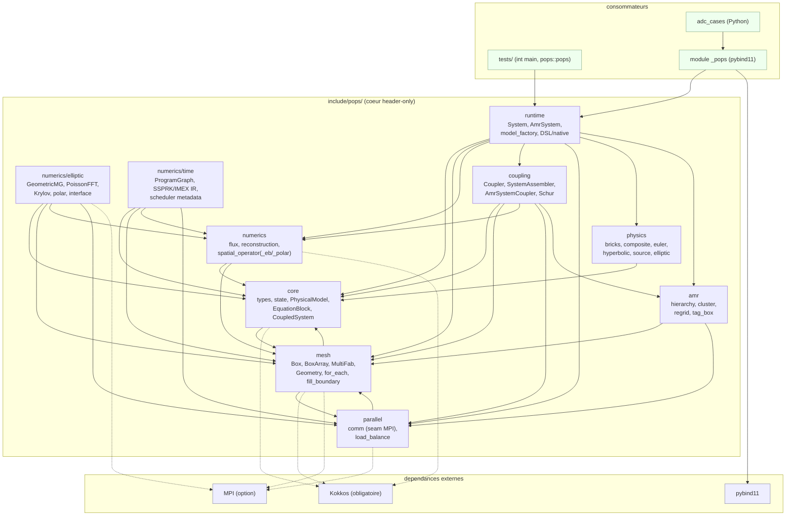
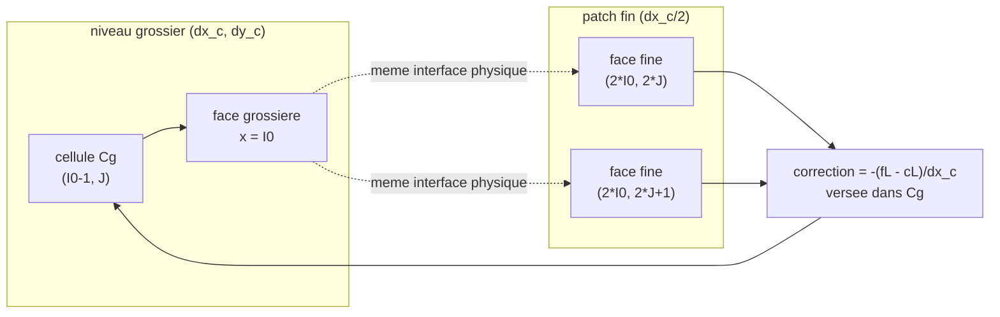
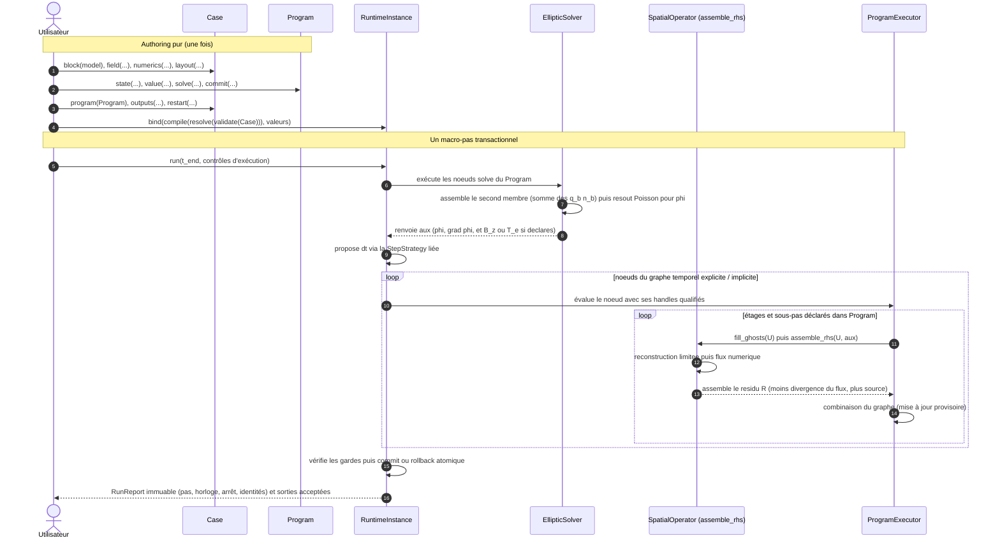
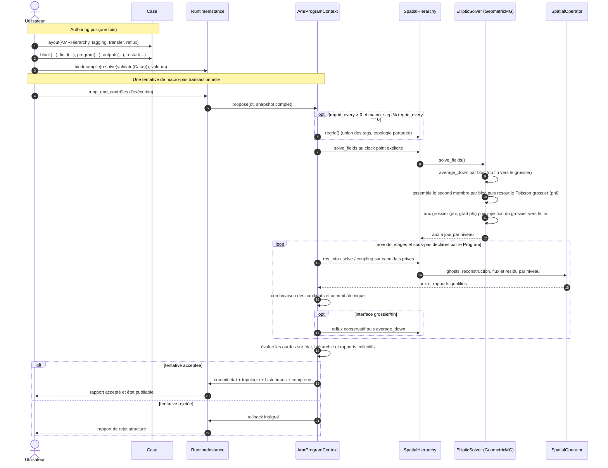

# Architecture of PoPS

PoPS is the header-only C++20 core for coupled hyperbolic-elliptic systems on
adaptive mesh (AMR), written for MPI + Kokkos (Kokkos is the ONLY on-node backend: Serial /
OpenMP / Cuda depending on the install; the standalone OpenMP backend was removed). The generic physics bricks
([`include/pops/physics/`](../include/pops/physics)) and the library's Python bindings (module
`pops` and compiled extension `_pops`) live here. `System` / `AmrSystem` are private native
execution engines behind `RuntimeInstance`, never Python authoring facades; the
neighboring repository `adc_cases` only contains Python use cases that import this module. The
core is model-agnostic: it names no scenario, it provides bricks composed in
`CompositeModel`. The layers are orthogonal (physics, numerics, data/mesh, execution,
time/coupling) and a high layer never depends on an execution detail.


## Contents

- [Overview](#overview)
- [The layers](#the-layers)
- [Component contracts and generated catalog](#component-contracts-and-generated-catalog)
- [Grid conventions](#grid-conventions)
- [AMR coarse-fine stencil (reflux)](#amr-coarse-fine-stencil-reflux)
- [Pipeline of a time step](#pipeline-of-a-time-step)
- [Verified properties](#verified-properties)
- [Backends](#backends)
- [Thread safety](#thread-safety)
- [Using the library](#using-the-library)
- [Limitations](#limitations)
- [Tree](#tree)

---
## Overview

The diagram below shows the public modules of [`include/pops/`](../include/pops), the
real external dependencies, and the consumers of the core. The arrows are the inclusions
actually present in the headers (verified by `grep '#include <pops/...>'`). The
external edges: **Kokkos is required** (the only on-node backend: `POPS_USE_KOKKOS` ON by default,
found by `find_package` or fetched by FetchContent); MPI is optional (`POPS_USE_MPI`);
pybind11 only serves the Python module. The sequential path goes through Kokkos Serial, not through a host loop
without Kokkos. Fidelity note: the project embeds neither Eigen, nor fftw, nor Catch2; the FFT of
[`numerics/elliptic/poisson_fft.hpp`](../include/pops/numerics/elliptic/poisson/poisson_fft.hpp) is written
by hand, and the tests are `int main` programs that link `pops::pops` (no third-party
framework).


```mermaid
flowchart TD
  subgraph pops["include/pops/ (coeur header-only)"]
    direction TB
    core["core<br/>types, state, PhysicalModel,<br/>EquationBlock, CoupledSystem"]
    physics["physics<br/>bricks, composite, euler,<br/>hyperbolic, source, elliptic"]
    mesh["mesh<br/>Box, BoxArray, MultiFab,<br/>Geometry, for_each, fill_boundary"]
    parallel["parallel<br/>comm (seam MPI),<br/>load_balance"]
    numerics["numerics<br/>flux, reconstruction,<br/>spatial_operator(_eb/_polar)"]
    elliptic["numerics/elliptic<br/>GeometricMG, PoissonFFT,<br/>Krylov, polar, interface"]
    timed["numerics/time<br/>ProgramGraph, SSPRK/IMEX IR,<br/>scheduler metadata"]
    amr["amr<br/>hierarchy, cluster,<br/>regrid, tag_box"]
    coupling["coupling<br/>Coupler, SystemAssembler,<br/>AmrSystemCoupler, Schur"]
    runtime["runtime<br/>System, AmrSystem,<br/>model_factory, DSL/native"]
  end

  subgraph ext["dependances externes"]
    direction TB
    kokkos["Kokkos (obligatoire)"]
    mpi["MPI (option)"]
    pybind["pybind11"]
  end

  subgraph cons["consommateurs"]
    direction TB
    tests["tests/ (int main, pops::pops)"]
    pymod["module _pops (pybind11)"]
    cases["adc_cases (Python)"]
  end

  %% dependances internes (inclusions reelles)
  mesh --> core
  mesh --> parallel
  parallel --> mesh
  physics --> core
  core --> mesh
  numerics --> core
  numerics --> mesh
  elliptic --> core
  elliptic --> mesh
  elliptic --> numerics
  elliptic --> parallel
  timed --> core
  timed --> mesh
  timed --> numerics
  timed --> parallel
  amr --> mesh
  amr --> parallel
  coupling --> core
  coupling --> mesh
  coupling --> numerics
  coupling --> parallel
  coupling --> amr
  runtime --> core
  runtime --> mesh
  runtime --> numerics
  runtime --> coupling
  runtime --> parallel
  runtime --> physics
  runtime --> amr

  %% dependances externes (seams confinees)
  mesh -.-> kokkos
  core -.-> kokkos
  numerics -.-> kokkos
  parallel -.-> mpi
  mesh -.-> mpi
  elliptic -.-> mpi

  %% consommateurs
  tests --> runtime
  pymod --> runtime
  pymod --> pybind
  cases --> pymod

  classDef extcls fill:#eef,stroke:#88a;
  classDef conscls fill:#efe,stroke:#8a8;
  class kokkos,mpi,pybind extcls;
  class tests,pymod,cases conscls;
```


## The layers

PoPS is organized into five orthogonal layers. A high layer expresses the problem, a low layer executes it; a high layer never depends on an execution detail. The structuring separation: the containers (what stores) are distinct from the execution policy (how one loops and communicates).

**Physics (local, device-callable).** The `PhysicalModel` concept ([`include/pops/core/model/physical_model.hpp`](../include/pops/core/model/physical_model.hpp)) only exposes local and pointwise laws, all `POPS_HD`: `flux`, `source`, `max_wave_speed`, `elliptic_rhs`. No access to storage nor to parallelism; no allocation in hot loops, no `std::function`, no dynamic polymorphism. The core is model-agnostic: a model is a composition (`CompositeModel`, [`include/pops/physics/composition/composite.hpp`](../include/pops/physics/composition/composite.hpp)) of generic bricks ([`include/pops/physics/bricks/bricks.hpp`](../include/pops/physics/bricks/bricks.hpp)) on three axes (transport / source / elliptic), the scenario names living on the application side. The `aux` channel carries `(phi, grad_x, grad_y)` and is extensible (`B_z`, `T_e`). The geometry (cartesian / polar / disk) is a config axis of the mesh, not of the model.

**Numerics / discretization.** The local numerical logic: Riemann flux ([`include/pops/numerics/fv/numerical_flux.hpp`](../include/pops/numerics/fv/numerical_flux.hpp): Rusanov / HLL / HLLC / Roe, `POPS_HD` policies), MUSCL + WENO5-Z reconstruction ([`include/pops/numerics/fv/reconstruction.hpp`](../include/pops/numerics/fv/reconstruction.hpp)), the elliptic operator ([`include/pops/numerics/elliptic/`](../include/pops/numerics/elliptic/)) and the logical BCs ([`include/pops/mesh/boundary/physical_bc.hpp`](../include/pops/mesh/boundary/physical_bc.hpp)). We distinguish the point-wise policies (flux, reconstruction, stencil: they take states, see no container) from the grid operators (`assemble_rhs`, [`include/pops/numerics/spatial_operator.hpp`](../include/pops/numerics/spatial_operator.hpp)) which loop over a `Box` via a local view `Array4` but ignore the decomposition into boxes/ranks and the backend. The geometry variants are purely additive: [`spatial_operator_eb.hpp`](../include/pops/numerics/spatial/embedded_boundary/operator.hpp) (cut-cell) and [`spatial_operator_polar.hpp`](../include/pops/numerics/spatial/operators/polar_operator.hpp), the cartesian remaining bit-identical.

**Mesh / data.** What stores: `Box<Dim>` ([`include/pops/mesh/index/box.hpp`](../include/pops/mesh/index/box.hpp)), `BoxArray<Dim>` ([`include/pops/mesh/layout/box_array.hpp`](../include/pops/mesh/layout/box_array.hpp)), `Distribution<Dim>` ([`include/pops/mesh/layout/distribution.hpp`](../include/pops/mesh/layout/distribution.hpp)), `MultiFab<Dim>` ([`include/pops/mesh/storage/multifab.hpp`](../include/pops/mesh/storage/multifab.hpp)), exact-ranked cartesian `Geometry<Dim>` ([`include/pops/mesh/geometry/geometry.hpp`](../include/pops/mesh/geometry/geometry.hpp)) and the AMR hierarchy. These containers carry distributed fields and halos; they do not select execution. Polar annular geometry remains a descriptor/output contract, not a second native `System` storage authority.

**Execution (seams).** The execution policy sees minimal exact-ranked views (`Box<Dim>`, `FieldView<Dim>`, scalar and rank), never a second dimension-specific container. `for_each_cell` ([`include/pops/mesh/execution/for_each.hpp`](../include/pops/mesh/execution/for_each.hpp)) iterates the compile-time rank through Kokkos, and [`FieldView`](../include/pops/mesh/storage/field_view.hpp) is the non-owning host/device view. `comm` ([`include/pops/parallel/comm.hpp`](../include/pops/parallel/comm.hpp)) provides rank/size and collectives; exact layout and ownership stay in prepared spatial providers. Halo exchange and field algebra are grid operators that orchestrate these seams.

**Time / coupling.** The layer that composes operators without knowing their implementation contains exact-ranked SSPRK objects ([`include/pops/numerics/time/integrators/time_steppers.hpp`](../include/pops/numerics/time/integrators/time_steppers.hpp)), IMEX asymptotic-preserving ([`include/pops/numerics/time/schemes/imex.hpp`](../include/pops/numerics/time/schemes/imex.hpp)) and low-level generic `lie_step` / `strang_step` helpers ([`include/pops/numerics/time/schemes/splitting.hpp`](../include/pops/numerics/time/schemes/splitting.hpp)). Production composition is authored exclusively through `pops.Program`; its immutable normalized `ProgramGraph` is the sole temporal authority for uniform and AMR execution. The exact-ranked [`System<Dim>`](../include/pops/runtime/system.hpp) and [`AmrSystem<Dim>`](../include/pops/runtime/amr_system.hpp) own field preparation, residual assembly and state publication. There is no separate single-block `Coupler`, static `SystemAssembler`, `Fab2D`, or AMR level-stack authority. [`AmrCouplerMP<Dim>`](../include/pops/coupling/amr/amr_coupler_mp.hpp) is a thin spatial facade over [`AmrRuntime<Dim>`](../include/pops/runtime/amr/amr_runtime.hpp); it never chooses a stage tableau or field-solve cadence. On the public Python surface, inter-species terms are declared with `Model.coupled_rate(...)`, called at explicit stages in the whole-system `Program`, and advanced or solved by that Program.


## Component contracts and generated catalog

Every source, native, or externally supplied component crosses composition and loading boundaries
with a schema-v2 `ComponentManifest`. The manifest is an immutable contract, not a report assembled
after lowering. Its stable component identifier is the namespaced `uri` plus semantic `version`; its
semantic payload declares the component type and facets, call signature, reads and writes,
parameters, provided interfaces, requirements and capabilities, effects, admissible layouts and
clocks, correlated target variants (dimension/scalar/device/required features), determinism,
restart schema, precision,
conservation properties, and named entry points.

Two domain-separated identities are deliberate:

- `semantic_digest` covers every behavior-bearing field and every registered semantic extension;
- `manifest_digest` additionally covers documentary extensions and is the identity of the complete
  manifest.

Changing a summary or provenance note therefore does not invalidate scientific semantics. A
semantic extension must name an absolute schema URI and a positive schema version, and must be
validated by a registered `ComponentExtensionSchema`; unversioned or unknown semantic extension
data is refused. Unknown top-level fields are also refused. Values use the closed PoPS canonical
CBOR vocabulary (no binary floats or opaque Python values), so Python and C++ produce identical
bytes and SHA-256 identities.

Builtin routes and model bricks have one declaration authority:
[`schemas/component_catalog.v2.json`](../schemas/component_catalog.v2.json). It owns stable wire IDs,
aliases, native entry points, requirements, limitations, route metadata, component defaults, and the
manifest/capability schema versions. [`scripts/generate_component_catalog.py`](../scripts/generate_component_catalog.py)
generates the Python route/schema products and the C++ catalog header. `routes.py`, `route_ids.hpp`,
and the Python/C++ brick inspection APIs contain behavior only; they must never declare mirrored
rows or fallback defaults. The generator's `--check` mode is a CI drift gate. The semantic catalog
digest enters native route signatures and compiled-artifact cache keys; the full digest additionally
authenticates documentary summaries and limitations without forcing recompilation.

Adding a builtin component is consequently one catalog change followed by regeneration. Adding an
external family does not require a base-class branch: it implements the small facet protocols named
by its manifest, registers that manifest, and lowers through an advertised entry point. Unsupported
targets and missing capabilities fail with a path, error code, and machine-readable evidence before
native execution.

## Grid conventions

The code separates the integer index space from physical cell centers. The index space is carried by
[`Box<Dim>`](../include/pops/mesh/index/box.hpp), a pair of inclusive `Index<Dim>` corners; the box is
empty as soon as `hi[axis] < lo[axis]`. The physical mapping is the exact-ranked
[`Geometry<Dim>`](../include/pops/mesh/geometry/geometry.hpp). Rank and axis extent are immutable parts
of the compiled provider contract, and the accessors remain `POPS_HD` for device kernels.

Three modules carry a grid, each with its own convention. The table below fixes
the notations used in the rest of this section.

### Cartesian single-level runtime, $N_x \times N_y$

`System` ([`include/pops/runtime/system.hpp`](../include/pops/runtime/system.hpp)) carries a single
grid shared by all the blocks (species). The configuration lives in `SystemConfig`.

| champ `SystemConfig` | role |
| --- | --- |
| `n` | cells per direction, domain $n \times n$ |
| `L` | size of the square domain $[0, L]^2$ |
| `periodic` | periodic domain (otherwise free outflow in transport) |

The index box is `Box2D::from_extents(n, n)`, i.e. $[0, n-1] \times [0, n-1]$. The cell
center is defined for any index, ghosts included (negative indices): `Geometry::x_cell(i)`
returns $x_{lo} + (i + 1/2)\,dx$ with $dx = (x_{hi} - x_{lo}) / N_x$ and likewise in $y$. The mesh is
therefore uniform and the cell center exists even outside the valid domain, which allows filling
the ghost layers by simple evaluation.

### Polar algorithm components (not a `System` runtime)

`PolarGeometry<2>`, the polar transport operators and the direct/tensor polar elliptic solvers remain
standalone C++ numerical components with dedicated algorithm tests. The exact-ranked `System<Dim>`
has one Cartesian coordinate-provider contract; the historical 2-D `geometry == "polar"` engine
and its `SystemConfig` fields were removed. `pops.mesh.PolarMesh` can still describe annular geometry
and exact cell measures for inspection/scientific output, but native execution fails during
resolution before artifact creation.

### Adaptive runtime: hierarchy of levels at constant physical extent

`AmrSystem` ([`include/pops/runtime/amr_system.hpp`](../include/pops/runtime/amr_system.hpp)) is the
refined counterpart of `System`: one or more blocks carried over a hierarchy of levels
(currently two levels, ratio 2). The configuration lives in `AmrSystemConfig`.

| champ `AmrSystemConfig` | role |
| --- | --- |
| `n` | cells of the coarse level per direction |
| `L` | size of the square domain $[0, L]^2$ |
| `regrid_every` | re-refinement every $N$ steps ($0 =$ never after init) |
| `periodic` | periodic domain |
| `distribute_coarse` | coarse replicated (default) or multi-box distributed (strong-scaling) |
| `coarse_max_grid` | tile size of the distributed coarse ($0 \Rightarrow n/2$) |

The refinement is not a refinement of the physical mesh: `Geometry::refine(r)` and
`Box2D::refine(r)` preserve the physical extent $[x_{lo}, x_{hi}]$ and refine the index space.
A coarse cell $[lo, hi]$ becomes a block $r \times r$ of fine indices
$[lo \cdot r,\; hi \cdot r + r - 1]$; the inverse `coarsen(r)` is a floor division of each
corner, which stays coherent on both sides of zero (negative ghosts). With a ratio 2, a fine
level therefore has a mesh $dx_f = dx_c / 2$ at unchanged physical domain.

The multi-block co-locates N species on a shared hierarchy (same `BoxArray`, same
`DistributionMapping`, same $dx, dy$ per level); the multi-block supports `regrid_every > 0`.
`AmrProgramContext` compares the accepted macro-step with that prepared interval, then calls the
immediate spatial `AmrRuntime::regrid()` primitive when due; `AmrRuntime` does not decide cadence.
The union-tag regrid rebuilds the hierarchy from all blocks' tags, while `regrid_every == 0` keeps it
frozen. Conservation is guaranteed per block via reflux and average_down, described below.

## AMR coarse-fine stencil (reflux)

At a 2:1 interface between a coarse level and a fine patch, the numerical flux computed on the
coarse side and the flux computed on the fine side do not coincide: without correction, the bordering
coarse cell would lose conservation. The reflux corrects the bordering coarse cell by replacing its
coarse flux contribution with the time-integrated fine flux crossing the same physical interface.

For the ratio 2 of the code, a coarse face at the interface is covered by two fine faces.
The schema below shows a bordering coarse cell `Cg` to the left of the interface and the two
fine sub-faces `f0`, `f1` of the patch that adjoin it.


```mermaid
graph LR
  subgraph Grossier["niveau grossier (dx_c, dy_c)"]
    Cg["cellule Cg<br/>(I0-1, J)"]
    Cgf["face grossiere<br/>x = I0"]
  end
  subgraph Fin["patch fin (dx_c/2)"]
    f0["face fine<br/>(2*I0, 2*J)"]
    f1["face fine<br/>(2*I0, 2*J+1)"]
  end
  Cg --> Cgf
  Cgf -. "meme interface physique" .-> f0
  Cgf -. "meme interface physique" .-> f1
  f0 --> Reflux["correction = -(fL - cL)/dx_c<br/>versee dans Cg"]
  f1 --> Reflux
  Reflux --> Cg
```

The mechanics is carried by
[`amr_reflux_mf.hpp`](../include/pops/numerics/time/amr/reflux/amr_reflux_mf.hpp), which is only an umbrella
including the sub-headers; the types of the interface live in
[`amr_patch_range.hpp`](../include/pops/numerics/time/amr/levels/amr_patch_range.hpp), while
[`amr_subcycling.hpp`](../include/pops/numerics/time/amr/levels/amr_subcycling.hpp) provides prepared
hierarchy storage and spatial transfer/reflux helpers. Neither header owns a temporal loop:
`ProgramGraph`, executed through `AmrProgramContext`, determines every stage, substep and catch-up.

Three objects share the work.

- `FluxRegister` is a coarse buffer with global indexing over a region. Each rank writes there
  its local contributions (0 elsewhere), `gather()` sums them by `all_reduce_sum_inplace`, then
  each rank reads the total via `at()`. In serial the all-reduce is the identity, hence bit-identical.
  `set` overwrites (average_down path), `add` accumulates while staying bounded to the region (reflux path).

- `CoverageMask` (and its envelope `CoarseFineInterface`) marks, on the coarse region, the
  cells shadowed by a fine patch. The mask is built on the global `BoxArray` of the fine patches,
  known by all the ranks, hence MPI-safe. `covered(I, J)` prevents the double-reflux of a
  fine-fine joint: we only pour a correction onto a bordering coarse cell not covered by an
  other patch.

- Prepared per-patch interface storage describes the parent footprint
  $[I_0..I_1] \times [J_0..J_1]$ and the coarse/fine edge strips. The transactional Program flux
  ledger owns time integration of those strips, using the exact rational stage coefficients carried
  by the normalized graph.

For a ratio-2 spatial interface, the spatial restriction of a fine edge flux is exactly the average
of the two sub-faces:

`Ffine_left[J,k] = 0.5 * (FX(2*I0, 2*J, k) + FX(2*I0, 2*J+1, k))`

(and symmetrically on the right, bottom and top edges). `AmrProgramContext` then accumulates that
spatial result with the graph-authored local time step and RK/IMEX coefficient. A rejected attempt
discards the candidate state and the corresponding ledger together.

The final pour from the Program ledger is carried by
`CoarseFineInterface::route_reflux_integrated`. On each bordering coarse
cell not covered, it adds to the register

$$
\text{ref.add}(I_0 - 1,\, J,\, k) \mathrel{+}= -\frac{f_L - c_L}{dx_c}
$$

on the left, $+(f_R - c_R)/dx_c$ on the right, and likewise in $y$ with $dy_c$ ($f_B$, $f_T$,
divided by $dy_c$). Both $f_\bullet$ and $c_\bullet$ are already time-integrated by the exact
Program coefficients. The sign (negative on the left / at the bottom, positive on the right / at the
top) follows the divergence convention of the scheme. The parent footprint is computed by
`PatchRange` ($I_0 = lo/2$, $I_1 = (hi-1)/2$), historically distinct from `Box2D::coarsen` to
preserve the bit-identical arithmetic. The average_down (`mf_average_down_multi` /
`mf_average_down_mb`) then overwrites each covered coarse cell with the $0.25$ average of the
four fine cells, closing the coarse/fine coherence.


## Pipeline of a time step

The time step has two native storage/operator targets that share one generated Program grammar:
`System` on a single-level grid and `AmrSystem` on an adaptive hierarchy. Both are private facades
materialized by `pops.bind` from one authenticated install plan; their low-level setters and block
installers are not authoring APIs. The plan declares field providers, composes each block and binds
its initial state atomically. The temporal authority does not differ: both execute the installed
`ProgramGraph`; only their spatial services and transaction envelopes differ.

### Single-level runtime execution

The core is `System<Dim>::step_cfl` (and `step`) in the exact-ranked
[`System` runtime](../src/runtime/system/system.cpp). The order is an explicit invariant: an installed whole-system Program is
mandatory and owns every stage and cadence. The runtime supplies data,
operator/provider seams and the native CFL-bound reduction; it has no implicit transport,
coupling, projection or `AmrRuntime`
fallback. The former adaptive multirate formula survives only as a test oracle in
`tests/cpp/support/reference_time_scheduler.hpp`; no installed header, reference driver, or
production facade exposes it until `ProgramGraph` can lower that composition.

The [`solve_fields` implementation](../src/runtime/system/system_fields.cpp) consumes the installed
[`ExactFieldSolverBackend<Dim>`](../include/pops/runtime/system/exact_field_solver_backend.hpp): it
solves the system Poisson whose right-hand side is the sum of the elliptic bricks of the blocks
($f = \sum_b q_b\, n_b$), then publishes its potential and gradients as owner-qualified field-output
`AuxiliaryComponentKey`s. The sealed exact auxiliary registry resolves every key to one compatible
storage group and validates its representation, centering, layout, rank and halo before publication;
there is no shared raw auxiliary channel or fixed field component convention.

Field solve legality is resolved from the owner-qualified Python `FieldSolvePlan` and its capability
proof before native artifact creation.  The native runtime receives only authenticated prepared
providers and executable operator callbacks; it does not maintain a second closed enum registry or
privilege a field named `phi`.

Each resolved field install carries the ordered, block-qualified RHS provider pack, output route,
method/solver options, four complete physical-face laws, hierarchy policy, and nullspace/gauge proof.
Non-constant Robin/Dirichlet/Neumann laws are compiled into named device launchers: runtime parameters
are copied into POD functors before launch. Pointwise dependencies use the explicit
`pops.fields.boundary_value(handle, component)` expression, while `logical_time(...)` reads the exact
Program-supplied time point; the resolver turns both into ordered direct-buffer/POD slots. Handles
remain Boolean/hashable identities and a vector state cannot be sampled without naming its component.
An iterate-dependent law installs its exact symbolic JVP and requires an explicit nonlinear solver,
and a device-invalid denominator is reduced to one rank-consistent witness before the solve can
publish. Uniform state/field dependencies and single-level AMR state dependencies are prepared
outside the iteration. A linear dynamic boundary on a level-local AMR named-field solve receives one
exact `FieldLogicalTimePoint.level` and state-provider storage materialized from that level before
the solve. A composite hierarchy that fully refines every parent level carries every level context
but executes the exact finest-level uniform operator; its linear residual and nonlinear/JVP route
therefore receive only the finest time point, dependencies, and distribution. A partially refined
CompositeFAC hierarchy remains an explicit refusal: its coarse/fine correction would need a
level-qualified homogeneous/JVP boundary operator, and reusing the inhomogeneous primal closure would
be mathematically wrong. Iterate-dependent level-local multilevel boundaries and AMR field-to-field
providers remain explicit refusals. No route falls through to a Python callback or a per-cell
registry lookup.
For field-coupled finite-difference JVPs, the exact boundary evaluation level must also equal the
active Program resource level before the perturbed field solve or the frozen-field restoration is
allowed to dispatch. A fine-level caller therefore cannot forge a coarse point and reuse level 0.
This identity guard does not create a fine-level tangent-field solve. Supporting a boundary JVP that
reads solved fields requires a provider contract that materializes the field tangent from the state
direction on every participating level, couples those tangents across CompositeFAC when requested,
and restores the frozen primal field transactionally. Reusing the primal field pointer would omit
the derivative of the field solve and is therefore not a valid fallback.
Linear and nonlinear field routes both retain the accepted warm start until their `SolveReport` is
consumed; an invalid boundary evaluation or iteration limit restores that value and cannot update the
published aux channel.

Nullspace dimension is derived from operator, boundary closure, and the material topology, while the
gauge remains an explicit representative choice. The Cartesian topology recipe is an explicit
axis-neighbor cell graph with its periodic and coarse/fine identifications; its connected-component
derivation proves one full-domain component (and, for composite AMR, masks coarse cells covered by
finer levels).
An embedded-boundary field solve or a level-local solve over partial AMR BoxArrays is therefore
refused until its material connectivity and coarse/fine boundary closure can be materialised; PoPS
does not pretend that a single constant mode covers an unknown disconnected topology.  Every AMR
topology replacement increments a runtime epoch embedded in the nullspace recipe, so no coverage mask
survives a regrid or restart hierarchy rebuild.

That derivation belongs only to an installed `FieldDiscretization` provider. A generic matrix-free
`LinearProblem` has no such provider authority and therefore never infers a nullspace from its stencil,
BC names, periodic axes, or preconditioner. Its author must always write `nullspace=None` or pair
`nullspace=ConstantNullspace()` with exactly one `MeanValueGauge(value)`. The latter route is scalar-only.
Because a right constant kernel alone does not prove invariance of the mean-zero complement, it also
requires at least the explicit `LinearOperatorProperties.symmetric_operator()` certificate.
Both choices are snapshotted into exact schema-v1 `nullspace_contract` / `gauge_contract` IR records;
mutating the authoring gauge later cannot alter graph identity or lowering. Until a provider exports a
real complement-preservation certificate, the constant-nullspace Krylov route accepts only
`preconditioners.Identity()`. The hierarchy-wide `CompositeTensorFAC` route rejects that contract
rather than pretending that a per-level gauge is a composite AMR gauge.

`LinearOperatorProperties` independently carries exactly three Boolean facts: symmetry, global
positive-definiteness, and positive-definiteness on the declared nullspace complement. Its four
canonical certificates are `general()`, `symmetric_operator()`,
`symmetric_positive_definite()`, and
`symmetric_positive_definite_on_nullspace_complement()`. Global and complement
positive-definiteness are mutually exclusive. Consequently CG requires the global SPD certificate
when `nullspace=None`, and the complement-SPD certificate for `ConstantNullspace`; PoPS never swaps
methods or upgrades a certificate from stencil metadata.

Field warm starts are checkpoint payloads keyed by the complete qualified provider slot.  The AMR v8
reader preflights topology, ownership maps, state, aux, potentials, provider slots and history rings,
then authenticates the runtime-owned tagging hysteresis before publishing the accepted Program image.
It restores the hierarchy through the final clock update inside one native accepted-state transaction.
Any exception restores the previous hierarchy, data, field warm starts, histories, diagnostics,
cadence counters and tagging state; a partially restored simulation is never observable.
The sealed accepted-state contract also records the topology epoch and regrid count, exact rational
level clocks, owner/state/space-qualified ring slots, lagged effective-flux publications, parent/child
temporal relations and every required transfer route.  Restart compares the bound identities and this
provenance before mutation.  During explicit bootstrap, the installed Program context republishes
that level-qualified image before each spatial hierarchy transition commits.  After the mandatory
zero-step `pops.run` establishes the checkpoint's controls identity, a checkpoint before the first
accepted step therefore cannot retain a stale coarse-only clock axis.  Multi-block and active-regrid
layouts use this same authenticated route. `RestoreRecordedHierarchy()` preserves the recorded patch
geometry. With `bit_identical=True` it also requires the recorded rank count and owner map; the
default non-bit-identical route may rematerialize ownership only when every persisted history ring is
Dense; source ranks must agree on the runtime-owned tagging payload and rank-count rematerialization
preserves it exactly. Native `SymbolicTagger` therefore accepts non-zero temporal hysteresis.
External Tagger components still refuse non-zero hysteresis until their adapter owns that persistent
route. `RegridOnRestart()` has a distinct `accepted_state_after_regrid` guarantee and identity. The
builtin accepted-state-v5 provider first restores and validates the AMR v8 accepted hierarchy,
state, histories, counters, clock and accepted shared-interface flux audit, then requests one
artifact-owned scientific regrid at that accepted coordinate. Each interface fragment retains its
topology epoch, exact clock window, rational Program weight, face measure and local duration; strict
restart rejects an incomplete or stale fragment before publishing the accepted image. It verifies
composite conservation, publishes a rank-consensus before/after
topology receipt and derives a new continuation run identity. The restored tagging hysteresis enters
that same transaction: a failed transform restores its exact accepted bytes, while a successful
transform advances one tagging cycle and publishes the transformed image. The bounded route requires
one AMR layout and unchanged MPI cardinality. Serial and exact-`MPI_COMM_WORLD` shared-interface
flux groups participate in the same topology rematerialization, all-rank identity consensus,
conservation check, rollback and retry. One rank-local post-transform failure is closed
collectively; rollback restores the complete accepted image before a retry may publish one common
receipt and resume the rematerialized interface. Active-depth changes, unsupported non-finest
replacements at depth greater than two, rank-changing dynamic interface rematerialization,
elliptic providers and bootstrap staggered caches remain refused. The phase-local history consensus
fingerprints materialize each dense ring slot collectively; they prove exact all-rank agreement on
each hierarchy, not bitwise equality across a topology-changing interpolation. Conservation is the
separate native before/after invariant on every accepted solution component. This is a cold-restart
audit cost, not a hot-step operation, and scales with the total active level-domain cells times
retained history depth. PoPS never silently changes patch geometry under
`RestoreRecordedHierarchy()`.

The transport of a block, in turn, reads this aux. The spatial primitive does `fill_ghosts` then
`assemble_rhs` (limited reconstruction then numerical flux -> $R = -\mathrm{div} F + S$).
Production stages and their coefficients are emitted by the installed Program (cf.
[`include/pops/numerics/time/integrators/time_steppers.hpp`](../include/pops/numerics/time/integrators/time_steppers.hpp), `SSPRK2Step<Dim>` /
`SSPRK3`). The step $dt$ returned by `step_cfl` is the min over the evolutive blocks of
$cfl \cdot h \cdot \mathrm{substeps}_b / (\mathrm{stride}_b \cdot w_b)$, with $h = \min(dx, dy)$ in
cartesian and $h = \min(dr,\, r_{\min}\, d\theta)$ in polar. Those metadata contribute only to the
declared stability bound; they cannot schedule a substep or a stride outside the Program.


```mermaid
sequenceDiagram
    autonumber
    actor Utilisateur
    participant Case
    participant Program
    participant Runtime as RuntimeInstance
    participant EllipticSolver as EllipticSolver
    participant SpatialOperator as SpatialOperator (assemble_rhs)
    participant Executor as ProgramExecutor

    Note over Utilisateur,Program: Authoring pur (une fois)
    Utilisateur->>Case: block(model), field(...), numerics(...), layout(...)
    Utilisateur->>Program: state(...), value(...), solve(...), commit(...)
    Utilisateur->>Case: program(Program), outputs(...), restart(...)
    Utilisateur->>Runtime: bind(compile(resolve(validate(Case))), valeurs)

    Note over Utilisateur,Executor: Un macro-pas transactionnel
    Utilisateur->>Runtime: run(t_end, contrôles d'exécution)
    Runtime->>EllipticSolver: exécute les noeuds solve du Program
    EllipticSolver->>EllipticSolver: assemble le second membre (somme des q_b n_b) puis resout Poisson pour phi
    EllipticSolver-->>Runtime: renvoie aux (phi, grad phi, et B_z ou T_e si declares)
    Runtime->>Runtime: propose dt via la StepStrategy liée

    loop noeuds du graphe temporel explicite / implicite
        Runtime->>Executor: évalue le noeud avec ses handles qualifiés
        loop étages et sous-pas déclarés dans Program
            Executor->>SpatialOperator: fill_ghosts(U) puis assemble_rhs(U, aux)
            SpatialOperator->>SpatialOperator: reconstruction limitee puis flux numerique
            SpatialOperator-->>Executor: assemble le residu R (moins divergence du flux, plus source)
            Executor->>Executor: combinaison du graphe (mise à jour provisoire)
        end
    end
    Runtime->>Runtime: vérifie les gardes puis commit ou rollback atomique
    Runtime-->>Utilisateur: RunReport immuable (pas, horloge, arrêt, identités) et sorties acceptées
```

Le `RunReport` compte les macro-pas acceptés et les tentatives rejetées de l'appel, expose le temps et
le macro-pas finaux ainsi que les identités authentifiées du run, du bind, du contexte d'exécution et
de l'artefact. Un run qui échoue lève une exception ; il ne retourne jamais un rapport marqué succès.

Strang and Lie composition are Program macros (`pops.lib.time.strang` / `lie`). They lower explicit
sub-flows into the same IR rather than selecting a native `System` stepper branch.

`ProgramContext<Dim>` and `AmrProgramContext<Dim>` are the two exact-ranked execution providers.
Each owns its persistent RHS/state/scalar resources directly, keyed by IR value, sub-slot and active
level; there is no dimension-erased execution-service authority between generated code and runtime.
The provider validates topology epoch, process-local materialization generation and exact layout,
then zeroes reused storage before publication. Prepared operator capabilities are retained as complete
evaluation snapshots, so a provider transition cannot leave a stale nonzero revision usable.

### Adaptive runtime execution

On the adaptive hierarchy, `AmrSystem::step`
([`include/pops/runtime/amr_system.hpp`](../include/pops/runtime/amr_system.hpp)) first requires an
installed Program, opens one complete accepted-step transaction, then invokes that Program through
`AmrProgramContext`
([`include/pops/runtime/program/amr_program_context.hpp`](../include/pops/runtime/program/amr_program_context.hpp)).
`AmrRuntime`
([`include/pops/runtime/amr/amr_runtime.hpp`](../include/pops/runtime/amr/amr_runtime.hpp)) is the
spatial hierarchy engine: it owns layouts, states, field solves, residuals, tagging, transfers and
reflux services, but it does not choose a temporal method.

At the start of a Program-owned hierarchy attempt, the context performs a due regrid from the union
of the resolved tagging predicates and applies the same topology to every block and field. The
Program then places `solve_fields`, residual evaluations, explicit or implicit stages, multirate
cadence and inter-species coupling at explicit clock points. `advance_hierarchy` recursively walks
the authored parent/child clock relations; its conservative flux ledger refluxes coarse/fine
interfaces and restores covered coarse cells by `average_down`. A failed solve or numerical guard
restores state, topology, fields, histories, clocks, diagnostics and counters before the attempt is
reported. Only a successful outer transaction advances the facade clock and publishes outputs.


```mermaid
sequenceDiagram
    autonumber
    actor Utilisateur
    participant Case
    participant Runtime as RuntimeInstance
    participant Program as AmrProgramContext
    participant AmrRuntime as SpatialHierarchy
    participant EllipticSolver as EllipticSolver (GeometricMG)
    participant SpatialOperator as SpatialOperator

    Note over Utilisateur,Case: Authoring pur (une fois)
    Utilisateur->>Case: layout(AMRHierarchy, tagging, transfer, reflux)
    Utilisateur->>Case: block(...), field(...), program(...), outputs(...), restart(...)
    Utilisateur->>Runtime: bind(compile(resolve(validate(Case))), valeurs)

    Note over Utilisateur,Program: Une tentative de macro-pas transactionnelle
    Utilisateur->>Runtime: run(t_end, contrôles d'exécution)
    Runtime->>Program: propose(dt, snapshot complet)

    opt regrid_every > 0 et macro_step % regrid_every == 0
        Program->>AmrRuntime: regrid() (union des tags, topologie partagee)
    end

    Program->>AmrRuntime: solve_fields au clock point explicite
    AmrRuntime->>EllipticSolver: solve_fields()
    EllipticSolver->>EllipticSolver: average_down par bloc (du fin vers le grossier)
    EllipticSolver->>EllipticSolver: assemble le second membre par bloc puis resout le Poisson grossier (phi)
    EllipticSolver->>EllipticSolver: aux grossier (phi, grad phi) puis injection du grossier vers le fin
    EllipticSolver-->>AmrRuntime: aux a jour par niveau

    loop noeuds, etages et sous-pas declares par le Program
        Program->>AmrRuntime: rhs_into / solve / coupling sur candidats prives
        AmrRuntime->>SpatialOperator: ghosts, reconstruction, flux et residu par niveau
        SpatialOperator-->>Program: taux et rapports qualifies
        Program->>Program: combinaison des candidats et commit atomique
        opt interface grossier/fin
            Program->>AmrRuntime: reflux conservatif puis average_down
        end
    end
    Program->>Program: évalue les gardes sur état, hiérarchie et rapports collectifs
    alt tentative acceptée
        Program->>Runtime: commit état + topologie + historiques + compteurs
        Runtime-->>Utilisateur: rapport accepté et état publiable
    else tentative rejetée
        Program->>Runtime: rollback intégral
        Runtime-->>Utilisateur: rapport de rejet structuré
    end
```

The uniform and adaptive pipelines therefore share one rule: the Program is the only temporal
authority. Their difference is spatial. The AMR context adds hierarchy clocks, coarse/fine field
transfer, periodic regrid and a conservative interface-flux ledger around the same authored graph.


## Verified properties

The library distinguishes two safety nets (cf. [`docs/ARCHITECTURE.md`](ARCHITECTURE.md) section 11): the bit-identical is a software net (the refactoring did not break anything), not a numerical proof. Both are necessary. The properties below are those actually measured by the test suite, not objectives.

**Mass conservation at round-off.** The finite-volume scheme is conservative by telescoping of the
fluxes; at coarse/fine interfaces the FluxRegister reflux closes the same balance. A condensed Program
freezes density during its implicit sub-flow, so any density change comes from the explicitly authored
transport/coupling sub-flows. The AMR conservation suites validate the resulting ledger at round-off.

**MPI distributed proofs.** Exact-ranked halo exchange, AMR compilation, Cartesian Poisson and
Krylov workspace ownership are exercised by their dedicated MPI suites, including multiple rank
counts where the manifest declares them. Additive global sums are not bit-exact across rank counts
because the reduction order changes; topology, pointwise maxima and declared tolerances remain the
relevant contracts.

**Device-clean kernels GH200.** Historical Kokkos Cuda campaigns on GH200 (node `armgpu`, `Kokkos_ARCH_HOPPER90`, `nvcc_wrapper`, OpenMPI CUDA-aware) covered single-grid System, AMR field operations, multi-GPU MPI halos and the integrated AmrSystem + MPI + GPU route. The final exact-ranked GeometricMG harness now proves only its real constant-scalar operator with optional reaction through a manufactured 1D/2D/3D specialization; the retired variable and anisotropic 2D routes are not advertised. Its current `amrmpi_integrated` harness also requires the installed `ProgramGraph` to consume B_z on both the coarse and fine trajectories. These harnesses live in `tests/gpu/romeo/` (out of CI for lack of GPU runner); after a runtime or numerical cutover, their host/source checks and historical results do not replace a fresh GH200 run. The ADC-700 refresh is the paired hardware campaign in `benchmarks/adc700/`: it refuses CPU evidence, records the concrete device inventory, compares a pinned pre-cutover native route with the Program-only candidate in ABBA order, and emits a machine-readable report with the `0.98` throughput threshold. The harness makes the proof reproducible but does not itself claim a result until that report is produced on real hardware. A component variant that does not declare and prove the selected GPU execution context is refused; there is no implicit host fallback. Multi-rank additive sums are not bit-exact across np (FMA order), and the AMR strong-scaling by distributed coarse is negative at this scale.

**Parity of authenticated generated blocks.** The private native block artifact specializes the same
catalog-selected templates as the builtin leaf. `test_compiled_model_parity` validates their numerical
parity on CPU/Serial, and `test_amr_compiled_model` validates the hierarchy installation. This is a
test oracle, not a second public registration route or a compatibility fallback. The generic native
component protocol separately proves its exact interface and target variant before installation.

## Backends

The backends (Kokkos, MPI, HDF5) are a property of the library, not a flag per target. They are attached to the interface target `pops`: everything that links `pops` (core tests, downstream applications) inherits the backend chosen at configuration. Kokkos is the ONLY on-node backend and it is required (the serial goes through Kokkos Serial, not through a manual C++ loop). One configures once (cf. [`docs/ARCHITECTURE.md`](ARCHITECTURE.md) section 9):

```
# Kokkos est obligatoire mais PAS forcement pre-installe : trouve s'il existe (-DKokkos_ROOT),
# sinon recupere + construit automatiquement (FetchContent). La cible on-node = options Kokkos_ENABLE_*.
cmake -B build                                       # serie : Kokkos fetch+build auto (Serial defaut)
cmake -B build -DKokkos_ENABLE_OPENMP=ON             # CPU multi-thread (Kokkos OpenMP, fetch)
cmake -B build -DKokkos_ROOT=$K                       # reutilise une install Kokkos existante
cmake -B build -DKokkos_ROOT=$K -DCMAKE_CXX_COMPILER=$K/bin/nvcc_wrapper  # GPU Cuda (install nvcc_wrapper)
cmake -B build -DPOPS_USE_MPI=ON                       # + distribue (POPS_HAS_MPI + MPI::MPI_CXX)
```

**Kokkos: the only on-node backend.** Kokkos covers the sequential (Serial), the multi-thread CPU (OpenMP) AND the GPU (Cuda/HIP) with a single code, without any CUDA kernel written by hand nor `#pragma omp`. The target is chosen by the options `Kokkos_ENABLE_SERIAL` / `Kokkos_ENABLE_OPENMP` / `Kokkos_ENABLE_CUDA` -- at config (FetchContent path) or at the install of Kokkos (`-DKokkos_ROOT` path), not by an pops flag. Kokkos is REQUIRED but does not need to be pre-installed: CMake does `find_package(Kokkos)` then, failing that, fetches it via FetchContent (version `POPS_KOKKOS_FETCH_VERSION`, default 4.4.01, tarball verified by SHA256). Configuring without Kokkos (`-DPOPS_USE_KOKKOS=OFF`) is a fatal error, and the seam `for_each_cell` does not compile without `POPS_HAS_KOKKOS`. The standard is C++20 (nvcc CUDA 12.x does not offer `-std=c++23`); the kernels marked `POPS_HD` and the seam `for_each_cell` are compiled for the chosen execution space. CI plays Kokkos Serial (gate `build-and-test`, C++ + Python) and, since the `ci-full` job, Kokkos OpenMP (`Kokkos_ENABLE_OPENMP=ON`). CI never builds `-DKokkos_ENABLE_CUDA=ON`: all the Kokkos Cuda cells are therefore ROMEO (manual GH200 validation) or unknown.

**MPI: distributed, optional.** `-DPOPS_USE_MPI=ON` defines `POPS_HAS_MPI` and links `MPI::MPI_CXX`. The `if(POPS_HAS_MPI)` block of the CMake compiles the MPI-only tests, each replayed at np=1/2/4. Out of MPI (a single process), the seam `comm` ([`include/pops/parallel/comm.hpp`](../include/pops/parallel/comm.hpp)) degenerates to the identity (rank 0, size 1, all-reduce and barrier no-op), so that a binary linked MPI but launched single-process behaves like a single-rank run. MPI + Kokkos Cuda multi-GPU is validated on ROMEO for 10 Krylov/Schur/MPI-kernel tests (rank-invariant np=1/2/4, `dmax=0`).

**The seam `for_each_cell`.** The seam point that makes all this possible is `for_each_cell(box, f)` in [`include/pops/mesh/execution/for_each.hpp`](../include/pops/mesh/execution/for_each.hpp). It expresses an execution policy, not numerical logic: it takes a `Box` and an `POPS_HD(i, j)` lambda, and compiles into `Kokkos::parallel_for` (Serial / OpenMP / Cuda depending on the Kokkos install). The numerical logic stays in the lambda (layer 2: discretization), never in the seam; growing it into `for_each_cell(U, grid, ghosts, mpi, bc, amr, ...)` would recreate an opaque framework. A grid operator sees a local view `Array4` + `Box`, but neither the `DistributionMapping` nor the loop policy. The reductions share the same philosophy: `for_each_cell_reduce_sum` / `_max` carry the deterministic reducers `Kokkos::Sum` / `Max` (the `sum` reassociates the addition by tile -- deterministic/idempotent but not bit-identical to a lexicographic sum, for all the Kokkos spaces; the `max` stays exact).

## Thread safety

The execution model is pure data parallelism, no threads sharing an arbitrary mutable state. What is safe and what is not follows directly from the mesh/data vs execution separation (layers 3-4, section 4 of the architecture).

**Reentrant / without shared state.**
- The body of `for_each_cell` is an `POPS_HD(i, j)` lambda that writes the cell `(i,j)` of its own local view `Array4`. As long as the kernel only writes its cell (cell-by-cell FV idiom), there is no race: each iteration touches a disjoint address. This is the basis of the Serial / OpenMP / Cuda portability without lock.
- A grid operator receives a local view (`Array4` + `Box`) and sees neither the `DistributionMapping`, nor the MPI rank, nor the loop policy. It is therefore independent of the decomposition into boxes/ranks and reentrant on distinct fabs.
- The reductions go through the deterministic reducers `for_each_cell_reduce_sum` / `_max`: the accumulation is managed by Kokkos (no shared host accumulator written concurrently), which avoids the hand-made reduction races.

**Not shared / to sequence explicitly.**
- Unified memory + fence: on GH200 the memory is unified (a single buffer). Any function that launches a device kernel then reads the same memory in a host loop must call `device_fence()` (= `sync_host()`) between the two, otherwise host/device race invisible in CPU CI. This is, according to CHOICES.md, the most subtle bug of the repository. The assumed choice is the explicit fence separate from the access (not a `Memory<T>`-like type that hides the barrier in the accessor). The detection net is `romeo/sanitizer.sbatch` (compute-sanitizer) plus the bit-identical CPU vs GPU checksum of `diocotron_amr_kokkos`, which diverges if a fence is missing.
- Halo writes: the three families of ghosts (physical, parallel, coarse-fine) are sequenced steps, not concurrent with the interior computation. `fill_ghosts` is an explicit composition `fill_boundary` (exchange) then `fill_physical_bc` (BC at the border); it executes between two sweeps, not during.
- MPI communication: the seam `comm` is not designed for concurrent calls from several threads on the same communicator; the pattern is single-thread per rank, threads/GPU inside the rank via `for_each_cell`.

**Post-commit scientific output.** A detached observer frame is immutable and is submitted only
after its numerical step commits. `ROOT` gathers on the main path and performs no MPI from its
worker. Asynchronous `PER_RANK` and `COLLECTIVE` output require `MPI_THREAD_MULTIPLE`; each consumer
receives a run-scoped duplicated execution lane and its worker never borrows `MPI_COMM_WORLD`. All
post-commit sessions in one `RuntimeInstance` run share one process-local FIFO, which gives HDF5 and
other asynchronous writers the same initialization/execution/finalization order on every rank.
Synchronous HDF5 drains that FIFO before entering its writer. The default PVTU placement relays
bounded VTU chunks through the lane to rank zero, so the published dataset does not require a shared filesystem;
`SharedDirectory()` is the explicit direct-publication contract.

`LiveVisualization` and the built-in Catalyst provider accept `SERIAL` and `COLLECTIVE`. The MPI
route uses the same duplicated observer lane as collective asynchronous output, passes its exact
Fortran handle through `catalyst/mpi_comm`, and agrees local preparation failures before entering
each Catalyst collective. `ROOT` and `PER_RANK` remain invalid because the Catalyst lifecycle is
collective. Progressive PVTU or HDF5 `AsyncScientificOutput` artifacts remain independent of the
live connection. Collective Catalyst execution is deliberately drained after every published frame
and followed by a rank consensus before the next native solver step. This prevents a VTK worker
collective from overlapping an AMR/solver collective on the main thread. Serial live visualization
and scientific-output workers remain asynchronous.

The built-in Catalyst provider permits one combined pipeline consumer and one simulation run per
`RuntimeInstance`. Its one-shot process-global lifecycle reservation is never released; another
built-in Catalyst simulation requires a fresh OS process. Multiple concurrent `RuntimeInstance`
runs in one process are unsupported when asynchronous HDF5 or built-in Catalyst is active: each
runtime owns a different FIFO and cannot jointly order process-global library state.

The PoPS post-commit worker is the sole worker layer: Catalyst internal async is forced off and an
active inherited `CATALYST_ASYNC_ENABLED` is rejected, so `catalyst.execute` completes before its
delivery receipt. In collective MPI mode PoPS then drains that worker before returning to the
solver; this live route is intentionally synchronous at frame boundaries. A worker-safe live
pipeline may publish sources and filters, but a local render
view additionally requires a ParaView off-screen backend that supports creation outside the main
thread. In particular, the macOS Cocoa backend cannot create `RenderView` from this worker; the
tutorial keeps its live pipeline renderless and carries reproducible presentation in the file-output
recipe/PVSM instead. A `DurableJournal` does not widen this
concurrency contract. Its at-least-once delivery guarantee starts only after the frame reaches the
durable `pending` handoff; that handoff is not atomic with the accepted transaction or a checkpoint.
Complete `delivered` archives are retained as evidence and require an application-managed storage
lifecycle.

The VTK XML writer itself accepts authenticated Cartesian snapshots in one, two or three spatial
dimensions and maps cell- and node-centred arrays to `CellData` and `PointData`/`PPointData`.
The native PoPS capture path and built-in Catalyst Blueprint path remain two-dimensional and
cell-centred; the generic writer does not imply a native 1D, 3D or nodal solver state. VTK array
names come from explicit declaration strings such as `model.state("U", ...)`, not Python
left-hand-side variable names. A real materialised PVSM is created only by a real ParaView
`pvpython`; the portable JSON/Python recipe remains the installation-independent representation.

## Using the library

`PoPS` is a header-only core. On the C++ consumer side, one pulls it by `FetchContent` and links the
target `pops::pops`; nothing is compiled in advance, the instantiation takes place at the caller's.

```cmake
include(FetchContent)
FetchContent_Declare(PoPS GIT_REPOSITORY https://github.com/wolf75222/PoPS.git)
FetchContent_MakeAvailable(PoPS)
target_link_libraries(mon_appli PRIVATE pops::pops)
```

The entry contract is the `PhysicalModel` concept, declared in
[`include/pops/core/model/physical_model.hpp`](../include/pops/core/model/physical_model.hpp). A type that satisfies it
exposes a flux, a source, a maximum wave speed (`max_wave_speed`) and a contribution to the elliptic right-hand
side (`elliptic_rhs`), with `M::Aux == pops::Aux` explicitly required by the concept. The
methods called in the kernels must carry `POPS_HD` (device callable); the concept does not verify it,
it is an invariant in the charge of the model author. One obtains such a type either by composing
generic bricks in `CompositeModel<Hyperbolic, Source, Elliptic>`
([`include/pops/physics/composition/composite.hpp`](../include/pops/physics/composition/composite.hpp)), or by writing one's own
struct.

The model is instantiated by `System<Dim>` or `AmrSystem<Dim>`, whose compile-time rank is selected
once from the authored Python domain. Their generated block closures assemble the elliptic source,
auxiliary fields and residuals over `Box<Dim>`, `Distribution<Dim>` and `MultiFab<Dim>`. The public
elliptic factory contract is likewise ranked through `EllipticBuildRequest<Dim>`; a backend cannot
substitute a two-dimensional mapping or field allocation. `AmrCouplerMP<Dim>` and
`AmrSystemCoupler<Dim>` retain only thin spatial-layout coordination over `AmrRuntime<Dim>`. The
normalized `ProgramGraph` places every operation on the exact parent/child clocks and owns every
state advance.

The private native facades `System`
([`include/pops/runtime/system.hpp`](../include/pops/runtime/system.hpp)) and `AmrSystem`
([`include/pops/runtime/amr_system.hpp`](../include/pops/runtime/amr_system.hpp)) wrap these spatial
services for multi-block execution. Pybind exposes only their private installation/execution seams,
consumed by `pops.bind` and held by `RuntimeInstance`; neither facade is a Python authoring surface
or a second temporal driver.

## Component interfaces and registration

Source components, generated components, builtins and external compiled components cross one manifest
trust boundary. `schemas/component_catalog.v2.json` owns the interface vocabulary and the builtin
route bindings; its generator emits the identical Python and C++ tables. A
`ComponentManifest.interfaces` row has exactly `name`, `mode` and `binding`. `mode` is one of
`method`, `value` or `entry_point`; every facet has exactly one row and an entry-point binding must
name a declared `ComponentManifest.entry_points` key. Missing or extra bindings are errors, never
method-name guesses.

The interfaces are deliberately small: Requirement, Lowering, Stencil, Stability, Provider,
Effects, Restart, Report, FallibleEvaluation and Format. Python uses an immutable
`ComponentAdapter`; C++ exposes independent concepts in
`include/pops/runtime/config/component_interfaces.hpp`. There is no component base class,
scientific concrete-class switch, `provides(any)` capability escape hatch or process-global
registry. Registration is atomic, content-addressed and explicitly frozen. Builtins and extensions
emit the same provenance/report shape.

A manifest `FallibleEvaluation` returns an explicit `EvaluationOutcome` (`ok`, `retry`, `reject` or
`failed`). It has no implicit Python truth value. `ComponentAdapter` validates this envelope and
exposes its declared transaction action; it is not a native solver-execution engine. Native
nonlinear-source and linear-operator solver routes use device-safe typed evaluation results and
propagate their status into the common `SolveOutcome`. A failed evaluation therefore cannot become
a neutral or publishable solved value.

Finite-volume components use the same small-interface rule. `PhysicalFluxView` exposes only
constitutive density, wave/stability and declared Riemann structure. A `NumericalFlux` consumes two
model-qualified `FaceTrace` values plus `FaceContext` and returns a typed density/outcome; the mesh
`SpatialOperator` alone applies face and cell measures. Provider packs are selected from exact
`(owner, space kind, space name, component)` identities. Missing, unavailable or contract-mismatched
providers fail during selection; homonymous components from different owners never alias.
Generated physical models carry those qualified rows as `flux_provider_requirements`. The native
binder validates their count, qualification, availability, unique in-range storage slots and then
loads only those declared slots into the model-qualified device pack. The physical law reads that
pack directly through the bounded `flux_provider<Component>()` protocol: `PhysicalFluxView` never
reconstructs the global `Aux` source/implicit carrier. Hand-written C++ fixtures that do not declare
the generated ABI may populate a full-width test pack, but they execute through the same direct
physical-flux protocol.

## Limitations

The following limits are guarded in the code (they raise a clear error rather than drift
silently), or are assumed scope boundaries.

- AMR composite tensor elliptic: a generated hierarchy-scoped solve routes through
  Poisson (`CompositeFacPoisson`,
  [`include/pops/numerics/elliptic/mg/composite_fac_poisson.hpp`](../include/pops/numerics/elliptic/mg/composite_fac_poisson.hpp))
  via `AmrTensorElliptic`
  ([`include/pops/runtime/amr/amr_tensor_elliptic.hpp`](../include/pops/runtime/amr/amr_tensor_elliptic.hpp)).
  The provider owns per-level coefficients, RHS, initial guess and publication; the generated Program
  remains independent of FAC and hierarchy storage. Unsupported hierarchy/MPI shapes return a typed
  capability failure consumed by the authored solve action; there is no fallback to a flat solve.

- FFT under a uniform `System` is one exact `PoissonFFTSolver<2>` route. The concrete engine performs
  FFT-x, an MPI slab transpose and FFT-y, so the prepared provider accepts only a two-dimensional,
  fully periodic, constant-coefficient, power-of-two layout with one canonical ordered slab per
  communicator rank. Rank one or three, non-power-of-two grids, walls, variable epsilon, anisotropy
  and reaction terms are rejected before installation; no remapped compatibility solver, spectral
  token or fallback to a different elliptic algorithm is published. `CartesianCG` is the uniform
  exact-ranked alternative in 1D/2D/3D, while `GeometricMG` owns the AMR MG/FAC route.

- Standalone polar algorithms: the global ring $r \in [r_{min}, r_{max}] \times \theta \in [0, 2\pi)$
  and scalar ExB transport remain directly testable C++ components. The direct polar Poisson
  `PolarPoissonSolver<2>` ([`include/pops/numerics/elliptic/polar/polar_poisson_solver.hpp`](../include/pops/numerics/elliptic/polar/polar_poisson_solver.hpp))
  is single-rank, on a single box covering the ring: its FFT-in-theta + tridiagonal-in-r requires the
  complete azimuthal line and the complete radial column on one rank, so its exact provider rejects
  communicator sizes greater than one or a layout other than one full-annulus `Box<2>`. It is not
  advertised as a Cartesian `System<Dim>` backend.

- The final exact-ranked uniform `System` names its iterative Poisson backend `CartesianCG`. Its
  authenticated provider schema contains only `rel_tol`, `abs_tol`, and `max_iterations`, the three
  values consumed by the compile-time-ranked 1D/2D/3D CG kernel. `GeometricMG` is reserved for the
  actual AMR MG/FAC route and is rejected for a uniform `System`; no token is silently remapped to a
  different algorithm.

These safeguards are deliberate: they transform a SIGSEGV in Release (absent box, assert disappeared) into
a readable error.

## Tree

Header-only core under `include/pops/`, ordered by orthogonal layer. One line per subfolder; the
file-by-file detail is in section 13.

```
include/pops/
  core/               types de base, State/Aux, concept PhysicalModel, EquationBlock, CoupledSystem, seam Kokkos
  mesh/               Index<Dim>, Box<Dim>, BoxArray<Dim>, Fab<Dim>, MultiFab<Dim>, Geometry<Dim>, halos, CL physiques
  physics/            briques generiques (etat/transport/source/elliptique) -> CompositeModel ; flux Euler, hyperbolique iso, pendants polaires
  numerics/           flux de Riemann (Rusanov/HLL/HLLC/Roe), reconstruction (MUSCL/WENO5-Z), spatial_operator (cartesien, EB cut-cell, polaire), LorentzEliminator
  numerics/elliptic/  concepts EllipticOperator/Solver, GeometricMG exact-rank (coefficient scalaire constant, reaction), Krylov generique prepare, Poisson FFT (mono + bandes), polaire direct + tensoriel, composite FAC AMR (mg/composite_fac_poisson)
  numerics/time/      ProgramGraph, IR SSPRK/IMEX/Lie/Strang, metadonnees de cadence, helpers spatiaux de transfert/reflux AMR
  coupling/           Coupler, SystemAssembler, AmrCouplerMP, AmrSystemCoupler, regrid BR extrait, sources couplees
  runtime/            facades natives privees System / AmrSystem, installation authentifiee, block builders, canal aux extensible
  amr/                AmrHierarchy, tag_box, clustering Berger-Rigoutsos, regrid (proper nesting)
  parallel/           seam MPI (comm degenere en serie), load balance (round-robin / SFC)
```
