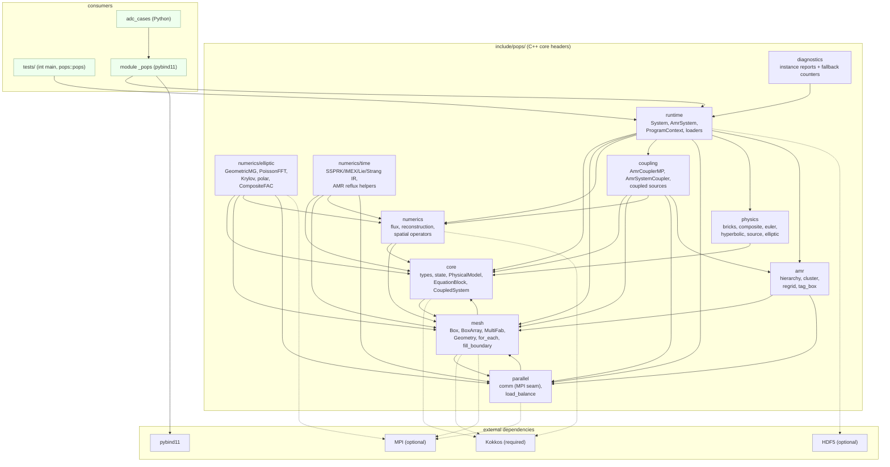
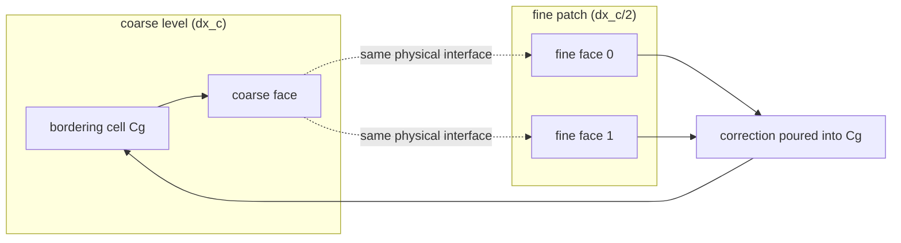
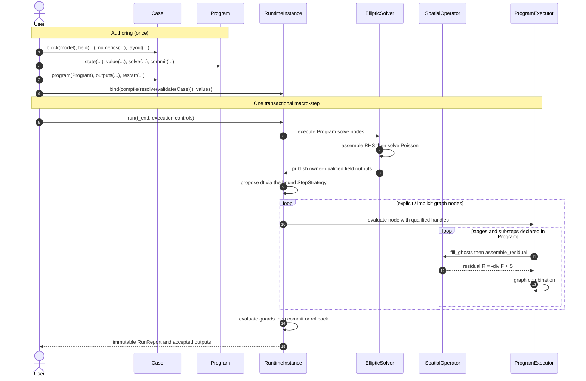

# Architecture of PoPS

PoPS is a C++20 core for coupled hyperbolic-elliptic systems on adaptive meshes. The
consumer surface is the headers under [`include/pops/`](../include/pops). Selected runtime
seams (`System`, `AmrSystem`, HDF5, program transactions) are compiled in `src/runtime/`.
Kokkos is the only on-node backend (Serial, OpenMP, or Cuda, depending on the install).
MPI and parallel HDF5 are optional. The generic physics bricks live in
[`include/pops/physics/`](../include/pops/physics). The Python package `pops` and the
compiled extension `_pops` bind that core.

`System<Dim>` and `AmrSystem<Dim>` are private native execution engines behind
`RuntimeInstance`. They are not Python authoring facades. Named scenarios live in the
neighboring repository `adc_cases`. The core is model-agnostic: it names no scenario and
exposes bricks composed in `CompositeModel`.

The public Python lifecycle is `validate -> resolve -> compile -> bind -> run`. Field-solve
legality, checkpoint identity, and consumer graphs are specified in
[`docs/design/SPECIFICATION_TECHNIQUE_FINALE_POPS_ARCHITECTURE.md`](design/SPECIFICATION_TECHNIQUE_FINALE_POPS_ARCHITECTURE.md).
This page maps the current source tree.

## Contents

- [Overview](#overview)
- [The layers](#the-layers)
- [Component contracts and generated catalog](#component-contracts-and-generated-catalog)
- [Grid conventions](#grid-conventions)
- [AMR coarse-fine stencil (reflux)](#amr-coarse-fine-stencil-reflux)
- [Pipeline of a time step](#pipeline-of-a-time-step)
- [Verified properties](#verified-properties)
- [Backends](#backends)
- [Thread safety](#thread-safety)
- [Using the library](#using-the-library)
- [Component interfaces and registration](#component-interfaces-and-registration)
- [Limitations](#limitations)
- [Tree](#tree)

---

## Overview

The diagram shows the public modules of [`include/pops/`](../include/pops), the real
external dependencies, and the consumers of the core. Kokkos is required
(`POPS_USE_KOKKOS` is ON by default; CMake finds it or fetches it). MPI is optional
(`POPS_USE_MPI`). pybind11 serves only the Python module. The sequential path goes through
Kokkos Serial, not through a host loop without Kokkos.

The project embeds neither Eigen, nor FFTW, nor Catch2. The FFT in
[`poisson_fft.hpp`](../include/pops/numerics/elliptic/poisson/poisson_fft.hpp) is written
here. Tests are `int main` programs that link `pops::pops`.


```mermaid
flowchart TD
  subgraph pops["include/pops/ (C++ core headers)"]
    direction TB
    core["core<br/>types, state, PhysicalModel,<br/>EquationBlock, CoupledSystem"]
    physics["physics<br/>bricks, composite, euler,<br/>hyperbolic, source, elliptic"]
    mesh["mesh<br/>Box, BoxArray, MultiFab,<br/>Geometry, for_each, fill_boundary"]
    parallel["parallel<br/>comm (MPI seam),<br/>load_balance"]
    numerics["numerics<br/>flux, reconstruction,<br/>spatial operators"]
    elliptic["numerics/elliptic<br/>GeometricMG, PoissonFFT,<br/>Krylov, polar, CompositeFAC"]
    timed["numerics/time<br/>SSPRK/IMEX/Lie/Strang IR,<br/>AMR reflux helpers"]
    amr["amr<br/>hierarchy, cluster,<br/>regrid, tag_box"]
    coupling["coupling<br/>AmrCouplerMP, AmrSystemCoupler,<br/>coupled sources"]
    runtime["runtime<br/>System, AmrSystem,<br/>ProgramContext, loaders"]
    diagnostics["diagnostics<br/>instance reports + fallback counters"]
  end

  subgraph ext["external dependencies"]
    direction TB
    kokkos["Kokkos (required)"]
    mpi["MPI (optional)"]
    hdf5["HDF5 (optional)"]
    pybind["pybind11"]
  end

  subgraph cons["consumers"]
    direction TB
    tests["tests/ (int main, pops::pops)"]
    pymod["module _pops (pybind11)"]
    cases["adc_cases (Python)"]
  end

  mesh --> core
  mesh --> parallel
  parallel --> mesh
  physics --> core
  core --> mesh
  numerics --> core
  numerics --> mesh
  elliptic --> core
  elliptic --> mesh
  elliptic --> numerics
  elliptic --> parallel
  timed --> core
  timed --> mesh
  timed --> numerics
  timed --> parallel
  amr --> mesh
  amr --> parallel
  coupling --> core
  coupling --> mesh
  coupling --> numerics
  coupling --> parallel
  coupling --> amr
  runtime --> core
  runtime --> mesh
  runtime --> numerics
  runtime --> coupling
  runtime --> parallel
  runtime --> physics
  runtime --> amr
  diagnostics --> runtime

  mesh -.-> kokkos
  core -.-> kokkos
  numerics -.-> kokkos
  parallel -.-> mpi
  mesh -.-> mpi
  elliptic -.-> mpi
  runtime -.-> hdf5

  tests --> runtime
  pymod --> runtime
  pymod --> pybind
  cases --> pymod

  classDef extcls fill:#eef,stroke:#88a;
  classDef conscls fill:#efe,stroke:#8a8;
  class kokkos,mpi,hdf5,pybind extcls;
  class tests,pymod,cases conscls;
```

## The layers

A high layer expresses the problem. A low layer executes it. A high layer never depends on
an execution detail. Containers (what stores) stay distinct from the execution policy (how
one loops and communicates).

**Physics (local, device-callable).** The `PhysicalModel` concept
([`physical_model.hpp`](../include/pops/core/model/physical_model.hpp)) exposes only local
pointwise laws, all `POPS_HD`: `flux`, `source`, `max_wave_speed`, `elliptic_rhs`. No
storage access, no parallelism, no allocation in hot loops, no `std::function`, no dynamic
polymorphism. A model is a `CompositeModel`
([`composite.hpp`](../include/pops/physics/composition/composite.hpp)) of generic bricks on
three axes (transport / source / elliptic). Each consumer receives a compact
`ProviderValues<N>` plan resolved from owner-qualified `ComponentKey`s. The core reserves
no physical auxiliary slots. Geometry (Cartesian / polar / embedded level set) is a mesh
config axis, not a model axis.

**Numerics / discretization.** Pointwise policies (Riemann flux, reconstruction, stencil)
take states and see no container. The ranked hyperbolic surface is
[`spatial_operator.hpp`](../include/pops/numerics/spatial_operator.hpp), a barrel over
[`PreparedCartesianOperator`](../include/pops/numerics/spatial/operators/cartesian_operator.hpp).
That operator materializes one `FaceField<Dim>` then assembles
`R = -div F + S` (`assemble_residual` / `materialize_face_fluxes`). It loops over a `Box`
via a local view and ignores box/rank decomposition and the backend. Flux policies live in
[`numerical_flux.hpp`](../include/pops/numerics/fv/numerical_flux.hpp) (Rusanov / HLL /
HLLC / Roe). Reconstruction lives in
[`reconstruction.hpp`](../include/pops/numerics/fv/reconstruction.hpp) (MUSCL, WENO5-Z).
Geometry variants are additive:
[`embedded_boundary/operator.hpp`](../include/pops/numerics/spatial/embedded_boundary/operator.hpp)
and
[`polar_operator.hpp`](../include/pops/numerics/spatial/operators/polar_operator.hpp).
The Cartesian path stays bit-identical when those variants are unused. There is no
`assemble_rhs` template on the production surface.

**Mesh / data.** What stores: `Box<Dim>`, `BoxArray<Dim>`, `Distribution<Dim>`,
`MultiFab<Dim>`, exact-ranked Cartesian `Geometry<Dim>`, and the AMR hierarchy. These
containers carry distributed fields and halos. They do not select execution. Polar annular
geometry remains a descriptor and output contract. It is not a second native `System`
storage authority.

**Execution (seams).** The execution policy sees minimal exact-ranked views (`Box<Dim>`,
`FieldView<Dim>`, scalar and rank). `for_each_cell`
([`for_each.hpp`](../include/pops/mesh/execution/for_each.hpp)) iterates the compile-time
rank through Kokkos. [`FieldView`](../include/pops/mesh/storage/field_view.hpp) is the
non-owning host/device view. `comm` ([`comm.hpp`](../include/pops/parallel/comm.hpp))
provides rank/size and collectives. Halo exchange and field algebra orchestrate these seams.

**Time / coupling.** Production composition is authored only through `pops.Program`. The
immutable Python `ProgramGraph` is the sole temporal IR. C++ executes the lowered graph
through [`ProgramContext<Dim>`](../include/pops/runtime/program/program_context.hpp) and
[`AmrProgramContext<Dim>`](../include/pops/runtime/program/amr_program_context.hpp).
Exact-ranked SSPRK objects, IMEX, and low-level `lie_step` / `strang_step` helpers remain
C++ bricks; they do not choose a production stepper. `System<Dim>` and `AmrSystem<Dim>` own
field preparation, residual assembly, and state publication. There is no generic
single-block `Coupler`, static `SystemAssembler`, `Fab2D`, or AMR level-stack authority.
[`AmrCouplerMP<Dim>`](../include/pops/coupling/amr/amr_coupler_mp.hpp) and
[`AmrSystemCoupler<Dim>`](../include/pops/coupling/system/amr_system_coupler.hpp) are thin
spatial facades over [`AmrRuntime<Dim>`](../include/pops/runtime/amr/amr_runtime.hpp). On
the public Python surface, inter-species terms are declared with `Model.coupled_rate(...)`
and advanced by the whole-system `Program`.

## Component contracts and generated catalog

Every source, native, or externally supplied component crosses composition and loading
boundaries with a schema-v2 `ComponentManifest`. The manifest is an immutable contract, not
a report assembled after lowering. Its stable identifier is the namespaced `uri` plus
semantic `version`. The payload declares type and facets, call signature, reads and writes,
parameters, interfaces, requirements, capabilities, effects, admissible layouts and clocks,
target variants, determinism, restart schema, precision, conservation properties, and named
entry points.

Two identities are deliberate:

- `semantic_digest` covers every behavior-bearing field and every registered semantic
  extension;
- `manifest_digest` additionally covers documentary extensions and is the identity of the
  complete manifest.

Changing a summary or provenance note does not invalidate scientific semantics. A semantic
extension must name an absolute schema URI and a positive schema version, and must be
validated by a registered `ComponentExtensionSchema`. Unknown top-level fields are refused.
Values use the closed PoPS canonical CBOR vocabulary, so Python and C++ produce identical
bytes and SHA-256 identities.

Builtin routes and model bricks have one declaration authority:
[`schemas/component_catalog.v2.json`](../schemas/component_catalog.v2.json).
[`scripts/generate_component_catalog.py`](../scripts/generate_component_catalog.py)
generates the Python route/schema products and the C++ catalog header. `routes.py`,
`route_ids.hpp`, and the inspection APIs contain behavior only; they must never declare
mirrored rows or fallback defaults. The generator `--check` mode is a CI drift gate.

Adding a builtin component is one catalog change followed by regeneration. An external
family implements the facet protocols named by its manifest, registers that manifest, and
lowers through an advertised entry point. Unsupported targets fail with a path, error code,
and machine-readable evidence before native execution.

## Grid conventions

The code separates the integer index space from physical cell centers. The index space is
carried by [`Box<Dim>`](../include/pops/mesh/index/box.hpp), a pair of inclusive
`Index<Dim>` corners. The box is empty as soon as `hi[axis] < lo[axis]`. The physical
mapping is the exact-ranked
[`Geometry<Dim>`](../include/pops/mesh/geometry/geometry.hpp). Rank and axis extent are
immutable parts of the compiled provider contract.

Native runtime configs share
[`RuntimeSpatialDomain<Dim>`](../include/pops/runtime/config/spatial_domain.hpp):

| Field | Role |
| --- | --- |
| `shape` | cells per axis (`Extent<Dim>`) |
| `lower`, `upper` | physical bounds, strictly increasing on every axis |
| `periodicity` | per-axis periodic flags |
| `boxes` | optional exact decomposition; empty means one full-domain box |
| `coordinate_system` | Cartesian identity for the compiled rank |

The index box is `Box<Dim>::from_extents(shape)`. Cell centers exist for any index,
ghosts included: `Geometry::x_cell(i)` returns `x_lo + (i + 1/2) * dx` with
`dx = (x_hi - x_lo) / N` on that axis.

### Uniform runtime

`System<Dim>` ([`system.hpp`](../include/pops/runtime/system.hpp)) carries one ranked grid
shared by all blocks. `SystemConfig<Dim>` extends `RuntimeSpatialDomain<Dim>` with the
load-balance route. There is no square-only `n` / `L` pair and no `Box2D` alias.

### Polar algorithm components (not a `System` runtime)

`PolarGeometry<2>`, the polar transport operators, and the direct/tensor polar elliptic
solvers remain standalone C++ numerical components with dedicated tests. `System<Dim>` has
one Cartesian coordinate-provider contract. The historical `geometry == "polar"` engine was
removed. `pops.mesh.PolarMesh` can still describe annular geometry for inspection and
scientific output. Native execution fails during resolution before artifact creation.
`verification/manifest.toml` records `polar_system_runtime = false`.

### Adaptive runtime

`AmrSystem<Dim>` ([`amr_system.hpp`](../include/pops/runtime/amr_system.hpp)) carries the
same ranked domain over a hierarchy. `AmrSystemConfig<Dim>` adds:

| Field | Role |
| --- | --- |
| `shape` | coarse cells per axis (default 128, not the uniform 64) |
| `level_count` | maximum active hierarchy depth (default 2; authored, not hardcoded) |
| `transition_ratios` | per-transition `Extent<Dim>` (baseline ratio 2) |
| `transition_buffers`, `transition_lookaheads` | per-transition nesting buffer and tagging lookahead |
| `regrid_every` | re-refinement every N accepted macro-steps (`0` freezes after init) |
| `distribute_coarse` | replicated coarse (default) or multi-box distributed coarse |
| `coarse_max_grid` | per-axis tile cap when the coarse is distributed |
| `explicit_bootstrap` | coarse-only start; `BootstrapPlan` creates fine levels |
| `cluster_*` | Berger-Rigoutsos knobs (`<= 0` keeps the historical `{0.7, 1, 32}`) |
| `load_balance_*` | prepared ownership route (default space-filling curve) |

`Geometry::refine(r)` and `Box<Dim>::refine(r)` preserve the physical extent and refine the
index space. A coarse cell becomes an `r`-block of fine indices; `coarsen(r)` is a floor
division of each corner. Multi-block runs co-locate species on a shared hierarchy (same
`BoxArray`, same distribution, same `dx` per level). `AmrProgramContext` compares the
accepted macro-step with the prepared interval, then calls the spatial
`AmrRuntime::regrid()` primitive when due. `AmrRuntime` does not decide cadence.

## AMR coarse-fine stencil (reflux)

At a 2:1 interface, the coarse numerical flux and the fine numerical flux do not coincide.
Without correction, the bordering coarse cell would lose conservation. Reflux replaces the
coarse flux contribution with the time-integrated fine flux crossing the same physical
interface.

For ratio 2, a coarse face is covered by two fine faces:


```mermaid
graph LR
  subgraph Coarse["coarse level (dx_c)"]
    Cg["bordering cell Cg"]
    Cgf["coarse face"]
  end
  subgraph Fine["fine patch (dx_c/2)"]
    f0["fine face 0"]
    f1["fine face 1"]
  end
  Cg --> Cgf
  Cgf -. "same physical interface" .-> f0
  Cgf -. "same physical interface" .-> f1
  f0 --> Reflux["correction poured into Cg"]
  f1 --> Reflux
  Reflux --> Cg
```

The mechanics live under
[`amr_reflux_mf.hpp`](../include/pops/numerics/time/amr/reflux/amr_reflux_mf.hpp).
[`amr_subcycling.hpp`](../include/pops/numerics/time/amr/levels/amr_subcycling.hpp)
provides prepared hierarchy storage and spatial transfer/reflux helpers. Neither header
owns a temporal loop. `ProgramGraph`, executed through `AmrProgramContext`, determines
every stage, substep, and catch-up.

Three objects share the work:

- `FluxRegister` is a coarse buffer with global indexing. Each rank writes local
  contributions, `gather()` sums them by `all_reduce_sum_inplace`, then each rank reads the
  total. In serial the all-reduce is the identity.
- `CoverageMask` marks coarse cells shadowed by a fine patch. It is built on the global
  fine `BoxArray`, known by all ranks. Only a bordering coarse cell that is not covered
  receives a correction, so a fine-fine joint is not refluxed twice.
- Prepared per-patch interface storage describes the parent footprint and the coarse/fine
  edge strips. The Program flux ledger owns time integration of those strips.

For a ratio-2 spatial interface, the restriction of a fine edge flux is the average of the
two sub-faces. `AmrProgramContext` then accumulates that spatial result with the
graph-authored local time step and RK/IMEX coefficient. A rejected attempt discards the
candidate state and the corresponding ledger together.

`average_down` then overwrites each covered coarse cell with the average of its fine
children, closing coarse/fine coherence.

## Pipeline of a time step

Uniform `System<Dim>` and adaptive `AmrSystem<Dim>` share one generated Program grammar.
Both are private facades materialized by `pops.bind`. The temporal authority does not
differ: both execute the installed `ProgramGraph`. Only their spatial services and
transaction envelopes differ.

The runtime supplies data, operator/provider seams, and the native CFL-bound reduction. It
has no implicit transport, coupling, or projection fallback. The former adaptive multirate
formula survives only as a test oracle in
`tests/cpp/support/reference_time_scheduler.hpp`.


```mermaid
sequenceDiagram
    autonumber
    actor User
    participant Case
    participant Program
    participant Runtime as RuntimeInstance
    participant Elliptic as EllipticSolver
    participant Spatial as SpatialOperator
    participant Executor as ProgramExecutor

    Note over User,Program: Authoring (once)
    User->>Case: block(model), field(...), numerics(...), layout(...)
    User->>Program: state(...), value(...), solve(...), commit(...)
    User->>Case: program(Program), outputs(...), restart(...)
    User->>Runtime: bind(compile(resolve(validate(Case))), values)

    Note over User,Executor: One transactional macro-step
    User->>Runtime: run(t_end, execution controls)
    Runtime->>Elliptic: execute Program solve nodes
    Elliptic->>Elliptic: assemble RHS then solve Poisson
    Elliptic-->>Runtime: publish owner-qualified field outputs
    Runtime->>Runtime: propose dt via the bound StepStrategy

    loop explicit / implicit graph nodes
        Runtime->>Executor: evaluate node with qualified handles
        loop stages and substeps declared in Program
            Executor->>Spatial: fill_ghosts then assemble_residual
            Spatial-->>Executor: residual R = -div F + S
            Executor->>Executor: graph combination
        end
    end
    Runtime->>Runtime: evaluate guards then commit or rollback
    Runtime-->>User: immutable RunReport and accepted outputs
```

`RunReport` counts accepted macro-steps and rejected attempts, and exposes the final time,
macro-step, and authenticated identities. A failed run raises; it never returns a
success-marked report.

Strang and Lie composition are Program macros (`pops.lib.time.strang` / `lie`). They lower
explicit sub-flows into the same IR.

On the adaptive hierarchy, `AmrSystem::step` opens one accepted-step transaction and
invokes the Program through `AmrProgramContext`. `AmrRuntime` owns layouts, states, field
solves, residuals, tagging, transfers, and reflux services. It does not choose a temporal
method. A due regrid rebuilds the shared topology from the union of tagging predicates.
`advance_hierarchy` walks the authored parent/child clock relations, refluxes coarse/fine
interfaces, and restores covered coarse cells by `average_down`. A failed solve or
numerical guard restores state, topology, fields, histories, clocks, diagnostics, and
counters before the attempt is reported.

Field-solve legality, nullspace/gauge contracts, warm starts, and AMR checkpoint identity
are resolved before native artifact creation. The native runtime receives authenticated
prepared providers. It does not maintain a second closed enum registry or privilege a field
named `phi`. Those contracts are documented in the
[final specification](design/SPECIFICATION_TECHNIQUE_FINALE_POPS_ARCHITECTURE.md).

## Verified properties

Bit-identical tests are a software net (a refactoring did not change bits). They are not a
numerical proof. The properties below are those the test suite actually measures.

**Mass conservation at round-off.** The finite-volume scheme is conservative by telescoping
fluxes. At coarse/fine interfaces the FluxRegister reflux closes the same balance. A
condensed Program freezes density during its implicit sub-flow, so any density change comes
from the explicitly authored transport/coupling sub-flows.

**MPI distributed proofs.** Exact-ranked halo exchange, AMR compilation, Cartesian Poisson,
and Krylov workspace ownership are exercised by dedicated MPI suites, including multiple
rank counts where the manifest declares them. Additive global sums are not bit-exact across
rank counts because the reduction order changes.

**Device kernels.** Historical Kokkos Cuda campaigns on GH200 covered single-grid System,
AMR field operations, multi-GPU MPI halos, and the integrated AmrSystem + MPI + GPU route.
Those harnesses live in `tests/gpu/romeo/` and are out of CI. After a runtime or numerical
cutover they do not replace a fresh device run. A component variant that does not declare
and prove the selected GPU execution context is refused; there is no implicit host
fallback.

**Parity of authenticated generated blocks.** `test_compiled_model_parity` validates
numerical parity of catalog-selected templates on CPU/Serial.
`test_amr_compiled_model` validates hierarchy installation. This is a test oracle, not a
second public registration route.

The repo-local scientific campaign under [`verification/`](../verification/README.md)
measures orders, conservation, phase, symmetry, and AMR interface errors against external
oracles. It is distinct from the fast-test catalogue.

## Backends

Backends are a property of the library, not a flag per target. They attach to the interface
target `pops`. Everything that links `pops` inherits the backend chosen at configuration.

```
cmake -B build                                       # Kokkos fetch+build (Serial default)
cmake -B build -DKokkos_ENABLE_OPENMP=ON             # Kokkos OpenMP
cmake -B build -DKokkos_ROOT=$K                      # reuse an existing Kokkos install
cmake -B build -DKokkos_ROOT=$K -DCMAKE_CXX_COMPILER=$K/bin/nvcc_wrapper  # Cuda
cmake -B build -DPOPS_USE_MPI=ON                     # distributed (POPS_HAS_MPI)
```

**Kokkos** is required. Configuring `-DPOPS_USE_KOKKOS=OFF` is a fatal error. CMake does
`find_package(Kokkos)` then, failing that, fetches version `POPS_KOKKOS_FETCH_VERSION`
(default 4.4.01, SHA256-verified tarball). The execution space is chosen by
`Kokkos_ENABLE_SERIAL` / `OPENMP` / `CUDA` at Kokkos install time, not by a PoPS flag. The
standard is C++20. CI plays Kokkos Serial and, on the `ci-full` job, Kokkos OpenMP. CI
never builds `-DKokkos_ENABLE_CUDA=ON`.

**MPI** is optional. `-DPOPS_USE_MPI=ON` defines `POPS_HAS_MPI` and links `MPI::MPI_CXX`.
Out of MPI, `comm` degenerates to the identity (rank 0, size 1, all-reduce and barrier
no-op).

**`for_each_cell`** in [`for_each.hpp`](../include/pops/mesh/execution/for_each.hpp) is the
dispatch seam. It takes a `Box` and a `POPS_HD` lambda and compiles into
`Kokkos::parallel_for`. Numerical logic stays in the lambda. Reductions use
`for_each_cell_reduce_sum` / `_max` (`Kokkos::Sum` / `Max`). The sum reassociates by tile:
deterministic for a given Kokkos space, not bit-identical to a lexicographic sum. The max
stays exact.

## Thread safety

The execution model is data parallelism. Kernels do not share arbitrary mutable state.

**Reentrant.** The body of `for_each_cell` writes cell `(i, j, ...)` of its own local
`Array4`. As long as the kernel only writes its cell, there is no race. A grid operator
receives a local view and sees neither the distribution, nor the MPI rank, nor the loop
policy. Reductions go through Kokkos reducers, not a shared host accumulator.

**Must be sequenced.** On unified memory (GH200), a function that launches a device kernel
then reads the same memory on the host must call `device_fence()` (`sync_host()`) between
the two. Halo writes (physical, parallel, coarse-fine) are sequenced steps, not concurrent
with the interior sweep. `fill_ghosts` is `fill_boundary` then `fill_physical_bc`. The
`comm` seam is not designed for concurrent calls from several threads on the same
communicator; the pattern is one thread per rank, threads/GPU inside the rank via
`for_each_cell`.

**Post-commit scientific output.** A detached observer frame is immutable and is submitted
only after its numerical step commits. Asynchronous `PER_RANK` and `COLLECTIVE` output
require `MPI_THREAD_MULTIPLE`. All post-commit sessions in one `RuntimeInstance` run share
one process-local FIFO, so HDF5 and other asynchronous writers keep the same
initialization/execution/finalization order on every rank. `LiveVisualization` and the
built-in Catalyst provider accept `SERIAL` and `COLLECTIVE`. `ROOT` and `PER_RANK` remain
invalid for Catalyst because its lifecycle is collective. Multiple concurrent
`RuntimeInstance` runs in one process are unsupported when asynchronous HDF5 or built-in
Catalyst is active.

Native capture, HDF5, and Catalyst accept Cartesian ranks 1, 2, and 3. Published native
fields stay cell-centred; a non-cell-centred native centering is refused before
publication. VTK array names come from explicit declaration strings such as
`model.state("U", ...)`, not Python left-hand-side variable names. The 2-D scalar-advection
tutorial is a tutorial choice, not an engine limit.

## Using the library

On the C++ consumer side, pull the core by FetchContent and link `pops::pops`:

```cmake
include(FetchContent)
FetchContent_Declare(PoPS GIT_REPOSITORY https://github.com/wolf75222/PoPS.git)
FetchContent_MakeAvailable(PoPS)
target_link_libraries(my_app PRIVATE pops::pops)
```

The entry contract is the `PhysicalModel` concept in
[`physical_model.hpp`](../include/pops/core/model/physical_model.hpp). A type that
satisfies it exposes a flux, a source, `max_wave_speed`, and `elliptic_rhs`, with
`M::Aux == pops::Aux`. Methods called in kernels must carry `POPS_HD`. One obtains such a
type by composing generic bricks in `CompositeModel<Hyperbolic, Source, Elliptic>` or by
writing a struct.

The model is instantiated by `System<Dim>` or `AmrSystem<Dim>`, whose compile-time rank is
selected once from the authored Python domain. Pybind exposes only their private
installation/execution seams, consumed by `pops.bind` and held by `RuntimeInstance`.
Neither facade is a Python authoring surface.

## Component interfaces and registration

Source components, generated components, builtins, and external compiled components cross
one manifest trust boundary. `schemas/component_catalog.v2.json` owns the interface
vocabulary and the builtin route bindings. A `ComponentManifest.interfaces` row has exactly
`name`, `mode`, and `binding`. `mode` is one of `method`, `value`, or `entry_point`.

The interfaces are small: Requirement, Lowering, Stencil, Stability, Provider, Effects,
Restart, Report, FallibleEvaluation, and Format. Python uses an immutable
`ComponentAdapter`. C++ exposes independent concepts in
`include/pops/runtime/config/component_interfaces.hpp`. There is no component base class,
scientific concrete-class switch, or process-global registry. Registration is atomic,
content-addressed, and explicitly frozen.

A manifest `FallibleEvaluation` returns an explicit `EvaluationOutcome` (`ok`, `retry`,
`reject`, or `failed`). It has no implicit Python truth value. Finite-volume components
follow the same rule: `PhysicalFluxView` exposes constitutive density, wave/stability, and
declared Riemann structure. A `NumericalFlux` consumes two model-qualified `FaceTrace`
values plus `FaceContext`. The mesh `SpatialOperator` alone applies face and cell measures.
Provider packs are selected from exact `(owner, space kind, space name, component)`
identities.

## Limitations

These limits raise a clear error rather than drifting silently.

- **AMR composite tensor elliptic.** A generated hierarchy-scoped solve routes through
  `CompositeFacPoisson` via `AmrTensorElliptic`. Unsupported hierarchy/MPI shapes return a
  typed capability failure. There is no fallback to a flat solve. A partially refined
  CompositeFAC hierarchy remains an explicit refusal.
- **FFT.** `PoissonFFTSolver<Dim>` supports native ranks 1, 2, and 3 on a fully periodic,
  constant-coefficient Cartesian layout with one canonical ordered slab of the last axis
  per communicator rank. Walls, variable epsilon, anisotropy, reaction terms, and
  non-canonical decompositions are rejected before installation. Power-of-two axes use the
  radix-2 path; other positive extents use a diagnosed direct-DFT path that inverts the
  same discrete operator. The catalog route `cartesian_cg` lowers to
  [`CartesianPoissonSolver<Dim>`](../include/pops/numerics/elliptic/nd/cartesian_poisson.hpp).
  `GeometricMG` (`pops::elliptic::mg::GeometricMG`) owns the AMR MG/FAC route and is
  rejected for a uniform `System`. Composite FAC has two headers:
  [`mg/composite_fac_poisson.hpp`](../include/pops/numerics/elliptic/mg/composite_fac_poisson.hpp)
  (nested Cartesian engine) and
  [`amr/composite_fac_poisson.hpp`](../include/pops/numerics/elliptic/amr/composite_fac_poisson.hpp)
  (partitioned-MPI wrapper).
- **Polar Poisson.** `PolarPoissonSolver<2>` is single-rank, on a single box covering the
  ring. Its FFT-in-theta + tridiagonal-in-r requires the complete azimuthal line and the
  complete radial column on one rank. It is not a Cartesian `System<Dim>` backend.
- **Embedded-boundary and level-local field solves** over partial AMR `BoxArray`s are
  refused until material connectivity and coarse/fine boundary closure can be
  materialised.
- **Iterate-dependent level-local multilevel boundaries** and AMR field-to-field providers
  remain explicit refusals. No route falls through to a Python callback or a per-cell
  registry lookup.

## Tree

Headers under `include/pops/`, ordered by layer. Compiled seams live in `src/runtime/`.

```
include/pops/
  core/               PhysicalModel, EquationBlock, CoupledSystem, types, Kokkos seam, identities
  mesh/               Index, Box, BoxArray, Fab, MultiFab, Geometry, halos, physical BCs
  mesh/nd_proof/      ND periodicity, translation schedules, local neighbor proofs
  mesh/layout/        BoxArray, Distribution, refinement, field distribution
  physics/            generic bricks -> CompositeModel; Euler, isothermal, polar pendants
  physics/admissibility/  admissible sets and projection
  numerics/fv/        pointwise Riemann flux + reconstruction policies
  numerics/spatial/   ND FV operators (Cartesian, polar, embedded-boundary, mask)
  numerics/linalg/    small dense linear algebra (eig, block inverse)
  numerics/nonlinear/ Newton options, local nonlinear, conservative recovery
  numerics/elliptic/  GeometricMG, CartesianPoissonSolver, Poisson FFT 1/2/3, polar, FAC, Krylov
  numerics/time/      SSPRK/IMEX/Lie/Strang IR + AMR reflux/subcycling helpers
  coupling/base/      aux fill + elliptic RHS contracts
  coupling/source/    coupled sources and CouplingOperator
  coupling/system/    AmrSystemCoupler (shared hierarchy layout auth)
  coupling/amr/       AmrCouplerMP, AmrRegridCoupler
  runtime/program/    ProgramContext / AmrProgramContext (native Program execution)
  runtime/system/     System internals: blocks, field solvers, aux
  runtime/amr/        AmrRuntime, tensor FAC, tagging/reflux components
  runtime/config/     spatial_domain, manifests, generated catalog + ABI
  runtime/builders/   model factory, compiled DSL blocks, native loader
  runtime/dynamic/    dlopen ABI, authenticated native packages
  runtime/checkpoint/ exact-ranked spatial checkpoint contract
  runtime/output/     collective HDF5 adapter (Dim-ranked field pieces)
  amr/                AmrHierarchy, tag_box, Berger-Rigoutsos clustering, regrid
  parallel/           MPI seam (identity in serial), load balance, execution lanes
  diagnostics/        RuntimeDiagnosticsReport + global fallback-route counters
```
