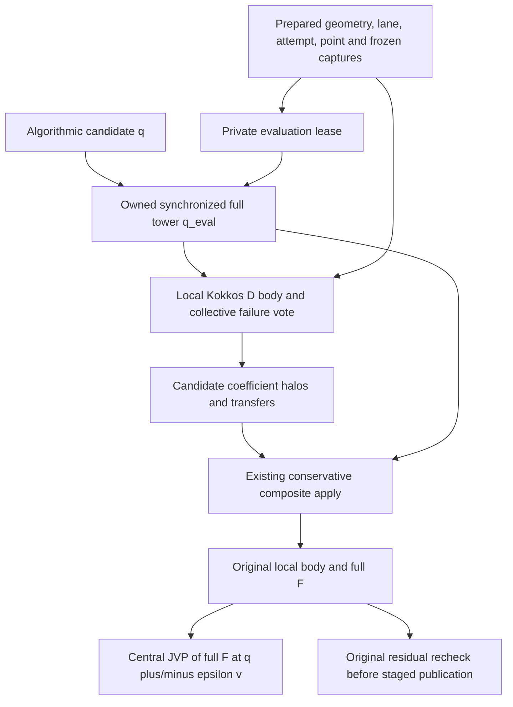

# Proposed next mechanism: coefficients evaluated per original-field candidate

**Status: design and exact math only.** No production code, ABI, native capability,
JIT, SDK or environment is changed by this note. Source baseline is
`b39f4a9906f904cd2f857c2874878da8aa84084f`; captured-D production is
`4ae5c4de2c73b88e1ed1644293df1c3ad0c66b9a`. The current explicit refusal of D(q)
remains correct. The proposal is a realization extension, not a qualification of
M26/M27 or a new scientific campaign.

## Normative boundary and choice

The handoff `results/corpus_matrix.json` M26 entry specifies the finite N12
symmetric interaction and energy pairing. Its PDE N32/64/128 leaves diffusion
to be fixed and requires a compatible gradient flux for a full energy claim.
M27 specifies only the stable linear mixed subcase, epsilon .08, periodic,
N16/32/64 and dt .01; it explicitly distinguishes a subsequent double-well
potential. `context/CORPUS_ORIGINAL.md` also requires the mixed chemical-potential
and boundary relations. Neither entry fixes a nonlinear mobility D(c), a
double-well convention, wetting data or a complete nonlinear energy acceptance.
These quantities must not be invented to make a campaign appear closed.

Constant-mobility M27 with a declared nonlinear local potential need not wait
for D(q): the original mixed FieldProblem local-body mechanism already permits
unknown products. Its State projection, accepted nonlinear energy/boundaries
and real saved-state reception remain separate obligations. M26 also needs a
real spatial interaction/convolution and its compatible flux; the finite map
witness cannot be relabeled AMR convolution. The smallest *new spatial body*
mechanism selected here is pointwise D(q, frozen State captures), which is
useful to those families when their additional physical data are declared.

## Exact counterexample: changing only the AST guard is wrong

Take dimensionless q=(1,2) on two periodic cells of spacing 1/2 and declare
`D(q)=1+q²`, with arithmetic face means. The original spatial relation is
`F(q)=-div_h(D_face(q) grad_h(q))`:

| Evaluation | Result |
|---|---|
| Original F(q) | (-28,28) |
| D frozen at zero, then applied to q | (-8,8) |
| Original DF(q)[(1,0)] | (20,-20) |
| D frozen at q, applied to direction (1,0) | (28,-28) |

The missing tangent is `-div_h(delta(D_face) grad_h(q))`. Exact central full-F
differences give the first tangent component `20+4*epsilon²`. This is a
constitutive/face-law counterexample, not a Newton convergence assertion. An
additional exact AMR-order counterexample is q_fine=(1,3): D(mean(q))=5 while
mean(D(q))=6. Thus the transfer order belongs to the discretization identity.

`tests/review/sol61_candidate_diffusion_counterexample.py` independently checks
these fractions, conserved shared faces, component permutations and quadratic
central-difference error for three/five components and five/seven cells. It
imports no PoPS, prototype, NumPy or native runtime and performs no solve.

## Existing native seam and the incompatibility to avoid

Uniform `program_emit_nonlinear_field.py` prepares the coefficient field and
halos once before its evaluate callback. The callback applies
`apply_general_field` with that fixed buffer, then evaluates the original local
body. AMR `PreparedAmrFieldResidual::solve` calls
`apply_original_field_operator(q,result)`, then its original LocalBody; the
central JVP correctly calls the whole evaluate callback at q±epsilon*v. Today
that spatial operator has immutable coefficients. The accepted original-F
recheck uses the same spatial operator.

`PreparedCompositeGeneralField::prepare_coefficients_impl_` copies into the real
scalar FAC entries, prepares their coefficient transfers/halos and increments
`original_field_generation_`. `PreparedAmrFieldResidual::require_authority`
authenticates that generation. Repreparing the existing provider in place at
every q would revoke the prepared invocation; retaining the old generation
would falsely authenticate a changed frozen operator. Either approach is wrong.
The immutable captured-D and legacy paths must remain byte-identical.

## Proposed realization and order

Proposed public selection (names/version reservation require ROOT integration):

```python
CellCenteredNonlinearCoupled(
    finite_difference_step=declared_step,
    face_policy="Arithmetic@1",
    coefficient_evaluation="PerCandidate@1",
)
```

The physical body `DivCoeffGrad(q_j, D_ij(q, captures))` is declared before this
method. Encoding the coefficient with the same qualified unknown tuple as the
local body infers unknown reads; no manual dependency register or model-name
dispatch is added. Default None preserves frozen @1/@2 routes. D(q) without
the selected realization remains refused. The first provider accepts pointwise
unknown/capture ASTs, arbitrary ordered component count and finite signed full
matrices. Gradient-dependent coefficients and different sampling/stencil rules
need their own realization; this is not a mathematical impossibility claim.



For every F evaluation, including every JVP endpoint and final recheck:

1. Authenticate the immutable authority on the **prepared lane**, including
   exact point/stage/physical time/duration, full tower topology/owners, widths,
   graph/equation/body identities, attempt lease and frozen captures. Allocate
   scratch once per invocation; catch local allocation/shape errors and vote
   before any later collective. Synchronize an owned q_eval copy through the
   real full-tower candidate restriction/ghost mechanism; never mutate the
   accepted State, caller seed or accepted field.
2. Issue a private evaluation generation before invoking the coefficient body.
   It records q_eval identity/generation and the actual prepared point/attempt;
   it is not caller-populated metadata attached to old vectors at consumption.
   Every rank agrees on the occurrence, even ranks with no local cells.
3. Execute the physical D AST locally in Kokkos into owned coefficient scratch,
   with q_eval and frozen capture views read-only. Authenticate layout, matrix
   width and actual read ports. Fence, check finite values and vote before
   transfer. Signed/zero/nonsymmetric entries stay finite-general; no silent
   absolute value, clamp, SPD claim or constitutive modification is allowed.
4. Prepare these **candidate coefficients** using the actual coefficient
   restriction/interpolation/physical halos of the existing scalar FAC entries,
   then apply their conservative composite flux/coarse-fine correction. The
   declared order is synchronized cell-mean q → cell D body → coefficient
   transfers → arithmetic faces. In covered cells, native coefficient
   restriction may replace D evaluated from restricted q. This selected
   composition must be identified explicitly; do not substitute D of a q ghost
   for a transferred D ghost or claim the two commute. Uniform uses the same
   cell evaluation then its existing coefficient boundary session.
5. Add the unchanged physical local reaction/forcing using q_eval and the same
   captures. Authenticate/fence the result inside a local-failure vote before
   the next norm. The Newton RHS alone is -F; JVP and original recheck remain
   +F. Central JVP calls this complete composition twice. Publication uses the
   same final evaluator and the existing original-F norm, coverage/measure and
   SolveOutcome/atomic-commit guards.

## Native ownership and interfaces

Keep `PreparedHierarchyFieldOperator@1` and its vtable unchanged. Add a separate
optional candidate-evaluation capability in
`include/pops/runtime/amr/hierarchy_field_operator.hpp`, provisionally
`pops.hierarchy.original-field-candidate-operator@1`. Its factory returns an
apply-only evaluation resource with its own coefficient/phi/image scratch and
coefficient generation. It retains prepared topology, coverage, geometry and
the exact lane, and exposes controlled writable coefficient ports followed by
sealed preparation/apply. The old immutable coefficient generation is never
relabelled or incremented by this evaluation resource.

`PreparedCompositeGeneralField` supplies that capability from its existing
scalar FAC preparation/apply machinery. Sharing immutable schedules/masks is
possible with strong ownership; mutable scalar phi, coefficient and image
buffers cannot be shared with the frozen operator or another concurrent
evaluation. Extract the apply storage from the current prepared class rather
than cloning its unused linear-GMRES basis into every evaluation. This is the
small native refactor required; a new host/composite mini-solver is unnecessary.

`PreparedAmrFieldResidual` gets a versioned overload with a coefficient body and
local body. The orchestrator owns the new resource and performs the votes,
synchronization, halo transfers and apply; the local coefficient callback enters
no MPI collective. Its generation/lease is revoked on parent rollback, failed
evaluation and destruction. Plus/minus evaluations are distinct occurrences;
F/D values cannot be cached only by equation, geometry or the Newton integer
supplied to a callback. Uniform uses the analogous owned coefficient scratch
inside its real prepared evaluate callback, with failure consensus before fill.

Expected source files are `_program_nonlinear_problem.py`,
`_program_expression.py` (only if qualified coefficient unknown reads need a
separate validation entry point), `methods.py`, `program_field_plan.py`, both
nonlinear emitters and Program serialization; native files are the capability,
prepared composite apply storage and prepared original residual. No
`ProgramRuntimeState` member or checkpoint wire field is needed: evaluation
scratch is provisional, absent from accepted history, and recreated from
authenticated equations/captures after restart. ABI impact must still be checked
against actual exported layouts; changed headers require a coherent all-dimension
SDK rebuild even if native wire/ABI ordinals remain unchanged.

The source residual contract would be @3 with coefficient evaluation policy and
unknown-read AST in its Method/Case/IR/cache identity. SolveRequest schema 2 can
retain its realization map if its reader authenticates the new key; conditional
Program IR needs the next unreserved version (11 in this source baseline).
Unknown/invented policy and old readers must refuse deterministically. No
legacy serialization is widened silently.

## Cost, preconditioning and reception

For N stored cells, m fields and L levels, each full F adds O(N*m²) coefficient
work/storage and the real per-entry coefficient halo/transfer preparations. A
central JVP adds two such full evaluations; line search and final recheck also
evaluate their own coefficients. Scratch is reused, with O(N*m) q_eval and
result storage plus the scalar FAC entry work already required by composite
apply. Distributions/empty ranks do not change the collective schedule. Expose
actual coefficient-evaluation/preparation counts and bytes; do not hide an
O(NDOF) matrix assembly or inflate Newton/GMRES tolerance, restart or budgets.

Identity remains the default preconditioner. Existing SpatialBasisJacobi@1 is
prepared from a frozen spatial operator before solve. It cannot silently become
an iteration-dependent full Jacobian. Initially reject that unbound combination
as a missing realization. A later explicit frozen-D reference at the declared
algorithmic seed can reuse c7's true basis response and retain the 1+stored-DOF
cost; its reference State and separate preconditioner authority must enter the
identity. It still preconditions the full original JVP and never replaces F.

Reception before any support claim:

- Exact scalar/vector counterexamples here; changing D at a fixed q changes
  original F and removing delta(D) fails the tangent test. Preserve @1/@2
  IR/CPP/manifest/request byte parity and source refusals of unsupported body
  stencils/policies.
- Real Uniform scalar/coupled3 manufactured nonconstant q and D(q,alpha), using
  b39's independent face oracle extended by the explicit constitutive body.
  Recompute original F and directional JVP from saved native fields; test a
  nonlinear coefficient change, permutations and more than one resolution.
- Real partial AMR tower: restriction commutator, nonconstant coarse/fine flux,
  anisotropic ratios, empty-owner MPI rank, arithmetic signed/singular entries
  with a separately declared closing reaction. Compare the same selected
  transfer order, composite coverage/measure and original residual; do not
  pretend a solve per level is composite.
- Rank-local invalid D/shape/point/lane/attempt/capture and revoked-generation
  injections before every later collective. No candidate visibility or accepted
  mutation on failure; explicit discard/rollback/retry, accepted checkpoint,
  exact restart and replay retain states, histories, diagnostics and context.
- Native source/SDK/DSO/JUnit pins, actual coefficient count/cost and saved NPZ
  receipts. Mass telescoping follows the shared flux; a nonlinear energy law
  requires a separately declared compatible method/acceptance and is not granted
  by this generic coefficient realization.

The exact Fraction script passed with `/usr/bin/python3 -I -B` (pure standard
library, no PoPS import) and emitted a fresh external JSON receipt. This proves
the counterexample/proposed mathematical obligations only. No native or
scientific result is asserted by this design gel.
