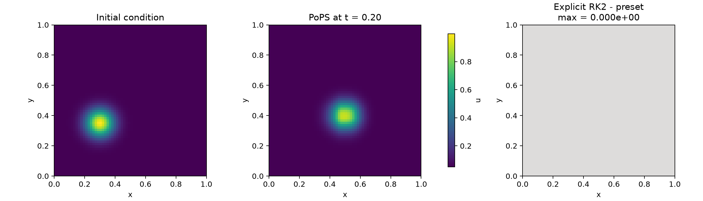
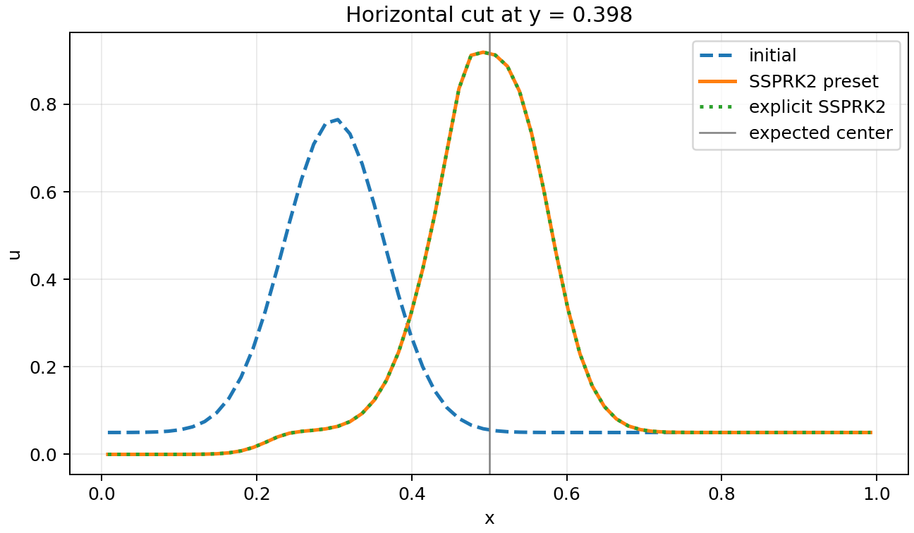

# Advection scalaire 2D avec PoPS

Ce tutoriel construit une simulation de l'equation d'advection scalaire. Chaque objet PoPS
apparait au moment ou il devient utile, jusqu'au cycle d'execution :

```text
Case -> validate -> resolve -> compile -> bind -> run
```

Les scripts se lisent de haut en bas. Python construit le graphe type et prepare la
condition initiale. Le C++/Kokkos execute les flux, les reconstructions, les stages temporels et
les mises a jour des cellules. Chaque fichier traite un seul choix numerique ou d'execution et
contient la declaration complete du cas.

## Installation

Depuis la racine du depot :

```bash
bash scripts/setup_env.sh
bash scripts/build_python.sh
conda activate pops
```

L'apercu du domaine utilise Matplotlib :

```bash
python -m pip install matplotlib
```

Le petit script [`00_domain_preview.py`](00_domain_preview.py) cree le meme rectangle que les cas
d'advection, puis l'enregistre immediatement :

```python
domain.show(path=HERE / "results" / "00_domain_preview.svg")
```

Changer seulement le suffixe en `.png` ou `.pdf` choisit un autre format pris en charge par
Matplotlib. Toute geometrie analytique concrete, y compris une composition CSG, se passe avec
`geometry=...` sans changer l'appel.

Quand `pops.run(...)` demarre, PoPS affiche le backend Kokkos reellement charge, sa concurrence
native (les threads configures avec OpenMP), le communicateur MPI, le maillage, la methode
numerique, le schema de temps et les sorties prevues. Le rang MPI 0 est le seul a ecrire ce resume.
`console=False` le masque sans changer le calcul ni son identite.

Les commandes OpenMP et MPI sont regroupees dans
[`platforms.md`](platforms.md).

## Choisir un script

| Maillage et plateforme | SSPRK2 preimplemente | SSPRK2 explicite |
|---|---|---|
| Uniforme, OpenMP 7 threads | [`01_openmp_preset_ssprk2.py`](01_openmp_preset_ssprk2.py) | [`02_openmp_explicit_ssprk2.py`](02_openmp_explicit_ssprk2.py) |
| Uniforme, MPI natif | [`03_mpi_preset_ssprk2.py`](03_mpi_preset_ssprk2.py) | [`04_mpi_explicit_ssprk2.py`](04_mpi_explicit_ssprk2.py) |
| AMR, OpenMP 7 threads | [`05_openmp_amr_preset_ssprk2.py`](05_openmp_amr_preset_ssprk2.py) | [`06_openmp_amr_explicit_ssprk2.py`](06_openmp_amr_explicit_ssprk2.py) |
| AMR distribue, MPI natif | [`07_mpi_amr_preset_ssprk2.py`](07_mpi_amr_preset_ssprk2.py) | [`08_mpi_amr_explicit_ssprk2.py`](08_mpi_amr_explicit_ssprk2.py) |

Les autres scripts traitent chacun un point precis :

| Sujet | Script |
|---|---|
| Apercu du domaine | [`00_domain_preview.py`](00_domain_preview.py) |
| Tagging AMR sur $\|\nabla u\|$ | [`09_openmp_amr_gradient_ssprk2.py`](09_openmp_amr_gradient_ssprk2.py) |
| Horloges AMR synchrones | [`10_openmp_amr_synchronous_ssprk2.py`](10_openmp_amr_synchronous_ssprk2.py) |
| Deux binds, une seule compilation | [`11_openmp_runtime_parameters.py`](11_openmp_runtime_parameters.py) |
| Sorties scientifiques periodiques | [`12_openmp_amr_outputs.py`](12_openmp_amr_outputs.py) |
| Checkpoint et restart AMR bit-identique | [`13_openmp_amr_restart.py`](13_openmp_amr_restart.py) |

Les scripts OpenMP appellent `pops.set_threads(7)` avant l'initialisation native. Les scripts MPI
fixent un thread par rang, construisent
`ExecutionContext.mpi_world(artifact)` et transmettent cette ressource a `pops.bind`; ils n'importent
pas `mpi4py`. Chaque fichier contient la declaration complete du cas.

## Probleme physique

On transporte une quantite scalaire $u(x,y,t)$ avec une vitesse constante
$a=(a_x,a_y)$ sur le carre unite :

```math
\frac{\partial u}{\partial t} + \nabla \cdot (a u) = 0.
```

On utilise

```math
a_x = 1, \qquad a_y = 0.25,
```

La condition initiale est une bosse gaussienne sur un fond uniforme $u_\infty=0.05$. Les deux
composantes de la vitesse sont positives. Les faces $x_{min}$ et $y_{min}$ sont donc entrantes et
imposent ce meme fond $u_\infty$ ; les faces $x_{max}$ et $y_{max}$ sont sortantes. Les conditions
aux limites n'ajoutent ainsi aucun front au paquet transporte.

## Semi-discretisation en volumes finis

La variable stockee est la moyenne cellulaire

```math
U_{ij}(t) = \frac{1}{|\Omega_{ij}|}
\int_{\Omega_{ij}} u(x,y,t)\,d\Omega.
```

La bosse initiale est echantillonnee au centre des cellules. Cette valeur approche a l'ordre deux
la moyenne exacte definie ci-dessus.

L'integration de l'equation sur la cellule et le theoreme de Gauss donnent

```math
\frac{dU_{ij}}{dt}
+ \frac{1}{|\Omega_{ij}|}
\sum_{f \in \partial\Omega_{ij}} \widehat{F}_f = 0.
```

Le script separe la physique, l'equation d'evolution et sa discretisation :

```python
physical_flux = model.flux(
    "advection_flux",
    frame=frame,
    state=U,
    components={x_axis: (AX * u,), y_axis: (AY * u,)},
    waves={x_axis: (AX,), y_axis: (AY,)},
)

advection_rate = model.rate(
    "advection_rate",
    equation=ddt(U) == -div(physical_flux),
)

finite_volume = FiniteVolume(
    flux=physical_flux,
    variables=variables.Conservative(U),
    reconstruction=reconstruction.MUSCL(limiters.VanLeer()),
    riemann=riemann.ScalarUpwind(velocity=velocity),
)
```

- `physical_flux` exprime la physique $F(U)=aU$ ;
- `advection_rate` donne l'equation d'evolution ;
- `FiniteVolume` choisit la discretisation du flux.

PoPS deduit l'ordre formel et la profondeur de halos de `MUSCL(VanLeer())`. Le script ne
repete donc ni `order=2`, ni un nombre de cellules fantomes.

## Flux upwind

Pour une face de normale $n_f$, la vitesse normale vaut $a\cdot n_f$. Le flux upwind est

```math
\widehat{F}(U_L,U_R) =
\begin{cases}
(a\cdot n_f)U_L, & a\cdot n_f > 0,\\
(a\cdot n_f)U_R, & a\cdot n_f \le 0.
\end{cases}
```

Pour cette equation lineaire, le flux de Rusanov avec
$\lambda=|a\cdot n_f|$ est algebriquement identique au flux upwind. Le descriptor
`ScalarUpwind(velocity=velocity)` enregistre ce contrat precis et utilise la route native
generique de Rusanov.

## Reconstruction MUSCL et limiteur Van Leer

Une methode constante par cellule est robuste mais tres dissipative. MUSCL reconstruit une
variation lineaire dans chaque cellule :

```math
U_{ij}(x) = U_{ij} + \nabla U_{ij}\cdot(x-x_{ij}).
```

Le limiteur Van Leer reduit la pente pres des variations fortes :

```math
\phi(r)=\frac{r+|r|}{1+|r|}.
```

Dans une zone reguliere, la reconstruction conserve une precision nominale d'ordre deux.
Pres d'un extremum ou d'un front, le limiteur reduit localement l'ordre pour eviter les
oscillations non physiques.

Les substitutions suivantes utilisent toutes des briques natives :

```python
reconstruction.FirstOrder()
reconstruction.MUSCL(limiters.Minmod())
reconstruction.MUSCL(limiters.VanLeer())
reconstruction.WENO5()  # implementation native WENO5-Z
```

Le document source cite aussi les limiteurs MC et Superbee. Leurs fonctions usuelles sont
$\phi_{MC}(r)=\max(0,\min(2r,(1+r)/2,2))$ et
$\phi_{SB}(r)=\max(0,\min(2r,1),\min(r,2))$. PoPS 1.0.0 ne fournit pas encore de descriptor
natif pour ces deux limiteurs. Ils peuvent etre compares sur le papier, mais ne sont pas
selectionnables dans ce tutoriel.

## Tutoriel 1 : briques preimplementees

Le premier script OpenMP est
[`01_openmp_preset_ssprk2.py`](01_openmp_preset_ssprk2.py). Il definit successivement :

1. rectangle, repere et grille ;
2. etat conservatif ;
3. vitesse et flux physique ;
4. taux d'evolution ;
5. methode de volumes finis ;
6. bloc qualifie du `Case` ;
7. conditions `Inflow` et `Outflow` ;
8. programme `pops.lib.time.SSPRK2` ;
9. condition initiale ;
10. cycle de compilation et execution.

Lancer le cas :

```bash
python docs/tuto/scalar_advection/01_openmp_preset_ssprk2.py
```

Le resultat final est ecrit dans
`docs/tuto/scalar_advection/results/01_openmp_preset_ssprk2.npz`.

La version MPI du meme preset est
[`03_mpi_preset_ssprk2.py`](03_mpi_preset_ssprk2.py). Sa commande de lancement exacte est donnee
dans [`platforms.md`](platforms.md).

## Integration temporelle SSPRK2

Apres discretisation spatiale, le systeme s'ecrit

```math
\frac{dU}{dt}=L(U).
```

SSPRK2 utilise deux evaluations de $L$ :

```math
U^{(1)} = U^n + \Delta t L(U^n),
```

```math
U^{n+1}
= U^n + \frac{\Delta t}{2}L(U^n)
+ \frac{\Delta t}{2}L(U^{(1)}).
```

Le premier script demande simplement la fabrique de bibliotheque :

```python
program = SSPRK2(tracer_U, rate=advection_rate)
program.step_strategy(AdaptiveCFL(cfl=CFL, max_dt=MAX_DT))
```

La strategie CFL appartient au programme. `pops.run` recoit seulement le temps final et la limite
du nombre de pas. Le schema temporel, le flux et la reconstruction sont deja fixes.

Les autres schemas temporels explicites utilisent le meme contrat :

```python
from pops.lib.time import ForwardEuler, SSPRK2, SSPRK3
```

- `ForwardEuler(...)` est explicite, d'ordre un et soumis a une condition CFL ;
- `SSPRK2(...)` est le compromis d'ordre deux execute ici ;
- `SSPRK3(...)` ajoute un troisieme stage et atteint l'ordre trois en temps.

Euler implicite demande un operateur residuel et une resolution implicite. Ce cas d'advection reste
explicite ; les exemples implicites se trouvent dans
[`advection_relaxation`](../advection_relaxation/README.md).

## Tutoriel 2 : programme temporel explicite

Le script OpenMP
[`02_openmp_explicit_ssprk2.py`](02_openmp_explicit_ssprk2.py) reconstruit le meme schema avec les
operations generiques de `pops.Program`. La methode spatiale reste MUSCL/Van Leer avec
`ScalarUpwind`, ce qui permet de comparer uniquement les deux ecritures du programme temporel.

```python
program = pops.Program("SSPRK2")
q = program.state(tracer_U)

stage_0 = StagePoint(
    "ssprk2_stage_0",
    {"main": TimePoint(program.clock, 0)},
)
k0 = program.value("ssprk2_k_0", advection_rate(q.n), at=stage_0)

stage_1 = StagePoint(
    "ssprk2_stage_1",
    {"main": TimePoint(program.clock, 1)},
)
q_stage = program.value(
    "ssprk2_U1",
    q.n + program.dt * k0,
    at=stage_1,
)
k1 = program.value("ssprk2_k_1", advection_rate(q_stage), at=stage_1)

half = Fraction(1, 2)
q_next = program.value(
    "ssprk2_step",
    q.n + program.dt * half * k0 + program.dt * half * k1,
    at=q.next.point,
)
program.commit(q.next, q_next)
```

Lancer ce second cas :

```bash
python docs/tuto/scalar_advection/02_openmp_explicit_ssprk2.py
```

Cette ecriture construit le graphe des stages. PoPS l'abaisse ensuite vers les operateurs
C++/Kokkos. Le preset `SSPRK2()` et le programme explicite ont la meme semantique et produisent le
meme resultat.

Le script MPI reprend cette construction
[`04_mpi_explicit_ssprk2.py`](04_mpi_explicit_ssprk2.py).

## Tutoriels 3 et 4 : raffinement adaptatif

Les quatre variantes suivantes remplacent le maillage uniforme par une hierarchie AMR a deux
niveaux. La grille de base contient $32\times32$ cellules. La bosse est projetee
conservativement sur la hierarchie. Les cellules ou $u>0.30$ sont raffinees, celles ou $u<0.20$
sont dereffinees, et un buffer de deux cellules entoure la zone marquee. L'intervalle entre les
deux seuils evite que le maillage oscille et lui permet de suivre le paquet sans conserver toute
sa trajectoire.

```python
refine_threshold = case.param(RuntimeParam("refine_u", default=0.30))
coarsen_threshold = case.param(RuntimeParam("coarsen_u", default=0.20))

tagging = AMRTagging(
    rules=(
        Tag(ValueExpr(tracer_U) > case.value(refine_threshold)),
        Coarsen(ValueExpr(tracer_U) < case.value(coarsen_threshold)),
        Buffer(cells=2),
    ),
    hysteresis=Hysteresis(0, EqualityPolicy.HOLD),
    conflict_policy=ConflictPolicy.REFINE_WINS,
)

transfer = AMRTransfer()
transfer.state(tracer_U, StateTransfer())
```

Le layout rassemble la hierarchie, le tagging, le calendrier de regrillage, le transfert et les
horloges :

```python
layout = AMR(
    grid=grid,
    hierarchy=AMRHierarchy(max_levels=2, ratios=(2,)),
    tagging=tagging,
    regrid=AMRRegrid(schedule=every(2, clock=program.clock)),
    transfer=transfer,
    execution=AMRExecution.subcycled((
        AMRClockRelation(0, 1, 2),
    )),
)
```

Le ratio spatial et le ratio temporel valent ici tous deux `2`, mais ce sont deux choix
independants. La hierarchie ne deduit pas le programme des horloges. `AMR` fournit le tagger
symbolique et le clusterer Berger-Rigoutsos.

Lancer les variantes OpenMP :

```bash
python docs/tuto/scalar_advection/05_openmp_amr_preset_ssprk2.py
python docs/tuto/scalar_advection/06_openmp_amr_explicit_ssprk2.py
```

Les variantes MPI ajoutent seulement la distribution des patches grossiers et le contexte natif :

```bash
mpiexec -n 2 python docs/tuto/scalar_advection/07_mpi_amr_preset_ssprk2.py
mpiexec -n 2 python docs/tuto/scalar_advection/08_mpi_amr_explicit_ssprk2.py
```

Chaque script affiche le nombre de niveaux, de patches fins et de regrids termines. Le runtime
C++/Kokkos effectue les calculs sur les cellules.

## Tagging par gradient

[`09_openmp_amr_gradient_ssprk2.py`](09_openmp_amr_gradient_ssprk2.py) raffine les fronts plutot
que les cellules dont la valeur depasse un seuil. Deux seuils evitent les decisions contradictoires :

```python
gradient_magnitude = norm(grad(ValueExpr(tracer_U)))

tagging = AMRTagging(
    rules=(
        Tag(gradient_magnitude > case.value(refine_threshold)),
        Coarsen(gradient_magnitude < case.value(coarsen_threshold)),
        Buffer(cells=2),
    ),
    hysteresis=Hysteresis(0, EqualityPolicy.HOLD),
    conflict_policy=ConflictPolicy.REFINE_WINS,
)
```

PoPS deduit le stencil, l'ordre et les halos du gradient a partir de la methode spatiale.

```bash
python docs/tuto/scalar_advection/09_openmp_amr_gradient_ssprk2.py
```

## Niveaux AMR synchrones

[`10_openmp_amr_synchronous_ssprk2.py`](10_openmp_amr_synchronous_ssprk2.py) conserve le ratio
spatial 2:1 mais fait avancer les deux niveaux avec le meme pas :

```python
hierarchy=AMRHierarchy(max_levels=2, ratios=(2,)),
execution=AMRExecution.synchronous(),
```

Le ratio temporel est ainsi choisi independamment du ratio spatial.

```bash
python docs/tuto/scalar_advection/10_openmp_amr_synchronous_ssprk2.py
```

## Compiler une fois, binder plusieurs fois

[`11_openmp_runtime_parameters.py`](11_openmp_runtime_parameters.py) declare la vitesse avec des
`RuntimeParam`, compile un seul artefact, puis cree deux installations independantes :

```python
artifact = pops.compile(resolved)

slow = pops.bind(
    artifact,
    params={a_x_param: 0.50, a_y_param: 0.10},
    initial_state={"tracer": initial_state.copy()},
)
fast = pops.bind(
    artifact,
    params={a_x_param: 1.00, a_y_param: 0.25},
    initial_state={"tracer": initial_state.copy()},
)
```

Les cles sont les handles owner-qualifies obtenus apres validation.

```bash
python docs/tuto/scalar_advection/11_openmp_runtime_parameters.py
```

## Sorties scientifiques periodiques

[`12_openmp_amr_outputs.py`](12_openmp_amr_outputs.py) confie une sortie periodique au
`ConsumerGraph`. Deux constantes, placees en tete du fichier, suffisent pour choisir le format et
la frequence :

```python
OUTPUT_FORMAT = output.ParaView()
OUTPUT_EVERY_STEPS = 2
```

Remplacer seulement `ParaView` par `HDF5` ou `NPZ` change le format sans toucher au reste du cas. La
frequence compte les pas acceptes : une longue simulation pourra par exemple utiliser
`OUTPUT_EVERY_STEPS = 100`.

```bash
python docs/tuto/scalar_advection/12_openmp_amr_outputs.py
```

Les instantanes sont ecrits au fil du calcul sous
`docs/tuto/scalar_advection/results/12_openmp_amr_outputs/`. Le format choisi rouvre ensuite la
serie, son dernier instantane et leurs identites, sans branche conditionnelle sur l'extension.

Avec `ParaView`, le script affiche une ligne `time series`. Ouvrir la valeur exacte affichee sur
cette ligne charge tous les instantanes dans la timeline ; son nom ressemble a
`series__f….vtu.series`. Le champ `tracer__U`
rassemble les valeurs des deux niveaux ; les cellules
grossieres recouvertes par le niveau fin sont marquees comme raffinees et ne sont pas affichees deux
fois.

## Checkpoint et restart exact

[`13_openmp_amr_restart.py`](13_openmp_amr_restart.py) avance jusqu'a un temps intermediaire et
cree un checkpoint. Un second bind restaure l'etat, la topologie AMR et les horloges, puis poursuit
la simulation. Les deux niveaux et les patches sont compares a la trajectoire continue.

```bash
python docs/tuto/scalar_advection/13_openmp_amr_restart.py
```

Le checkpoint est ecrit sous
`docs/tuto/scalar_advection/results/13_openmp_amr_restart/`.

## Figures generees

Apres les deux simulations OpenMP :

```bash
python docs/tuto/scalar_advection/plot_openmp_results.py
```

La premiere figure compare les deux executions OpenMP : condition initiale, solution advectee et
difference entre les deux ecritures de SSPRK2.



La seconde compare une coupe horizontale et la position theorique du centre de la bosse.



## Personnaliser le modele et le programme

Deux parties sont ecrites directement dans le script :

- un flux physique utilisateur, ecrit symboliquement avec `model.flux(...)` puis compile ;
- un programme temporel utilisateur, compose avec les operations generiques de
  `pops.Program` puis compile.

Les limiteurs et les flux de Riemann de la boucle de calcul viennent des implementations natives
listees plus haut. L'interface externe `NumericalFlux` traite les interfaces conservatives entre
blocs. Elle ne sert pas encore de flux interieur pour ce cas mono-bloc.

## Note sur Euler implicite

Le PDF source indiquait qu'Euler implicite est « inconditionnellement instable » pour les
problemes lineaires. Il s'agit d'une coquille : Euler implicite est A-stable. Son interet et sa
precision dependent du probleme, du solveur et du cout de la resolution implicite. Le cas presente
ici utilise SSPRK2.

## Aller plus loin

[L'exemple final d'advection scalaire](../../../examples/final/EXEMPLE_SPEC_FINALE_ADVECTION_SCALAIRE_COMPLET.py)
compose toutes ces briques avec trois niveaux, diagnostics, controles d'identite et preuves de
restart exhaustives.
