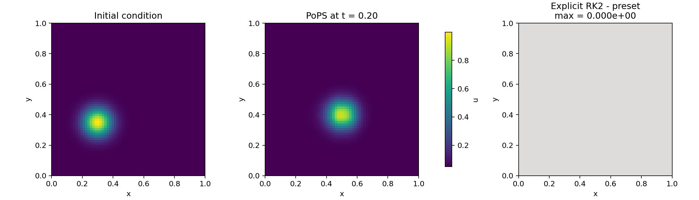

# Advection scalaire 2D avec PoPS

Ce premier tutoriel construit une simulation complete et executable de l'equation
d'advection scalaire. Il introduit chaque objet PoPS au moment ou il devient utile, puis
execute exactement le cycle public final :

```text
Case -> validate -> resolve -> compile -> bind -> run
```

Les deux scripts de simulation sont deliberement top-level et quasi lineaires. Python
construit un graphe type et prepare la condition initiale ; les flux, reconstructions,
stages temporels et mises a jour de cellules sont compiles puis executes en C++/Kokkos.

## Installation

Depuis la racine du depot :

```bash
bash scripts/setup_env.sh
bash scripts/build_python.sh
conda activate pops
```

Le script de visualisation utilise Matplotlib :

```bash
python -m pip install matplotlib
```

Les commandes OpenMP et MPI sont regroupees dans
[`platforms.md`](platforms.md).

## Probleme physique

On transporte une quantite scalaire $u(x,y,t)$ avec une vitesse constante
$a=(a_x,a_y)$ sur le carre unite :

$$
\frac{\partial u}{\partial t} + \nabla \cdot (a u) = 0.
$$

Le tutoriel choisit

$$
a_x = 1, \qquad a_y = 0.25,
$$

et une bosse gaussienne comme condition initiale. Les deux composantes de la vitesse sont
positives : les faces $x_{min}$ et $y_{min}$ sont donc entrantes, tandis que les faces
$x_{max}$ et $y_{max}$ sont sortantes.

## Semi-discretisation en volumes finis

La variable stockee est la moyenne cellulaire

$$
U_{ij}(t) = \frac{1}{|\Omega_{ij}|}
\int_{\Omega_{ij}} u(x,y,t)\,d\Omega.
$$

Pour garder le script lisible, la bosse initiale est echantillonnee au centre des cellules.
Cette valeur est une approximation d'ordre deux de la moyenne exacte definie ci-dessus.

L'integration de l'equation sur la cellule et le theoreme de Gauss donnent

$$
\frac{dU_{ij}}{dt}
+ \frac{1}{|\Omega_{ij}|}
\sum_{f \in \partial\Omega_{ij}} \widehat{F}_f = 0.
$$

Dans le script, les trois niveaux restent separes :

```python
physical_flux = model.flux(
    "advection_flux",
    frame=frame,
    state=U,
    components={x_axis: (AX * u,), y_axis: (AY * u,)},
    waves={x_axis: (AX,), y_axis: (AY,)},
)

advection_rate = model.rate(
    "advection_rate",
    equation=ddt(U) == -div(physical_flux),
)

finite_volume = FiniteVolume(
    flux=physical_flux,
    variables=variables.Conservative(U),
    reconstruction=reconstruction.MUSCL(limiters.VanLeer()),
    riemann=riemann.ScalarUpwind(velocity=velocity),
)
```

- `physical_flux` exprime la physique $F(U)=aU$ ;
- `advection_rate` exprime l'equation d'evolution ;
- `FiniteVolume` choisit la realisation numerique de ce flux.

PoPS deduit l'ordre formel et la profondeur de halos de `MUSCL(VanLeer())`. Le script ne
repete donc ni `order=2`, ni un nombre de cellules fantomes.

## Flux upwind

Pour une face de normale $n_f$, la vitesse normale vaut $a\cdot n_f$. Le flux upwind est

$$
\widehat{F}(U_L,U_R) =
\begin{cases}
(a\cdot n_f)U_L, & a\cdot n_f > 0,\\
(a\cdot n_f)U_R, & a\cdot n_f \le 0.
\end{cases}
$$

Pour cette equation lineaire, le flux de Rusanov avec
$\lambda=|a\cdot n_f|$ est algebriquement identique au flux upwind. Le descriptor
`ScalarUpwind(velocity=velocity)` enregistre ce contrat precis et utilise la route native
generique de Rusanov.

## Reconstruction MUSCL et limiteur Van Leer

Une methode constante par cellule est robuste mais tres dissipative. MUSCL reconstruit une
variation lineaire dans chaque cellule :

$$
U_{ij}(x) = U_{ij} + \nabla U_{ij}\cdot(x-x_{ij}).
$$

Le limiteur Van Leer reduit la pente pres des variations fortes :

$$
\phi(r)=\frac{r+|r|}{1+|r|}.
$$

Dans une zone reguliere, la reconstruction conserve une precision nominale d'ordre deux.
Pres d'un extremum ou d'un front, le limiteur reduit localement l'ordre pour eviter les
oscillations non physiques.

Les substitutions suivantes utilisent toutes des briques natives :

```python
reconstruction.FirstOrder()
reconstruction.MUSCL(limiters.Minmod())
reconstruction.MUSCL(limiters.VanLeer())
reconstruction.WENO5()  # implementation native WENO5-Z
```

Le document source cite aussi les limiteurs MC et Superbee. Leurs fonctions usuelles sont
$\phi_{MC}(r)=\max(0,\min(2r,(1+r)/2,2))$ et
$\phi_{SB}(r)=\max(0,\min(2r,1),\min(r,2))$. Ils ne disposent pas encore d'un descriptor
natif dans PoPS 1.0.0 : on peut les comparer sur le papier, mais pas les selectionner dans
ce tutoriel sans inventer une fausse route Python dans la boucle de calcul.

## Tutoriel 1 : briques preimplementees

Le script complet est
[`01_pops_library.py`](01_pops_library.py). Il se lit dans cet ordre :

1. rectangle, repere et grille ;
2. etat conservatif ;
3. vitesse et flux physique ;
4. taux d'evolution ;
5. methode de volumes finis ;
6. bloc qualifie du `Case` ;
7. conditions `Inflow` et `Outflow` ;
8. programme `pops.lib.time.SSPRK2` ;
9. condition initiale ;
10. cycle de compilation et execution.

Lancer le cas :

```bash
python tutorials/scalar_advection/01_pops_library.py
```

Le resultat final est ecrit dans
`tutorials/scalar_advection/results/01_pops_library.npz`.

## Integration temporelle SSPRK2

Apres discretisation spatiale, le systeme s'ecrit

$$
\frac{dU}{dt}=L(U).
$$

SSPRK2 utilise deux evaluations de $L$ :

$$
U^{(1)} = U^n + \Delta t L(U^n),
$$

$$
U^{n+1}
= U^n + \frac{\Delta t}{2}L(U^n)
+ \frac{\Delta t}{2}L(U^{(1)}).
$$

Le premier script demande simplement la fabrique de bibliotheque :

```python
program = SSPRK2(tracer_U, rate=advection_rate)
program.step_strategy(AdaptiveCFL(cfl=CFL, max_dt=MAX_DT))
```

La strategie CFL appartient au programme. `pops.run` ne choisit ni le schema temporel, ni
le flux, ni la reconstruction ; il recoit seulement la fin de simulation et la limite de
pas.

Les autres briques temporelles demandees dans le document source se placent dans le meme
contrat :

```python
from pops.lib.time import ForwardEuler, SSPRK2, SSPRK3
```

- `ForwardEuler(...)` est explicite, d'ordre un et soumis a une condition CFL ;
- `SSPRK2(...)` est le compromis d'ordre deux execute ici ;
- `SSPRK3(...)` ajoute un troisieme stage et atteint l'ordre trois en temps.

Euler implicite n'est pas un simple preset explicite interchangeable : il requiert un
operateur residuel et une resolution implicite. PoPS expose ces briques pour les programmes
couples, mais leur construction sortirait du probleme d'advection explicite de prise en main.

## Tutoriel 2 : programme temporel explicite

Le script
[`02_explicit_ssprk2.py`](02_explicit_ssprk2.py) reconstruit exactement le meme schema avec
les operations generiques de `pops.Program`. C'est la personnalisation executable montree
ici : la methode spatiale reste volontairement le meme MUSCL/Van Leer/ScalarUpwind natif afin
d'isoler la construction du programme temporel.

```python
program = pops.Program("SSPRK2")
q = program.state(tracer_U)

stage_0 = StagePoint(
    "ssprk2_stage_0",
    {"main": TimePoint(program.clock, 0)},
)
k0 = program.value("ssprk2_k_0", advection_rate(q.n), at=stage_0)

stage_1 = StagePoint(
    "ssprk2_stage_1",
    {"main": TimePoint(program.clock, 1)},
)
q_stage = program.value(
    "ssprk2_U1",
    q.n + program.dt * k0,
    at=stage_1,
)
k1 = program.value("ssprk2_k_1", advection_rate(q_stage), at=stage_1)

half = Fraction(1, 2)
q_next = program.value(
    "ssprk2_step",
    q.n + program.dt * half * k0 + program.dt * half * k1,
    at=q.next.point,
)
program.commit(q.next, q_next)
```

Lancer ce second cas :

```bash
python tutorials/scalar_advection/02_explicit_ssprk2.py
```

Cette ecriture n'execute pas les stages en Python. Elle construit le graphe que PoPS abaisse
vers les operateurs C++/Kokkos. Le preset `SSPRK2()` et le programme explicite ont la meme
semantique et doivent produire le meme resultat.

## Figures generees

Apres les deux simulations :

```bash
python tutorials/scalar_advection/03_make_figures.py
```

La premiere figure montre la condition initiale, la solution advectee et la difference entre
les deux ecritures de SSPRK2.



La seconde compare une coupe horizontale et la position theorique du centre de la bosse.


## Ce qui est vraiment personnalisable aujourd'hui

Ce tutoriel montre deux extensions finales et executees :

- un flux physique utilisateur, ecrit symboliquement avec `model.flux(...)` puis compile ;
- un programme temporel utilisateur, compose avec les operations generiques de
  `pops.Program` puis compile.

Un limiteur ou un flux de Riemann Python ne doit jamais etre appele dans la boucle de calcul.
La surface 1.0.0 fournit actuellement les reconstructions et flux natifs listes plus haut.
L'interface de composant `NumericalFlux` externe est reelle pour les interfaces conservatives
entre blocs, mais elle n'est pas encore la route du flux interieur mono-bloc de ce premier
tutoriel. Le document ne simule donc pas un support qui n'existe pas.

## Correction apportee au document source

Le PDF source indiquait qu'Euler implicite est « inconditionnellement instable » pour les
problemes lineaires. C'est une coquille. Euler implicite est au contraire A-stable ; son
interet et sa precision dependent ensuite du probleme, du solveur et du cout de la resolution
implicite. Ce premier tutoriel reste volontairement explicite et utilise SSPRK2.

## Aller plus loin

L'
[exemple final d'advection scalaire](../../examples/final/EXEMPLE_SPEC_FINALE_ADVECTION_SCALAIRE_COMPLET.py)
ajoute AMR, tagging par gradient, transferts conservatifs, reflux, sorties HDF5/ParaView et
restart bit-identique. Il sert de reference exhaustive, tandis que les scripts de ce dossier
restent le parcours de prise en main.
